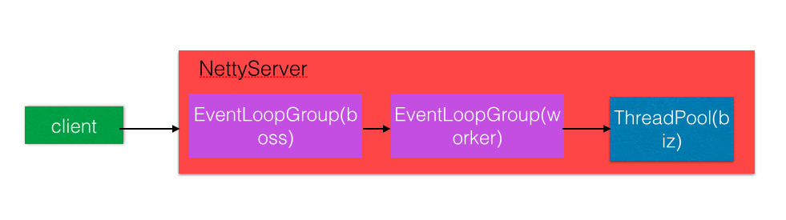
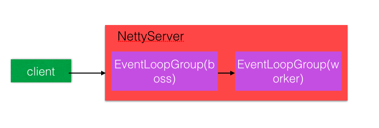
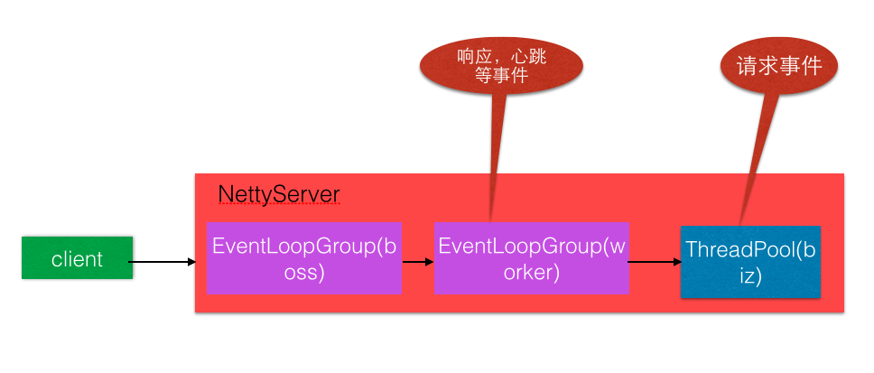
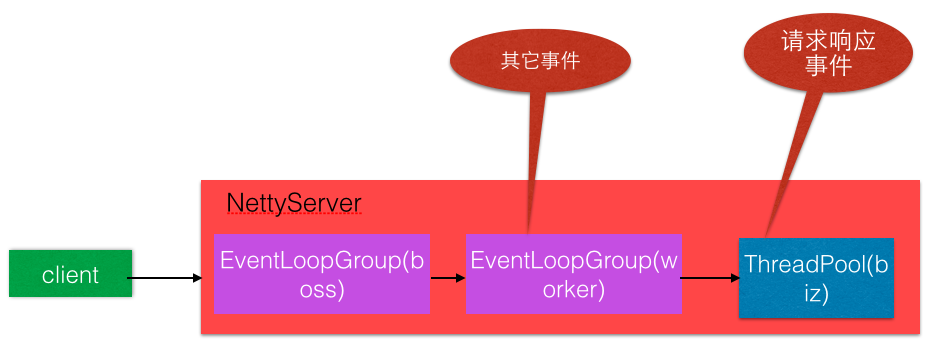

需要理解的内容：负载均衡、熔断、注册中心、稳定性（宕机、突发高流量）、决策、架构关系、架构分层；

# 一. Dubbo 架构

> 参考地址：[《dubbo系列三、架构介绍及各模块关系》](https://www.cnblogs.com/wangzhuxing/p/9725096.html)

Dubbo 是阿里服务化治理方案的核心框架，是一种分布式 RPC 框架，它提供了**注册中心机制**，解耦了消费方与服务方动态发现的问题。

## 1.1 Dubbo 架构

Dubbo 的架构主要分为四部分：**服务提供方、服务消费者、注册中心、统计中心**，这四部分也被称为**部署逻辑拓扑节点**。Dubbo 运作模式如下：

1. **注册**：**服务提供方 (Provider)** 启动时，把自己的元数据向**注册中心 (Registry)** 上面注册；
2. **订阅**：**服务消费者 (Consumer)**启动时，从**注册中心 (Registry)** 订阅服务提供方的元数据；
3. **通知**：注册中心的数据发生变更，变更的数据会推送给订阅的服务消费者；
4. **调用**：获取服务提供方的元数据后，消费者可以发起 RPC 调用；
5. **监控**：RPC 调用发生前后，会向**监控中心 (Monitor)** 上报统计信息；


Dubbo 的架构如上图所示，上图图例说明：

- 图中小方块 **Protocol, Cluster, Proxy, Service, Container, Registry, Monitor** 代表**层**或**模块**，<font color=blue>**蓝色**</font>的表示与业务有交互，<font color=green>**绿色**</font>的表示只对 Dubbo 内部交互；
- 图中**背景方块 Consumer, Provider, Registry, Monitor** 代表 Dubbo 架构的四个部分；
- 图中**<font color=blue>蓝色虚线</font>**为初始化时调用，<font color=red>**红色虚线**</font>为运行时异步调用，<font color=red>**红色实线**</font>为运行时同步调用；
- 注：图中只包含 RPC 的层，不包含 Remoting 的层，Remoting 整体都隐含在 Protocol 中；关于分层见下一节的图示。

## 1.2 Dubbo 分层


上图为 **Dubbo 的分层结构**。横向将其分为两部分，左边淡蓝色背景是**消费者**使用的接口，右边淡绿色背景是**提供者**使用的接口，位于两者中轴线上的是消费者与提供者共同使用的接口。  
纵向可以将 Dubbo 分为十层。如果按照**总体功能**，可以想左侧的分类一样，将 Dubbo 分为三层：

- **业务层 (Business)**：Business
- **RPC 层**：Config, Proxy, Registry, Cluster, Monitor, Protocol
- **远程调用层 (Remote)**：Exchange, Transport, Serialize

如果按照**调用方**的角度：

- **API 层**：**Service, Config**，供用户调用；
- **SPI 层**：除 API 层其他所有层，这些层全部可扩展的主要提供给扩展者使用，这也是 Dubbo 扩展能力强的原因。  

各层及各层的核心组件如下：

|层次名|作用|
|:--|:--|
|业务层 (Service)|业务代码的接口与实现，即开发者实现的业务代码|
|配置层 (Config)|对外配置接口，以用来**暴露服务配置的 ServiceConfig** 与**引用的服务配置 ReferenceConfig** 为中心|
|服务代理层 (Proxy)|无论是服务提供者还是消费者，Dubbo 框架都会生成一个代理类，整个过程对上面是透明的，调用远程接口就像调用本地方法一样。核心为 **ServiceProxy**|
|注册层 (Registry)|负责 Dubbo 框架的**服务注册与发现**。集群中有服务上下线时，注册中心通知订阅该服务的订阅方相应的动作|
|集群容错层 (Cluster)|又称路由层，负责远程调用失败的**容错**策略，以及选择调用节点的**负载均衡**策略|
|监控层 (Monitor)|监控 RPC 调用次数、调用时间|
|远程调用层 (Protocol)|封装 **RPC 调用的具体过程**。Dubbo 以 **Invoker 为核心模型**，框架中其他所有模型向它靠拢，可以是一个本地、远程、或者集群的实现|
|信息交换层 (Exchange)|封装请求响应模式|
|网络传输层 (Transport)|把网络传输抽象成统一的接口，以 Mina, Netty 为统一接口，以 **Message** 为中心|
|序列化层 (Serialize)|负责管理整个框架网络传输时的序列化、反序列化工作|

## 1.3 Dubbo 架构关系

首先在 Dubbo 架构图中的服务提供者 (Provider) 与服务消费者 (Consumer) 都是抽象的、相对性的概念，类似于我们平常说的服务器、客户端结构。这样的概念主要是为了让读者更加直观的了解哪些类属于客户端与服务端。  
在 RPC 层中，**Protocol 是核心层**。只要有 Protocol + Invoker + Exporter，就可以完成非透明的 RPC 远程调用。

在**远程调用层 Remote** 中，基本是 **Dubbo 协议的实现**。Remote 层内部再划分为传输层 Transport 与信息交换层 Exchange，传输层只负责消息的单向传输，是对不同协议 Mina, Netty, Grizzly 的抽象，同时也可以扩展接口；而Exchange 层在 Transport 层之上封装了**请求-响应**的模型。

> 该部分需要进一步深入理解。

# 二. 注册中心
第三章

首先需要说明的一点是，服务的暴露与注册是两个不同的概念。在Dubbo中，微服务之间的交互默认是通过Netty进行的，而服务之间的通信是基于TCP以全双工的方式进行的。那么也就是说，每个服务都会存在一个ip和port。所谓的服务暴露就是指根据配置将当前服务使用Netty绑定一个本地的端口号(对于消费者而言，则是尝试连接目标服务的ip和端口)。至于注册，由于微服务架构中对于新添加的服务，需要一定的机制来通知消费者，有新的服务可用，或者对于某些下线的服务，也需要通知消费者，将这个已经下线的服务给移除。Dubbo中服务的注册与发现默认是委托给zookeeper来进行的。

暴露：书 5.2.2 章，文章[《Dubbo服务暴露与注册》](https://zhuanlan.zhihu.com/p/87075790)


> 参考地址：[《阿里dubbo服务注册原理解析》](https://www.cnblogs.com/linlinismine/p/7814521.html)  
>
> 详细调用过程：[《dubbo服务注册与发现、服务调用过程》](https://www.jianshu.com/p/1ff25f65587c)

ServiceBean#afterSetProperties 中调用了 <code>com.alibaba.dubbo.config.ServiceConfig#export</code>方法，主要代码如下：

```java
//如果配置不是local则暴露为远程服务.(配置为local，则表示只暴露本地服务)
if (!Constants.SCOPE_LOCAL.toString().equalsIgnoreCase(scope)) {
    if (logger.isInfoEnabled()) {
        logger.info("Export dubbo service " + interfaceClass.getName() + " to url " + url);
    }
    if (registryURLs != null && registryURLs.size() > 0
            && url.getParameter("register", true)) {
        for (URL registryURL : registryURLs) {
            url = url.addParameterIfAbsent("dynamic", registryURL.getParameter("dynamic"));
            URL monitorUrl = loadMonitor(registryURL);
            if (monitorUrl != null) {
                url = url.addParameterAndEncoded(Constants.MONITOR_KEY, monitorUrl.toFullString());
            }
            if (logger.isInfoEnabled()) {
                logger.info("Register dubbo service " + interfaceClass.getName() + " url " + url + " to registry " + registryURL);
            }
            Invoker<?> invoker = proxyFactory.getInvoker(ref, (Class) interfaceClass, registryURL.addParameterAndEncoded(Constants.EXPORT_KEY, url.toFullString()));
            Exporter<?> exporter = protocol.export(invoker);
            exporters.add(exporter);
        }
    } else {
        Invoker<?> invoker = proxyFactory.getInvoker(ref, (Class) interfaceClass, url);
        Exporter<?> exporter = protocol.export(invoker);
        exporters.add(exporter);
    }
}
```

整个服务的暴露过程如下图所示：


然后再补上一消费者调用提供者的图：


下面给出具体某一种协议的实现，假设配的协议是dubbo，注册中心用的是zookeepr。那么代码的调用过程大致是这样：

1. 调用 JavassistProxyFactory 生成一个Invoker；

2. 用com.alibaba.dubbo.rpc.protocol.dubbo.DubboProtocol#export 方法，进行一个服务的暴露；

3. DubboProtocol#export 方法最终会调用 com.alibaba.dubbo.registry.zookeeper.ZookeeperRegistryFactory#createRegistry；进行一个服务注册；

这时 zookeeper 相应的目录下面就会有对应的内容，这时服务注册就算完成了。

> 注：本业务组实现的框架中，服务注册与发现方式见[《项目经历—注册中心》篇](./项目经历/注册中心.md)

# 三. Dubbo 扩展点

第四章、第八章

# 四. 启动与服务暴露、引用

暴露：书 5.2.2 章，文章[《Dubbo服务暴露与注册》](https://zhuanlan.zhihu.com/p/87075790)

## 4.1 启动时 dubbo 标签解析

服务启动时，首先解析 dubbo 的配置文件。dubbo 的配置文件是一个 Sprng Bean 的 XML 配置文件，其中都是 dubbo 自定义的标签。Spring 启动过程中会使用 <code>BeanDefinitionParser</code> 解析 XML 配置文件中的 Bean，dubbo 就是提供了一个 <code>BeanDefinitionParser</code> 的实现类 <code>DubboBeanDefinitionParser</code>，其中的 parse 方法对解析 dubbo 自定义的标签（包括 ServiceBean, Provider, Consumer 等）进行解析，每种标签对应一种 Config 文件，同时对应一种处理逻辑。  
其中对 <code>ServiceBean</code> 标签的解析，其中包含服务暴露的过程。

> 注：名称的处理首先是在 Dubbo 的名称空间处理器 <code>DubboNamespaceHandler</code> 中，将一个个 dubbo 标签解析方法注册，这样在服务启动的时候，会触发对 XML 文件中所有 dubbo 标签的解析。

## 4.2 服务暴露

服务暴露主要通过 <code>ServiceBean</code> 完成。<code>ServiceBean</code> 实现了两个主要的 Spring 接口：<code>InitializingBean</code> 和 <code>ApplicationListener</code>。

1. **InitializingBean#afterPropertiesSet()**：将前面进行的标签解析结果（包括 Application, Provider, Module, Register, Monitor, Protocol 等信息）保存起来；
2. **ApplicationListener#onApplicationEvent()**：注册了 **ContextRefreshEvent** 事件，在 Spring 容器加载完毕后调用**服务接口的暴露**。

从 ServiceBean 的 ApplicationListener 可以看到，服务接口的暴露是在 Spring 容器加载完毕后执行的。主要方法是通过 **doExport()** 方法实现的。  
doExport() 方法中，会**将服务的 URL 地址通过 Invoker 的形式暴露出去**。在暴露的过程中 Invoker 是一种包装，将暴露出去的 RPC 接口、接口的实现类、在注册中心的 URL 地址等信息包装成 Invoker。暴露时根据配置文件中的 Protocol 信息，不同的 Protocol 类型执行各自 export 方法，将 Invoker 暴露出去。通常 Dubbo 会用 RegistryProtocol 执行 Invoker 的暴露。  
RegistryProtocol 将 Invoker 封装的信息注册到注册中心上，同时本地记录服务提供者、消费者的列表。主要过程有两步：

1. **启动 Netty 服务器监听**：调用 **DubboProtocol # export()** 方法，内部调用的 <code>openServer()</code> 方法会读取配置信息中的 IP 端口信息，启动一个 Netty 服务器并监听连接；
2. **服务注册**：**RegistryProtocol # export()** 方法中，将 Invoker 中的 URL 信息将服务注册到注册中心，同时将注册中心的信息保存到本地。

这样一个服务的暴露就完成了。如果我们想要调用其他的远程服务，由于在启动时已经将其他服务的调用信息从注册中心上获取并保存到了本地，所以直接本地获取对应远程服务的服务提供者，进行路由和负载均衡筛选出一个服务，对该服务进行远程调用。

## 4.3 服务引用

服务引用与服务暴露是比较类似的，服务暴露是服务提供者对外提供暴露服务，服务引用是服务消费者对服务进行消费的过程。服务引用是通过 ReferenceBean 实现的。  
ReferenceBean 实现了 FactoryBean 接口。在 ReferenceBean 通过 FactoryBean#getObject() 方法实现远程引用对象，通过注册中心获取服务列表。引用通过 Protocol 执行引用，比如在 DubboProtocol, RegistryProtocol 中的 refer() 方法。  
在 RegistryProtocol#refer() 方法中，订阅了该服务的远程服务，另外也会调用 DubboProtocol 的 refer() 方法。
DubboProtocol#refer() 方法与 DubboProtocol#export() 方法类似，它开启了一个 Netty 客户端，connect 对应服务的 Netty Server，也就是与其他远程服务建立连接。

# 五. 集群容错

在客户端已经从注册中心拉取和订阅服务列表完毕的前提下，Dubbo 完成一次完整的 RPC 调用，流程如下：

1. **服务列表聚合**；
2. **路由**；
3. **负载均衡**；
4. 选择一台机器进行 RPC 调用；
5. 请求交给底层 I/O 线程池处理；
6. 读写、序列化、反序列化；
7. 方法调用；

将上面的步骤进行细化，在一次 RPC 调用过程中，Cluster 层的流程如下：

1. 根据不同的**容错机制**，生成 Invoker 对象，调用 AbstractClusterInvoker 的 Invoker 方法；
2. 获得可调用的服务列表；
3. 使用 Router 接口处理服务列表，根据**路由**规则过滤一部分服务；
4. **负载均衡**；
5. **RPC 调用**；

其中步骤 1, 2, 3 是模板方法，使用通用的校验、参数准备等准备工作。最终，不同的容错机制的子类实现不同的 <code>doInvoke</code> 方法，每个子类方法都有各自的路由、负载均衡实现策略。

本章节主要总结 RPC 在 Cluster 层的工作，涉及步骤 1, 2, 3, 4，其中容错机制见[5.1](##5.1 容错机制)，容错过程中获取 Invoker 列表需要用到 Directory，见[5.2](##5.2 Directory)；Directory 过程中需要用到路由，见[5.3](##5.3 路由)；负载均衡见[5.4](##5.4 负载均衡)。剩余步骤 5, 6, 7 是具体的 RPC 调用，见[第六章](#6. 远程调用)。

## 5.1 容错机制

容错过程是在各容错机制实现子类的 <code>doInvoke</code> 方法重写实现的。容错过程对上层用户是完全透明的，上层用户不用关心容错过程是怎么实现的，同时用户也可以通过不同的配置项来选择不同的容错机制。支持的容错机制如下：

> 注：  
> 大部分容错机制的核心步骤都是：
> 
> 1. 校验；
> 2. 获取配置参数；
> 3. 实现各自容错机制的调用；
> 
> 在上述步骤 3 容错机制的调用中，主要步骤都是：
> 
> 1. 校验；
> 2. 负载均衡；
> 3. RPC 调用；
> 
> 如果有不同，在各自条目中进行说明

1. **Failover**：重试失败，默认策略
	- 调用失败，尝试调用其他服务器；
	- 根据配置的重试次数，进行重试；如果有成功，则返回；全部重试失败之后，抛出异常；
2. **Failfast**：快速失败
	- RPC 调用失败后，将异常封装为 <code>RpcException</code>，抛出并返回，不做任何重试；
3. **Failsafe**：安全失败
	- 出现异常时忽略；
4. **Failback**：定时重试失败
	- 调用失败后，将该失败的 <code>invocation</code> 缓存到 <code>ConcurrentHashMap</code> 中，并返回空结果集；同时设置定时线程池，定时时间到了就将失败的任务投入线程池，重新请求；
	- 如果重新请求成功，则从缓存中移除，请求失败则判断失败次数；如果失败次数少于设定的阈值，则重新投入定时线程池；如果多于设定的阈值，打印错误并放弃该请求；
	- 定时重试失败的实现思路，可以用于 **Kafka 的重试队列**；
5. **Forking**：并行
	- 根据设定的并行数量，循环执行负载均衡，筛选出可调用的 Invoker 列表；
	- 循环使用线程池，同时调用多个相同的服务；多个服务中，只要其中一个返回，就立即返回结果；所有线程调用失败，则抛出异常；
		- 该部分的实现是通过阻塞队列 <code>BlockingQueue</code> 实现的；将多个调用任务投入线程池后，任务执行结果投入 <code>BlockingQueue</code>；
		- 如果任务执行结果是异常类型，投入 <code>BlockingQueue</code> 抛出异常；此时记录异常次数，只有到**记录异常次数等于服务数量**时，说明所有服务都抛出异常，此时再将异常信息投入 <code>BlockingQueue</code>
		- 调用任务投入线程池之后，就立即调用 <code>BlockingQueue # poll(int)</code> 方法拉取结果，拉取到第一个结果就返回。如果返回值正常，就是其中一个服务的返回结果；如果返回值为 <code>Exception</code> 类型，说明所有服务都出现异常；
6. **Broadcast**：广播
	- 广播调用所有可用服务，循环遍历所有 Invoker，每个 Invoker 分别做 RPC 调用；
	- 如果有任意一个节点报错，等待广播最后完成之后抛出；如果多个节点异常，最后一个节点抛出的异常会覆盖前面抛出的异常；
7. **Available**：可用
	- 最简单的方式，请求**不会做负载均衡**，遍历所有服务列表，找到第一个可用节点，直接请求并返回结果；
8. **Mock**：仿真
	- 调用失败时返回伪造的响应结果，或者直接强行返回伪造结果；
9. **Mergeable**：合并：将多个节点请求的结果合并；

## 5.2 Directory

容错过程中需要获取 Invoker 列表，用于后续的路由和负载均衡。这个过程需要用到 <code>Directory # list</code> 方法执行。Directory 接口有一个**抽象类 AbstractDirectory**，以及两个主要实现类：**动态列表 RegistryDirectory**，以及静态列表 StaticDirectory。主要总结的是动态列表 <code>RegistryDirectory</code>，以及封装了基础方法的抽象类 <code>AbstractDirectory</code>。  
<code>RegistryDirectory</code> 主要实现了两个功能：

1. 与注册中心的**订阅，动态更新**本地的 Invoker 列表；
2. 实现父类的 <code>doList</code> 方法；

### 5.2.1 订阅与动态更新

注册中心订阅的部分主要在 <code>ZookeeperRegistry # doSubscribe()</code> 方法中实现，见[第二章注册中心](#二. 注册中心)部分。  
在监听到注册中心对应 URL 变化后，触发 <code>RegistryDirectory</code> 对各种本地配置的**动态更新**。更新的配置包括：

1. **路由信息**：通过路由工厂 <code>RouterFactory</code> 将 URL 包装成路由规则（见[5.3](#5.3 路由)），更新本地路由信息；
	- 更新路由规则，是通过 override 协议实现的；
2. **服务提供者配置 Configurator**：管理员可以在 dubbo-admin 下动态修改生产者的参数，这些参数会保存在配置中心的 configurators 类目录下；
3. **Invoker 修改**：如果监听到的 Invoker 类型 URL 不为空，则将新的 URL 与本地旧 URL 合并，同时销毁旧 Invoker；

### 5.2.2 doList

<code>doList</code> 方法主要作用，就是调用路由方法。

## 5.3 路由

> 注：路由的整体思路与笔者设计的动态汇总统计业务不谋而合，通过表达式的方式实现数据的处理。

**路由**会根据用户配置的不同路由策略，对 Invoker 列表进行过滤。主要分为**条件路由**、**文本路由**、**脚本路由**。路由工厂 <code>RouterFactory</code> 是一个 SPI 接口，用户可以自行通过实现 <code>Router</code> 接口扩展 Router 类；在调用的时候，在 URL 的 <code>protocol</code> 参数中可以设置 **file / script / condition**，分别寻找对应的实现类。

### 5.3.1 条件路由 (ConditionRouter)

条件路由使用的是 <code>condition://协议</code>，URL 形式是：<code>"condition://0.0.0.0/com.foo.DemoService?category=routers&dynamic=false&rule=" + URL.encode("host = 10.20.153.10 => host = 10.20.153.11")</code>；每个参数都是有含义的：

|参数名|含义|
|:--|:--|
|condition://|路由类型为条件路由（可扩展）|
|0.0.0.0|对全部 IP 生效，填入具体 IP，则只对该 IP 生效|
|com.foo.DemoService|对指定服务生效，必填|
|category=routers|当前设置指该数据为动态配置类型，必填|
|dynamic=false|当前设置表示该数据为持久数据，必填|
|enable=true|覆盖规则生效，默认生效|
|force=false|路由结果为空时，是否强制执行，默认为 false，路由为空时将自动失效|
|rule=...|路由规则内容，必填|

条件路由最关键的部分在于 **rule** 的路由规则。以下面的路由规则为例：

```java
method = find* => host = 192.168.1.22
```

1. 该路由规则的意义：所有调用 <code>find</code> 开头的方法，都会被路由到 192.168.1.22 的服务节点上；
2. <code>=></code> 之前部分是**服务消费者匹配条件**；
	- 如果匹配条件为空，则表示应用于所有消费者；
3. <code>=></code> 之后部分是**服务提供者列表的过滤条件**；
	- 如果过滤条件为空，则表示禁止访问；
4. 表示规则的表达式支持 <code>$protocol</code> 等**占位符**方式，也支持 <code>=, !=</code> 等条件，也支持**通配符** <code>*</code>。

条件路由的具体实现类是 <code>ConditionRouter</code>，整体的思想是通过正则表达式，按照 <code>=></code>进行分割，然后对符号前后的内容进行正则表达式的匹配，匹配结果存入对象 <code>MatchPair</code> 中。对于上述的**占位符、通配符**等，<code>MatchPair</code> 会进行匹配解析。

> 注：条件路由的整体思路，类似于笔者设计的动态汇总统计业务。

### 5.3.2 文件路由 (FileRouter)

文件路由通常和脚本路由搭配使用。文件路由将规则写到文件中，文件中写的是自定义的脚本规则，脚本可以是 Javascript, Groovy 等，文件路由 <code>FileRouter</code> 找到对应文件，将文件中的脚本内容按照类型匹配脚本路由，执行解析。

### 5.3.3 脚本路由 (ScriptRouter)

**脚本路由**使用 JDK 自带的脚本解析器，对脚本解析并运行，默认使用 Javascript 解析器。在构造脚本路由时初始化脚本执行引擎，根据脚本不同的类型，通过 JDK 提供的 <code>ScriptEngineManager</code> 创建不同的脚本执行器。接收到脚本内容后，执行 route 方法。具体的过滤逻辑需要用户自行定义。

> 注：在笔者设计的动态汇总统计业务中，笔者使用了 Aviator 表达式引擎，它与脚本路由中的脚本执行器 <code>ScriptEngineManager</code> 类似。

## 5.4 负载均衡

很多容错策略在路由选择出所有可用 Invoker 列表中实行最后一步筛选，负载均衡。  
负载均衡的核心是 <code>LoadBalance</code> 接口及其子类具体实现的，但并不是直接使用 <code>LoadBalance</code> 方法。在容错策略中的负载均衡先使用了抽象父类 <code>AbstractClusterInvoker</code> 中定义的 <code>Invoker select</code> 方法，它在 <code>LoadBalance</code> 基础上又封装了一些特性：

1. **粘滞连接**：尽可能让客户端总是向同一提供者发起调用。
	- 类似的策略，也在 Kafka 再均衡策略 StickyAssignor 中用过；
2. **可用检测**；
3. **避免重复调用**；

<code>select</code> 方法也使用了模板模式，在 <code>select</code> 方法中处理通用逻辑，最后提供 <code>doSelect</code> 抽象方法供各子类具体实现。Dubbo 内置了四种负载均衡算法，此外由于 <code>LoadBalance</code> 接口带有 @SPI 注解，所以用户也可以自行扩展负载均衡算法。在调用方法时我们可以在 URL 中通过 <code>loadbalance=xxx</code> 动态指定 select 方法的负载均衡算法。

### 5.4.1 Random

根据权重，设置随机概率做负载均衡。

### 5.4.2 RoundRobin

见[《Nginx》篇 6.2.2](./Nginx.md)。

### 5.4.3 LeastActive

LeastActive 就是**最少活跃调用负载均衡**，Dubbo 在运行过程中会统计每一次 Invoker 的调用，每次从活跃数最少的 Invoker 中选一个节点。

### 5.4.4 一致性 Hash

一致性 Hash 的原理见[《数据结构与算法》篇第五章](./数据结构与算法.md)。

Dubbo 的一致性 Hash 负载均衡，将**接口名 + 方法名**作为 Key 值，类型为 <code>ConsistentHashSelector</code> 实例对象作为 Value 存入一个 ConcurrentHashMap 中。每次请求进入，解析请求获取到方法，将该方法转为 Key 值，找到对应的 <code>ConsistentHashSelector</code> 进行负载均衡。所以 <code>ConsistentHashSelector</code> 是 Dubbo 中一致性 Hash 实现的核心。  
<code>ConsistentHashSelector</code> 的环形散列是用 **TreeMap** 实现的，所有真实节点、虚拟节点都放在 TreeMap 中。将**节点的 IP + 递增数字**，然后作 MD5 计算，最后进行 Hash 计算，作为 TreeMap 的 Key 值。TreeMap 的 Value 值为对应的某个可以调用的节点。关键代码如下：

```java
    // 遍历所有节点
    for (Invoker<T> invoker : invokers) {
        // 得到每个节点的 IP
        String address = invoker.getUrl().getAddress();
        // replicaNumber 是生成的虚拟节点数量，默认 160 个
        for (int i = 0; i < replicaNumber / 4; i++) {
            // 对 IP + 递增数字作 MD5 计算，作为节点标识
            byte[] digest = md5(address + i);
            for (int h = 0; h < 4; h++) {
                // 对标识作 Hash 计算，作为 TreeMap 的 Key 值
                long m = hash(digest, h);
                // 当前 Invoker 为 Value
                virtualInvokers.put(m, invoker);
            }
        }
    }
```

每次请求进来后，进行上述的 Key 值运算，每次请求的参数都不同，但是由于 TreeMap 是有序的树形结构，所以可以调用 <code>TreeMap#ceilingEntry</code> 方法，找到最近一个大于或等于给定 Key 值的节点 Entry。这样的操作相当于**一致性 Hash 算法的顺时针向前查找**的效果。

# 六. 远程调用

[第五章](# 五. 集群容错)的七个步骤中，前四个步骤是 Cluster 层的工作。远程调用是后续步骤 5, 6, 7 的内容，同时也是 Cluster 层以下的工作。该部分对 Dubbo 远程调用的基础与实现进行总结，包括 Dubbo 协议，编解码器，Dubbo 线程模型。

## 6.1 Dubbo 协议

Dubbo 协议设计参考了 TCP/IP 协议，每次 RPC 调用，报文都会包括**协议头**和**协议体**两个部分。  
协议报文头部共 **16 字节**，携带信息有：

1. **魔数**：标识该报文是 Dubbo 协议类型；
2. **数据包类型**：标识该报文是请求或响应；
3. **调用方式**：单向/双向；
4. **事件标识**：0 表示当前数据包是请求或响应包；1 表示当前数据包是心跳包；
5. **序列化器编号**：标识该数据用哪种方式序列化；包括 Hassian, FastJson, Kryo 等七种方式；
6. **状态**：OK, CLIENT\_TIMEOUT, SERVER\_TIMEOUT, BAD\_REQUEST, BAD\_RESPONSE  等；
7. **请求编号**：RPC 请求的唯一 ID，用来将请求和响应作关联；
8. **消息体长度**：用 4 个字节表示消息体的长度；

> 注：Dubbo 协议属于 Dubbo 框架的 Protocol 层。

## 6.2 编解码器

编解码器有三种场景，**请求、响应、Telnet 调用**。主要对请求和响应场景进行总结。

> 注：编解码属于 Dubbo 框架的 Exchange, Transport 层。

### 6.2.1 编码器

Dubbo 编码器主要是**将 Java 对象编码成字节流，返回给客户端**。所有的编解码层实现类都应该继承于 <code>ExchangeCodec</code> 类。  
Dubbo 协议**请求**的编码方法 <code>ExchangeCodec#encodeRequest()</code> 中，按照 Dubbo 协议的内容编码成字节流，其中关键方法 <code>ExchangeCodec#encodeRequestData()</code> 将请求内容序列化。在该方法中**对接口、方法、方法参数类型、方法参数进行编码**，并写入字节流中。

Dubbo 协议**响应**的编码方法 <code>ExchangeCodec#encodeResponse()</code> 基本类似，核心内容在于**序列化响应调用方法 encodeResponseData()**，以及**编码异常处理部分**。  
1. <code>ExchangeCodec#encodeResponseData</code> 方法编码思路比较简单，编码内容可以分为**正常 Java 类**与**异常信息**两类，分别对其进行序列化操作。  
2. 在 <code>ExchangeCodec#encodeResponse()</code> 方法中，出现编码异常处理的情况，首先将 ChannelBuffer 复位，避免造成缓冲区中的数据错乱；然后将异常信息通过 Channel 发送给客户端，防止客户端只有等到超时才感知到服务调用返回。

### 6.2.2 解码器

#### 6.2.2.1 粘包、半包

> 注：参考地址：[《Dubbo源码解析（十七）Dubbo 处理TCP粘包拆包》](https://blog.csdn.net/u013076044/article/details/89279699)

解码相较于编码比较复杂，因为在解码过程中涉及**粘包**和**半包**问题。Dubbo 是基于 TCP 协议进行数据传输的，粘包和半包问题就是 TCP 流协议的典型问题。  
流就像是河里的流水，是连成一片的，中间并没有分界线，TCP 底层并不了解上层业务数据的具体含义，它会根据 TCP 缓冲区的实际情况进行包的划分。所以在业务上，一个完整的包可能会被 TCP 拆分成多个包发送，这种情况会导致**半包**；也可能把多个小包封装成一个大的数据包发送，这种情况会导致**粘包**。  

由于底层 TCP 无法理解上层的业务数据，所以底层是无法保证数据包不被拆分和重组。这个问题只能通过上层应用设计协议的方式来解决。业界主流协议解决方案如下：

1. **消息定长**：比如每个报文固定长度 200 字节，长度不够的用空格补位；
2. **字符分割**：比如 FTP 协议，在包尾增加回车换行符作为分割；
3. **将消息分为消息头与消息体**：消息头中包含表示该消息总长度的字段，通常会放到第一个字段，用 int32 表示消息总长度；
4. **规定应用层协议**；

Dubbo 使用的就是第四种方案，自行规定应用层的协议，即上面 [6.1](## 6.1 Dubbo 协议) 章节总结的内容。Dubbo 中 <code>ExchangerCodec</code> 将消息解析为请求 Request 与响应 Response 的角色。

#### 6.2.2.2 解码过程

解码过程可以分为两步，第一步是**报文头部解码**，第二步是**报文体解码**，并将报文体转换成 RpcInvocation。解码过程在 <code>ExchangeCodec#decode()</code> 方法中，第一步解码报文头部的过程如下：

1. 检查魔数；
2. 检查当前请求头是否完整，即是否大于 16 字节；如果不完整，则返回状态 <code>NEED_MORE_INPUT</code>；
3. 获取此次请求体长度，判断**请求体 + 消息体长度**与**消息包长度**大小；
	- 前者代表了一个报文的长度，后者代表此次读取的长度；
	- 如果前者大于后者，说明这次消息不是完整的，也就是说发生了拆包现象；此时直接返回状态 <code>NEED_MORE_INPUT</code>；
4. 正常状态，进入解析消息体的步骤；

第二步报文体解码的方法在 <code>DubboCodec</code> 进行了重写，即方法 <code>DubboCodec#decodeBody()</code>。步骤如下：  

1. **Request / Response**：根据 Dubbo 报文头中的 <code>FLAG_REQUEST</code> 标志位，判断这次消息是请求还是响应；
2. **消息是否正常**：根据解析出来的状态码，判断这次消息是否正常；
3. **反序列化**：解析消息使用的序列化方式，进行反序列化；
4. **返回**：解析成功，将解析的请求（或响应）返回到上游方法；

### 6.2.3 Telnet

编解码器将 Telnet 当做明文字符串处理，根据 Dubbo 的调用规范，解析成调用命令格式，查找对应的 Invoker，发起方法调用。

## 6.3 线程模型

> 参考地址：[《Dubbo学习笔记8：Dubbo的线程模型与线程池策略》](https://www.cnblogs.com/xhj123/p/9095278.html)

**Dubbo 默认底层网络通信使用 Netty 框架**。服务提供方 **NettyServer** 提供两级线程池，其中 **EventLoopGroup(boss)** 用来**接受客户端的连接请求**，并将接受的请求分发 (Dispatch) 给 **EventLoopGroup(worker)** 来处理。可以将 boss 和 worker 线程组称为 **IO 线程**，它的特点是不会发起新的 IO 请求，逻辑处理能迅速完成。有的包括查询数据库等操作的复杂操作处理慢，需要将这些复杂操作放到 **Dubbo 线程池**中（又称业务线程池）。根据请求消息被 IO 线程处理，还是被业务线程处理，Dubbo 提供了几种**线程模型**，不同线程模型实现不同的线程分发策略，同时各自实现了 **Dispatcher** 可扩展 SPI 接口。  

### 6.3.1 分发策略

Dispatcher 是线程派发器，真正的职责是**创建具有线程派发能力的 ChannelHandler**，比如 AllChannelHandler, MessageOnlyChannelHandler 等。

#### 6.3.1.1 AllDispatcher

**all** 策略，分发实现类 **AllDispatcher**，将所有消息都派发到 Dubbo 线程池，包括请求、响应、连接事件、断开事件、心跳等，是 Dispatcher 的默认实现。



#### 6.3.1.2 ConnectionOrderedDispatcher

**connection** 策略，分发实现类 **ConnectionOrderedDispatcher**，只将连接断开事件放到线程池中有序执行，其他线程派发到 Dubbo 线程池处理。


#### 6.3.1.3 DirectDispatcher

**direct** 策略，分发实现类 **DirectDispatcher**，所有方法调用和事件处理都在 IO 线程池中。不推荐该策略。



#### 6.3.1.4 ExecutionDispatcher

**execution** 策略，分发实现类 **ExecutionDispatcher**，只将请求类派发到 Dubbo 线程池处理，其他类型的 IO 事件在 IO 线程池中。



#### 6.3.1.5 MessageOnlyChannelHandler

**message** 策略，分发实现类 **MessageOnlyChannelHandler**，只在 Dubbo 线程池中处理请求和响应事件，其他事件在 IO 线程池中处理。



#### 6.3.1.6 MockDispatcher

**mock** 策略，分发实现类 **MockDispatcher**，默认返回 null。

### 6.3.2 线程池策略

扩展接口 ThreadPool 的 SPI 实现有如下几种：

- **fixed**：固定大小线程池，启动时建立线程，不关闭，一直持有；默认实现；
- **cached**：缓存线程池，空闲一分钟自动删除，需要时重建；
- **limited**：可伸缩线程池，但池中的线程数只会增长不会收缩。只增长不收缩的目的是为了避免收缩时突然带来大流量引起性能问题。

## 6.4 业务处理：ChannelHandler


# 七. 稳定性

（宕机、突发高流量）  
Sentinal？网上博客

# 八. Dubbo 过滤器

# 九. 决策
