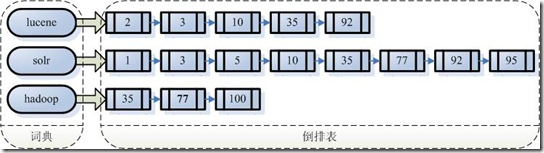
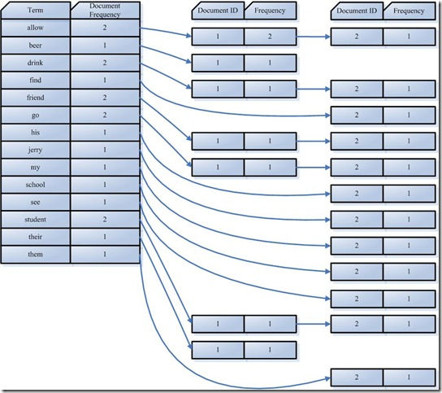
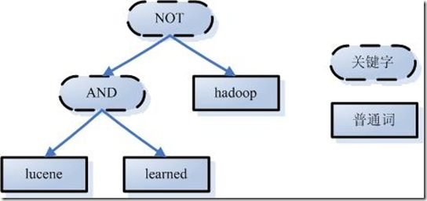

# ElasticSearch 篇

ES=elaticsearch简写， Elasticsearch是一个开源的高扩展的分布式全文检索引擎，它可以近乎实时的存储、检索数据；本身扩展性很好，可以扩展到上百台服务器，处理PB级别的数据。 

Lucene 与 ES 的关系：

- Lucene只是一个库。想要使用它，你必须使用Java来作为开发语言并将其直接集成到你的应用中，更糟糕的是，Lucene非常复杂，你需要深入了解检索的相关知识来理解它是如何工作的。

- Elasticsearch也使用Java开发并使用Lucene作为其核心来实现所有索引和搜索的功能，但是它的目的是通过简单的RESTful API来隐藏Lucene的复杂性，从而让全文搜索变得简单。

ES 主要解决问题：**检索相关数据**、**返回统计结果**、**速度要快**。

## 1. ES 核心概念

1. **Cluster：集群**
	- ES 可以作为一个独立的单个搜索服务器。不过为了处理大型数据集，实现容错和高可用性，ES 可以运行在许多互相合作的服务器上。这些服务器的集合称为集群。
2. **Node：节点**
	- 形成集群的每个服务器称为节点。
3. **Shard：分片**
	- 当有大量的文档时，由于内存的限制、磁盘处理能力不足、无法足够快的响应客户端的请求等，一个节点可能不够。这种情况下，数据可以分为较小的分片。每个分片放到不同的服务器上。 
	- 当你查询的索引分布在多个分片上时，ES会把查询发送给每个相关的分片，并将结果组合在一起，而应用程序并不知道分片的存在，即这个过程对用户来说是透明的。
4. **Replia：副本**
	- 为提高查询吞吐量或实现高可用性，可以使用分片副本。 
	- **<font color=red>副本是一个分片的精确复制</font>**，每个分片可以有零个或多个副本。ES 中可以有许多相同的分片，**其中之一被选择更改索引操作**，这种特殊的分片称为**主分片**。 
	- 当主分片丢失时，如：该分片所在的数据不可用时，集群将副本提升为新的主分片。
5. **全文检索**
	- 全文检索就是对一篇文章进行索引，可以根据关键字搜索，类似于 mysql 里的 like 语句。 
	- 全文索引就是把内容根据词的意义进行分词，然后分别创建索引，例如”你们的激情是因为什么事情来的” 可能会被分词成：“你们“，”激情“，“什么事情“，”来“ 等token，这样当你搜索“你们” 或者 “激情” 都会把这句搜出来。

## 2. ES 数据架构的主要概念

与关系数据库 Mysql 对比，ES 数据架构主要概念如下：

|MySQL|Elastic Search|
|:--:|:--:|
|Database|Index|
|Table|Type|
|Row|Document|
|Column|Field|
|Schema|Mapping|
|Index|Everything is indexed|
|SQL|Query DSL|
|SELECT * FROM table...|GET http://...|
|UPDATE table SET...|PUT http://...|

- 关系型数据库中的**数据库（DataBase），等价于ES中的索引（Index）**； 
- 一个数据库下面有 N 张表（Table），等价于 1 个索引 Index 下面有 N 多类型（Type）；
- 一个数据库表（Table）下的数据由多行（ROW）多列（column，属性）组成，等价于 **1 个 Type 由多个文档（Document）和多 Field 组成**。 
- 在一个关系型数据库里面，schema 定义了表、每个表的字段，还有表和字段之间的关系。 与之对应的，在 ES 中：Mapping 定义索引下的 Type 的字段处理规则，即索引如何建立、索引类型、是否保存原始索引 JSON 文档、是否压缩原始 JSON 文档、是否需要分词处理、如何进行分词处理等。 
（5）在数据库中的增 insert、删 delete、改 update、查 search 操作**等价于ES中的增PUT/POST、删Delete、改update、查GET**；

## 3. ELK
ELK = elasticsearch + Logstash + kibana。ELK 架构为数据分布式存储、可视化查询和日志解析创建了一个功能强大的管理链。 三者相互配合，取长补短，共同完成分布式大数据处理工作。

- **elasticsearch**：后台分布式存储以及全文检索；
- **logstash**：日志加工、搬运工；
- **kibana**：数据可视化展示。 

# Lucene 篇

> 参考地址：[《Lucene介绍与使用》](https://blog.csdn.net/weixin_42633131/article/details/82873731)

## 1. Lucene 简介

Lucene 是一套用于全文检索和搜寻的开源程序库，提供了一个简单却强大的 API，能够做全文索引和搜寻。在 Java 开发环境里，Lucene 是一个成熟的免费开放源代码工具，它并不是现成的搜索引擎产品，但可以用来制作搜索引擎产品。Solr 和 ElasticSearch 都是基于 Lucene 开发的企业级的搜索引擎产品。 Lucene 的 API 来实现对索引的增（创建索引）、删（删除索引）、改（修改索引）、查（搜索数据）。 

## 2. 全文检索

计算机索引程序通过扫描文章中的每一个词，**对每一个词建立一个索引**，指明该词在文章中出现的次数和位置。当用户查询时，检索程序就根据实现建立的索引进行查找，并将查找的结果反馈给用户的检索方式。总结起来，就是 Lucene 全文检索**对文档中全部内容进行分词**，然后**对单词建立倒排索引**的过程。  

## 3. 创建索引

与关系数据库 Mysql 对比，Lucene 数据架构主要概念如下：

|MySQL|Lucene|
|:--:|:--:|
|Database|Index|
|Table|Type|
|Row|Document|
|Column|Field|
|Schema|Mapping|
|Index|Everything is indexed|
|SQL|Query DSL|

  

代码实现流程如下：

```java
    // 创建索引
    @Test
    public void testCreate() throws Exception{
        //1 创建文档对象
        Document document = new Document();
        // 创建并添加字段信息。
        // 参数：字段的名称、字段的值、是否存储；
        // 这里选Store.YES代表存储到文档列表。Store.NO 代表不存储
        document.add(new StringField("id", "1", Field.Store.YES));
        // 这里我们 title 字段需要用 TextField，即创建索引又会被分词;
        // StringField 会创建索引，但是不会被分词
        document.add(new TextField("title", "谷歌地图之父跳槽facebook", 
                                   Field.Store.YES));

        //2 索引目录类,指定索引在硬盘中的位置
        Directory directory = FSDirectory.open(new File("d:\\indexDir"));
        //3 创建分词器对象
        Analyzer analyzer = new StandardAnalyzer();
        //4 索引写出工具的配置对象
        IndexWriterConfig conf = new IndexWriterConfig(Version.LATEST, analyzer);
        //5 创建索引的写出工具类。参数：索引的目录和配置信息
        IndexWriter indexWriter = new IndexWriter(directory, conf);

        //6 把文档交给IndexWriter
        indexWriter.addDocument(document);
        //7 提交
        indexWriter.commit();
        //8 关闭
        indexWriter.close();
    }
```

## 4. 创建索引的 API 详解

### 4.1 Document

文档对象 Document 对应数据库中的一行，是一条原始的数据；如下图所示；

  

### 4.2 Field

字段类 Field 对应数据库中的一列，有不同的数据类型。一个 Document 中可以有很多个不同的字段，每一个字段都是一个 Field 类的对象。由于一个 Document 中的字段的类型是不确定的，因此 Field 类就提供了各种不同的子类，来对应这些不同类型的字段。这些子类有一些不同的特性：

- **DoubleField、FloatField、IntField、LongField、StringField、TextField**：
	- 这些子类一定会被创建索引，但是不会被分词，而且不一定会被存储到文档列表。
	- 是否存储要通过构造函数中的参数 Store 来指定：如果**Store.YES**代表存储，**Store.NO**代表不存储；
- **TextField**：既创建索引，又会被分词；
	- 注：StringField 会创建索引，但不会被分词；如果不分词，会造成整个字段作为一个词条，除非用户完全匹配，否则搜索不到：
- **StoreField**：一定会被存储，但不一定会创建索引；
	- 注：StoredField 可以创建各种基础数据类型的字段；

> 注：相关问题：
> 
> - **问题1：如何确定一个字段是否需要存储？**
> 	- 如果一个字段要显示到最终的结果中，那么一定要存储，否则就不存储。
> - **问题2：如何确定一个字段是否需要创建索引？**
> 	- 如果要根据这个字段进行搜索，那么这个字段就必须创建索引。
> - **问题3：如何确定一个字段是否需要分词？**
> 	- 前提是这个字段首先要创建索引；
> 	- 然后如果这个字段的值是不可分割的，那么就不需要分词。例如：ID；

### 4.3 Directory

目录类 Directory 指定索引要存储的位置。有两种主要类型：

- **FSDirectory**：文件系统目录，会把索引库指向本地磁盘；
	- 特点：速度略慢，但是整体比较安全；
- **RAMDirecotry**：内存目录，会把索引库保存在内存；
	- 特点：速度快，但是不安全；

### 4.4 Analyzer

分词器类 Analyzer 提供分词算法，可以把文档中的数据按照算法分词。通常官方的分词器并没有合适的中文分词器，所以一般会用到第三方提供的分词器。比如 **IK 分词器**。  
IK 分词器的词库有限，新增加的词条可以通过配置文件添加到 IK 的词库中（即扩展词典），同时也可以把一些不用的词条（停止词典）去除。

### 4.5 IndexWriterConfig

索引写出器配置类 IndexWriterConfig，设定 Lucene 的版本与分词器类型，用来配置索引写出器。例如：

```java
//3 创建分词器对象
Analyzer analyzer = new StandardAnalyzer();
//4 索引写出工具的配置对象
IndexWriterConfig conf = new IndexWriterConfig(Version.LATEST, analyzer);
```

### 4.6 IndexWriter

IndexWriter 索引写出器类，用来实现对索引的增删改，即创建索引、删除索引、修改索引。

## 5. 查询索引数据

代码实现如下：

```java
    @Test
    public void testSearch() throws Exception {
        // 1. 创建索引目录对象
        Directory directory = FSDirectory.open(new File("d:\\indexDir"));
        // 2. 创建索引读取工具
        IndexReader reader = DirectoryReader.open(directory);
        // 3. 创建索引搜索工具
        IndexSearcher searcher = new IndexSearcher(reader);

        // 4. 创建查询解析器
        // 两个参数：默认要查询的字段的名称，分词器
        QueryParser parser = new QueryParser("title", new IKAnalyzer());
        // 5. 创建查询对象
        Query query = parser.parse("谷歌");

        // 6. 搜索数据
        // 两个参数：查询条件对象，以及要查询的最大结果条数
        // 返回的结果按照匹配度排名得分前 N 名的文档信息（包含查询到的总条数信息、所有符合条件的文档的编号信息）。
        TopDocs topDocs = searcher.search(query, 10);
        
        // 获取总条数
        System.out.println("本次搜索共找到" + topDocs.totalHits + "条数据");
        // 获取得分文档对象（ScoreDoc）数组
        // ScoreDoc中包含：文档的编号、文档的得分
        ScoreDoc[] scoreDocs = topDocs.scoreDocs;
        for (ScoreDoc scoreDoc : scoreDocs) {
            // 取出文档编号
            int docID = scoreDoc.doc;
            // 根据编号去找文档
            Document doc = reader.document(docID);
            System.out.println("id: " + doc.get("id"));
            System.out.println("title: " + doc.get("title"));
            // 取出文档得分
            System.out.println("得分： " + scoreDoc.score);
        }
    }
```

### 5.1 Query
Query 是查询对象，包含要查询的关键词信息；在上面的代码中，通过 QueryParser 解析关键字，得到查询对象。

### 5.2 高级查询

除了使用 QueryParser 解析之外，也可以通过自定义查询对象（高级查询），即通过 Query 的子类，直接创建查询对象，实现高级查询。实现高级查询的测试代码如下：

```java
    // 传入 Query 对象，实现高级查询
    public void search(Query query) throws Exception {
        // 1. 创建索引目录对象
        Directory directory = FSDirectory.open(new File("indexDir"));
        // 2. 创建索引读取工具
        IndexReader reader = DirectoryReader.open(directory);
        // 3. 创建索引搜索工具
        IndexSearcher searcher = new IndexSearcher(reader);

        // 4. 搜索数据
        // 两个参数：查询条件对象，以及要查询的最大结果条数
        // 返回的结果是按照匹配度排名得分前 N 名的文档信息（包含查询到的总条数信息、所有符合条件的文档的编号信息）。
        TopDocs topDocs = searcher.search(query, 10);
        // 5. 获取总条数
        System.out.println("本次搜索共找到" + topDocs.totalHits + "条数据");
        // 获取得分文档对象（ScoreDoc）数组.SocreDoc中包含：文档的编号、文档的得分
        ScoreDoc[] scoreDocs = topDocs.scoreDocs;

        for (ScoreDoc scoreDoc : scoreDocs) {
            // 取出文档编号
            int docID = scoreDoc.doc;
            // 根据编号去找文档
            Document doc = reader.document(docID);
            System.out.println("id: " + doc.get("id"));
            System.out.println("title: " + doc.get("title"));
            // 取出文档得分
            System.out.println("得分： " + scoreDoc.score);
        }
    }
```

#### 5.2.1 TermQuery

TermQuery 词条查询，**词条 Term 是搜索的最小单位**，不可以再被分词，而且值必须是字符串。

```java
    @Test
    public void testTermQuery() throws Exception {
        // 创建词条查询对象
        Query query = new TermQuery(new Term("title", "谷歌地图"));
        search(query);
    }
```

#### 5.2.2 WildcardQuery

WildcardQuery 通配符查询，类似于用数据库中 <code>like '%谷歌%'</code> 的通配符用法。

- **?** 字符可以代表任意一个字符；
- **\*** 字符可以代表任意多个任意字符；

```java
    @Test
    public void testWildCardQuery() throws Exception {
        // 创建查询对象
        Query query = new WildcardQuery(new Term("title", "*歌*"));
        search(query);
    }
```

#### 5.2.3 FuzzyQuery

FuzzyQuery 模糊查询， 允许用户输错，但是要求错误的最大编辑距离不能超过 2。**编辑距离**就是一个单词到另一个单词最少要修改的次数，比如 facebool --> facebook 需要编辑1次，编辑距离就是1。

```java
    @Test
    public void testFuzzyQuery() throws Exception {
        // 创建模糊查询对象:允许用户输错。但是要求错误的最大编辑距离不能超过2
        // 编辑距离：一个单词到另一个单词最少要修改的次数 facebool --> facebook 需要编辑1次，编辑距离就是1
//    Query query = new FuzzyQuery(new Term("title","fscevool"));
        // 可以手动指定编辑距离，但是参数必须在0~2之间
        Query query = new FuzzyQuery(new Term("title","facevool"),1);
        search(query);
    }
```

#### 5.2.4 NumericRangeQuery

数值范围查询 NumericRangeQuery 可以对非 String 类型的 ID 进行精确查找。

```java
	@Test
	public void testNumericRangeQuery() throws Exception{
		// 数值范围查询对象
		// 参数：字段名称，最小值、最大值、是否包含最小值、是否包含最大值
		Query query = NumericRangeQuery.newLongRange("id", 2L, 2L, true, true);
		search(query);
	}
```

## 6. 全文检索

> 参考地址：[《全文检索原理及实现方式》](https://blog.csdn.net/qq_16162981/article/details/70142166)

### 6.1 全文检索简介

我们生活中的数据总体分为两种：**结构化数据**和**非结构化数据**。其中结构化数据指具有固定格式或有限长度的数据，如数据库，元数据等。**非结构化数据**指**不定长或无固定格式的数据**，如邮件，word 文档等。  
对于非结构化数据（即对全文数据）进行搜索主要有两种方法。一是**顺序扫描**，比如要找内容包含某一个字符串的文件，就是一个文档一个文档的看，对于每一个文档，从头看到尾，如果此文档包含此字符串，则此文档为我们要找的文件，接着看下一个文件，直到扫描完所有的文件。当然这是一种特别慢的搜索方法。
另外一种方法就是全文检索。全文检索的思路类似于数据库的索引，它将非结构化数据中的一部分信息提取出来，重新组织，使其变得有一定结构，然后对此有一定结构的数据进行搜索，从而达到搜索相对较快的目的。这部分**从非结构化数据中提取出的，然后重新组织的信息**，我们称之索引。  
比如字典，字典的拼音表和部首检字表就相当于字典的索引，对每一个字的解释是非结构化的，如果字典没有音节表和部首检字表，在茫茫辞海中找一个字只能顺序扫描。然而字的某些信息可以提取出来进行结构化处理，比如读音，就比较结构化，分声母和韵母，分别只有几种可以一一列举，于是将读音拿出来按一定的顺序排列，每一项读音都指向此字的详细解释的页数。我们搜索时按结构化的拼音搜到读音，然后按其指向的页数，便可找到我们的非结构化数据——也即对字的解释。这种**先建立索引，再对索引进行搜索的过程**就叫**全文检索 (Full-text Search) **。

全文检索大体分两个过程，**索引创建 (Indexing)** 和**搜索索引 (Search)**。

- **索引创建**：将现实世界中所有的结构化和非结构化数据提取信息，创建索引的过程。
	1. 有一系列待索引文件；
	2. 被索引文件经过语法分析和语言处理形成一系列**词 (Term)** 。
	3. 经过索引创建形成**词典**和**反向索引表**。
	4. 通过索引存储，将索引写入硬盘。
- **搜索索引**：得到用户的查询请求，搜索创建的索引，然后返回结果的过程。
	1. 用户输入查询语句。
	2. 对查询语句经过语法分析和语言分析，得到一系列**词(Term)** 。
	3. 通过语法分析，得到一个**查询树**；
	4. 通过索引存储，将索引读入到内存。
	5. 利用查询树**搜索索引**，从而得到每个词 (Term) 的文档链表；根据查询树逻辑运算，对文档链表进行交集、差集、非运算，并得到结果文档。
	6. 将搜索到的结果文档进行**查询的相关性排序**。
	7. 返回查询结果给用户。

### 6.2 索引创建

非结构化数据中所存储的信息是每个文件包含哪些字符串，也即已知文件，欲求字符串相对容易，也即是从文件到字符串的映射。而我们想搜索的信息是哪些文件包含此字符串，即已知字符串，欲求文件，也就是**从字符串到文件的映射**。两者恰恰相反。于是如果索引总能够保存从字符串到文件的映射，则会大大提高搜索速度。   

#### 6.2.1 索引创建简述

假设我的文档集合里面有100篇文档，为了方便表示，我们为文档编号从1到100，得到下面的结构：

 

左边保存的是一系列字符串，称为<font color=red>**词典**</font>；右面表示每个字符串都指向包含此字符串的**文档 (Document) 链表**，此文档链表称为<font color=red>**倒排表 (Posting List)**</font>。  
有了索引，便使保存的信息和要搜索的信息一致，可以大大加快搜索的速度。


> 注：比如说，我们要寻找既包含字符串“lucene”又包含字符串“solr”的文档，我们只需要以下几步：
> 1. 取出包含字符串“lucene”的文档链表。
> 2. 取出包含字符串“solr”的文档链表。
> 3. 通过合并链表，找出既包含“lucene”又包含“solr”的文件。
> 
>  

顺序扫描是每次都要扫描，而创建索引的过程仅仅需要一次，以后便是一劳永逸的了，每次搜索，创建索引的过程不必经过，仅仅搜索创建好的索引就可以了。这也是全文搜索相对于顺序扫描的优势之一：**一次索引，多次使用**。

#### 6.2.2 索引创建原理

创建原理在文章[《全文检索原理及实现方式》](https://blog.csdn.net/qq_16162981/article/details/70142166)有详细的说明，这里只进行总结。

1. 准备一些要索引的原文档 (Document)；例如有文档：
	- 文档 1：Students should be allowed to go out with their friends, but not allowed to drink beer；
	- 文档 2：My friend Jerry went to school to see his students but found them drunk which is not allowed.
2. **文档分词**：做分词、去除标点符号、去除无效词 (a, the, this) 等，获得词元；
3. **词元处理**：如变为小写、去除复数、转为一般现在时等操作；
4. **构建索引**：将处理后的词元传给索引组件，创建得到一个字典。按照字母顺序排序后，可以得到每个词元**在每个文档中出现的频率**。将每个词信息合并，并按照频率倒序排序，可以得到倒排链表。
	- 
	- **文档频次 (Document Frequency)**：总共有多少文件包含此词 (Term)。
	- **词频率 (Frequency)**：文件中包含了几个此词 (Term)。

### 6.3 搜索索引

问题：如何像 Google 一样在成千上万的搜索结果中，找到和查询语句最相关的呢？如何判断搜索出的文档和查询语句的相关性呢？

#### 6.3.1 输入查询语句

查询语句也是有一定语法的，比如最基本的 AND, OR, NOT 等。

#### 6.3.2 查询语句构建语法树

1. **词法分析**：识别单词和关键字；比如提取查询语句的 AND, NOT 等；
2. **语法分析**：形成语法树；
3. **语言处理**：同词元处理；



#### 6.3.3 搜索索引

按照语法树，对索引进行搜索。类似于 6.2.1 的过程。

#### 6.3.4 计算相关性排序

计算文档和查询语句的相关性，我们可以把查询语句看作一片短小的文档，对文档与文档之间的**相关性 (relevance) 进行打分 (scoring)**，分数高的相关性好，排在前面。  
文档由很多词组成，找出词对文档重要性的过程，又称为**计算词的权重 (Term weight)**。影响一个词在一片文档中重要性的关键因素：

1. **Term Frequency (tf)**：某个词在某篇文档中出现的次数；TF 值越大，说明该词越重要；
	- 可以理解为：一个词在某篇文档中出现的次数很多，说明该文档就是讲这方面的问题的；所以说明这个词在这篇文章很重要。
2. **Document Frequency (df)**：所有文档中，某个词在多少文档中出现过；DF 值越大，说明该词越不重要；
	- 例如：this 在很多文档中出现，但它并不重要。

判断 Term 之间关系从而得到文档相关性的过程，就是向量空间模型算法。该算法**把文档看作一系列词 (Term)**，每一个词 (Term) 都有一个权重 (Term weight)。不同的词 (Term) 根据自己在文档中的权重来影响文档相关性的打分计算。计算方法在前面所述的文档中可以计算。

比如计算一个共有 11 个词的查询语句，共有三篇文档搜索出来，首先计算所有词的权重，然后根据打分公式分别计算查询语句与三篇文档的相关性。最后按照相关性进行排序，即可得到最想要的文档。


# Logstash 篇


# Kibana 篇

