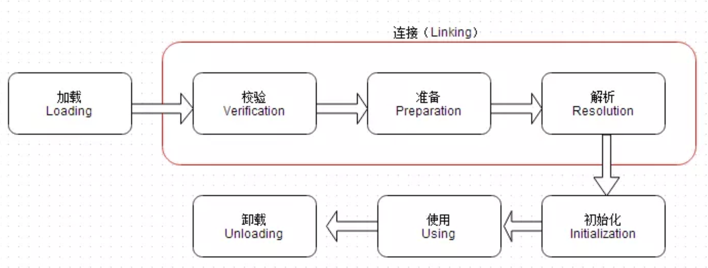
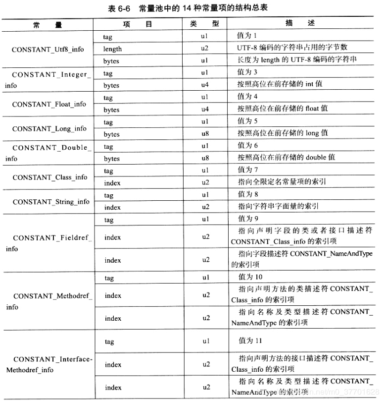
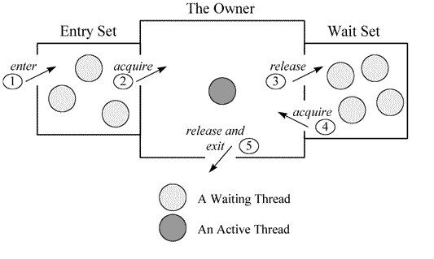

# 一. JVM 调优，工作中怎么用，GC 算法和回收策略有哪些

**JVM 调优如何使用**：

笔者首先会使用到的工具：

- java 自带工具：JVisualVM 用于监控，jstack 查看线程状态，jmap 用于堆 dump；
- Memory Analyser：载入堆 dump 文件，进行分析。

1. 在项目启动的时候，加入 -XX:+PrintGCDetails 参数，可以观察 GC 的频率。观察 GC 频率可以判断 GC 频率是否正常（主要是针对 Full GC）。如果不正常，就可以观察 GC 日志，并且针对 GC 的频率进行原因的猜测。
2. 如果有堆 Dump 文件，则可以观察内存中占据最大空间的对象是什么，如果有特定的某些对象占据了太大的对象，则需要重新考虑是否有可以优化的空间？（比如 C3P0 连接池资源过大，太多的 HashMap 节点占据过大内存等）

GC 回收算法：

1. **标记-清除算法**：对需要回收的对象进行标记，然后清除；
2. **复制算法**：将内存区域分为两部分 A, B 区域，发生 GC 时，将 B 区域的所有内容复制到 A 区域，然后清除 B 区域所有内容。发生第二次 GC 时反过来。
	- 适用于朝生夕死对象较多的情况下；
	- 在实际使用时 (如 Parallel Scavange 收集器)，多数情况下只在两块小区域中进行复制操作，这两块小区域通常是在新生代中。新生代分为三部分：Eden + Survivor * 2 (To Survivor, From Survivor)，三者比例通常为 8:1:1。通常如果发生 minor GC 时，将 Eden + Survivor1 的存活的对象全部拷贝到 Survivor2 中，然后将 Eden 和 Survivor1 的全部对象清除。
3. **标记-整理算法**：将需要回收的对象进行标记并清除，然后内存碰撞，所有对象的内存移到一一端。
4. **分代回收算法**：垃圾收集器大多都是只针对新生代或者老年代，所以商用的垃圾收集器一般都会分别针对新生代与老年代，用不同的分代回收算法进行垃圾回收。

**GC 回收策略**：

有几种不同的垃圾收集器，不同收集器各自有各自的收集对象以及收集策略；

1. **Serial** + **Serial Old** 收集器：两者都是串行收集器；Serial 收集器用于新生代的 Minor GC，单线程的 STW GC；Serial Old 收集器用于旧生代，单线程的 STW Full GC；
2. **ParNew** 收集器：Serial 收集器的多线程版本，用于新生代的 GC；
3. **Parallel Scavenge** + **Parallel Old** 收集器：两者都是并行收集器，且都是强调 GC 时间的垃圾收集器。可以通过设置垃圾收集的比率 (程序时间 / (程序时间 + GC 时间))，或者 GC 最大时间，来保障 GC 时间不会过长。但这样也牺牲了新生代空间大小，以及吞吐量大小。
	- Parallel Scavenge: 针对新生代，使用复制算法。
	- Parallel Old: 针对旧生代，使用标记-整理算法。
4. **CMS 收集器**：用于旧生代，强调最短回收时间，使用标记-清除算法。
	- 步骤：
		- (1) 初始标记：标记 GC Roots 直接关联的对象；
		- (2) 并发标记：标记 GC Roots 链上的所有对象，时间最长；
		- (3) 重新标记：标记在并发标记过程中产生的对象，时间不长；
		- (4) 并发清除：对所有被标记的对象进行并行的回收（使用标记-清除算法）；
	- 缺点在于使用了标记-清除算法，容易在内存空间中产生碎片。
5. **G1 收集器**，是一种新式的收集器，对旧生代、新生代没有明确的区分对待，因为它将堆内存划分为若干个 Region，旧生代和新生代与之前的定义不同，物理上不再隔离。标记清除的步骤和 CMS 收集器相似。

**GC 分配内存策略**：

1. 给对象分配内存时，首先优先分配到 Eden 区；随着 GC 次数的增加，Eden + Survivor1/2 的内存会用 minor GC 的**复制算法**将内存转移到 Survivor2/1 中，这样的操作会让对象的 GC 年龄 +1；
2. 对于比较大的对象 (比如较长的 String 或者数组)，可能会直接进入旧生代。在虚拟机参数中可以设置该参数 -XX:PertenureSize，大于该值的对象便直接进入旧生代。
3. 对于年龄比较大的对象，即经过了多次 minor GC 的对象，会进入旧生代。虚拟机参数 -XX:MaxTenuringThreshold 设置该值，默认值为 1；
4. 并非所有对象年龄都必须达到 MaxTenuringThreshold 值才会晋升老年代，虚拟机会针对根据对象年龄，以及对象的大小，动态的判定是否可以直接进入老年代。Survivor 空间中相同年龄所有对象的大小之和**大于 Survivor 空间的一半，年龄大于或等于该年龄的对象**可以直接进入旧生代；
5. **分配担保策略**：在进行 Minor GC 之前，判断旧生代可用空间是否大于新生代中所有对象大小之和；如果是，则这次 Minor GC 是安全的；如果不是，则需要根据虚拟机参数 HandlePromotionFailure 值，判断是否允许担保失败。如果该值为是，判断老年代可用空间是否大于一个经验值，如果大于，则尝试一次 MinorGC，如果小于，则进行 Full GC。

> 注：GC 机制见下。

# 二. GC 机制

GC 的机制是什么？垃圾回收器的基本原理是什么？是否可以立即回收内存？怎么样主动的通知 JVM 进行垃圾回收？

## 2.1 GC 的目标与流程

GC 的目标，是在 GC Root 链之外的所有对象，GC Roots 是可达性分析算法的回收目标。GC Root 对象如下：

- <font color=red>**被 JVM 栈引用的所有对象**</font>；
- 方法区中，类静态引用的对象；
- 本地方法中静态引用的对象；
- 方法区中常量引用的对象；

可达性分析时，需要找 GC Roots 的引用链。为了保证 GC Roots 状态的一致性，整个分析 GC Roots 引用链的过程就像是冻结了时间一样，即 Stop the world。  
Stop the world 时，JVM 使用 OopMap 记录哪些地方存放着对象引用。由于为了权衡 OopMap 的大小与数量（如果 OopMap 数量过多，会比较频繁的出现 GC，如果 OopMap 大小过大，每次的 GC 时间会过长），所以 HotSpot JVM 在特定的位置记录 OopMap，这些特定的位置称为**安全点 (SafePoint)**。  
GC 开始时需要中断线程，各个线程开始主动轮询一个中断标志，这个中断标志和一个安全点是重合的。各线程轮询时发现中断标志为真，就自己中断挂起。此外，对于处于 sleep, blocked 状态的线程，在进入 sleep, blocked 状态时，就会标注自己处于一个**安全区域**。对于处于安全区域的线程，不会参与前面所说的中断标志位的轮询过程。

## 2.2 引用的类型

引用的区分：

- **强引用**：类似于 new Object()，无论如何都不会被回收，即使 OOM 异常；
- **软引用**：JVM 内存不够的时候就会回收；
- **弱引用**：只要 GC 就会回收 (WeakHashMap 与其有关)
- **虚引用**：没什么卵用，摆设一个而已

对于方法区，类很少会被回收，或者说类被回收的条件很苛刻：

1. 该类不存在任何实例对象；
2. 该类的 ClassLoader 已经被回收；
3. 没有任何地方调用该类的反射；

> 注：垃圾回收基本原理见前面的 GC 算法原理；

立即回收内存？不一定。

主动通知 JVM 进行垃圾回收：System.gc();

# 三. 类加载机制、类加载器

> 参考地址：  
>
> [《类加载机制-深入理解jvm》](https://www.jianshu.com/p/3556a6cca7e5)  
>
> [《Java Class文件格式、常量池项目的类型、表的结构》](https://blog.csdn.net/m0_37701628/article/details/86684589)  

## 3.1 类的加载过程

Java 类的加载过程主要分为五步：**加载**、**验证**、**准备**、**解析**、**初始化**。其中验证、准备、解析可以合称为**连接**。此外，这五步的顺序并不是完全固定的，比如为了支持动态绑定，解析的过程可以放在初始化之后。类的加载过程如下图所示：



### 3.1.1 加载

加载过程主要做三件事情：

1. 根据全类名获取 **\*.class** 文件的路径，通过二进制流读入 JVM 的方法区；
2. 在方法区中将该字节流转为方法区的运行时数据结构；
3. 在堆中生成代表该类的 **java.lang.Class** 对象，Class 对象的实例作为访问**方法区中运行时数据结构的访问入口**；

### 3.1.2 校验

校验阶段主要确保 Class 文件字节流中的内容不会违反当前 JVM 的规范，不会危害到 JVM 运行时的安全。主要验证的有**文件格式、元数据、字节码、符号引用**。

### 3.1.3 准备

准备阶段主要是将为类变量分配内存，并初始化为默认值。以下面的片段为例：

```java
public static int value = 111;
```

需要注意的是，在准备阶段对于 int 类型，**初始默认值为 0** 而不是 111。同样的，其他基本类型的初始默认值都是该基本类型的默认值（如 double 的 0.0）。将 value 赋值为 111 的操作在初始化的步骤（即 clinit 方法）中进行。

### 3.1.4 解析

解析是将**符号引用**转换为**直接引用**的过程。

- **符号引用**：一组用于标识类型的符号，符合 Java 虚拟机规范的常量表，例如其中一项**常量池项目类型**如下图所示；
- **直接引用**：在内存中能够唯一标识对象的引用。可以是内存指针、偏移量、或者是能间接定位到目标的句柄等。



### 3.1.5 初始化

执行类构建方法 **clinit** 的过程。clinit 方法由**所有类变量的赋值动作**和**静态语句块 static{}** 合并而来，这其中也包含了父类的 clinit 方法（类变量赋值动作与父类的静态语句块），同时在执行一个类的 clinit 方法时，也会通过递归方式保证其**父类的 clinit 方法先被调用**。

此外对于初始化阶段，只有几种情况才会要求类立刻执行 clinit 方法：

1. **new**：new 关键字某个未被初始化的类；
2. **父类**：初始化某子类时，父类未被初始化，则先初始化父类；
3. **反射**：通过反射调用某个未初始化的类；
4. **main 方法所在类**；

## 3.2 类加载器

ClassLoader 中有一个 ClassLoader parent，记录其父类加载器。根类加载器 bootstrap ClassLoader 是最顶层的 ClassLoader，没有父类加载器。类加载器的加载范围不同，如果子类加载器想要加载父类加载器已经加载的类，可以通过双亲委派机制，直接访问父类加载器已经加载的类。   
但是有的时候父类加载器也需要加载子类加载器的 Class，这时候就需要打破双亲委派机制，主要方式是使用 Thread 类里的线程上下文类加载器的方法 setContextClassLoader。

# 四. JVM 的内存结构

哪些是共享的，哪些是线程私有的？ Java虚拟机里堆栈分别存放什么？

# 五. Java的类加载在哪些情况下会触发？

《深入 Java 虚拟机》P210

- new 指令
- 调用到类的 static 内容
- 反射调用
- 初始化时，如果发现父类没有初始化，则对其进行初始化

# 六. 频繁老年代回收怎么分析和解决？

帖子回复：

1. full GC 频繁回收 是不是 你分配的 年轻代  内存空间不够 导致要回收老年的堆来释放内存
2. 你说的是其中的一个原因，不过后来多调试了几次，发现了永久代空间太小导致了full gc的执行更频繁。在网上找到了导致full gc的执行的因素：
	- 年轻代空间不足
	- per Gen（永久代）空间满
	- CMS GC时出现promotion failed和concurrent mode failure
	- 统计得到的Minor GC晋升到旧生代的平均大小大于旧生代的剩余空间等
3. 个人觉得，优化手段已经可以了，如果效果不明显，不妨看看业务代码是不是有自己的问题。使用工具抓一下内存，分析一下，哪些对象是最多的，是否合理。jvm优化也有极限，核心问题还是代码质量。
4. JVM调优肯定得看gc log，然后针对性分析、调优。没有通用的、一劳永逸的方案。
5. 我个人认为在项目基本完成后先监控jvm，进行内存和cpu占用率等等的分析会更快发现优化的地方
	- 在开发中为了及时交付不能不在代码质量上做一些牺牲；
	- 团队开发，难免会有良莠不齐的状况导致了整体质量的下降；
	- 在开发一段时间后，囿于个人代码的习惯等等原因很难发现优化的地方
6. Full GC本身是好的，可以清除老年代的垃圾，但是如果Full GC发生的频率高了，就会影响性能，同时意味着系统内存分配机制出现问题。
	- 因为Full GC本身执行时间较长（甚至超过1秒），而且除非采用G1 GC，否则其它的GC方式都会或多或少挂起所有线程执行（Stop-the-world），如果Full GC频繁发生，系统被挂起的次数就会增加，响应时间就会变慢。
	- 同时，Full GC频繁发生，意味着你的内存分配机制存在问题，也许是内存泄露，有大量内存垃圾不断在老年代产生；也许是你的大对象（缓存）过多；也有可能是你的参数设置不好，minor GC清理不掉内存，导致每次minor GC都会触发Full GC；还有可能是你的老年代大小参数设置错误，老年代过小等等原因

# 七. JVM 逃逸分析

> 参考地址：[《JVM的逃逸分析》](https://www.jianshu.com/p/f8326e26b6f9)

## 7.1 逃逸的定义

一个对象（或变量）在方法中处理完毕返回时，返回结果可能会被其他对象引用，或者全局引用，这种现象即为**逃逸**。或者可以说，一个对象指针被多个线程或方法引用时，该对象指针就是逃逸状态。

```java
public StringBuilder escapeDemo1(String a, String b) {
    StringBuilder stringBuilder = new StringBuilder();
    stringBuilder.append(a);
    stringBuilder.append(b);
    return stringBuilder;
}
```

上述代码中，StringBuilder 在方法中是局部的，但返回时可能会有多个线程或方法引用 StringBuilder，这时就构成了逃逸。如果要改为非逃逸情况，则应该返回 String，最后 <code>return stringBuilder.toString()</code>。

## 7.2 逃逸分析的原理

方法栈上对象的调用，正常情况下应该是栈向 Java 堆中查找对象的引用，然后从堆中加载该对象到栈中，直到方法结束。  
逃逸分析的优化后，不会将对象放到 Java 堆中，而是直接放到了栈中，此时该对象在栈中属于局部变量，不会发生逃逸。而且随着方法执行完毕，栈内存被回收，局部变量也回收了，这样也变相的减轻了 GC 的压力。

## 7.3 逃逸分析适用范围

由于栈空间一般小，无法存储大容量数据，所以目前的实现都是采用不那么准确，但是时间压力相对较小的算法来完成逃逸分析，可能导致效果不稳定。逃逸分析的效果只能在满足**高频和高数量**的**小容量的变量**分配结构，才是合适的。

# 八. JVM 的锁优化

> 参考地址：  
> [《java 中的锁 -- 偏向锁、轻量级锁、自旋锁、重量级锁》](https://blog.csdn.net/zqz_zqz/article/details/70233767)  
> [《彻底搞懂synchronized(从偏向锁到重量级锁)》](https://blog.csdn.net/qq_38462278/article/details/81976428)  
> [《synchronized实现原理》](https://blog.csdn.net/qq_41701956/article/details/83660927)

在介绍 JVM 锁优化之前，首先明确几个概念，用于后续的介绍。

## 8.1 线程状态切换

由于需要限制不同的程序之间的访问能力，防止他们获取别的程序的内存数据，或者获取外围设备的数据，CPU 划分出两个权限等级：**用户态**和**内核态**。  

- **内核态**：CPU 可以访问内存所有数据，可以访问硬盘、网卡等外围设备；也可以将自己从一个程序切换到另一个程序；
- **用户态**：只能访问受限的内存，不允许访问外围设备。占用 CPU 的能力被剥夺，CPU 资源可以被其他程序获取；

Java 程序运行时，在若干线程抢夺 <code>synchronized</code> 的锁时，只有一个线程抢夺成功，其他线程会进入阻塞状态，等待锁的释放。但 **Java 线程是映射到操作系统的原生线程上的**，**阻塞**与**唤醒**一个 Java 线程，需要操作系统的介入，也就是**<font color=red>用户态与内核态的切换</font>**。  
线程状态的切换会消耗大量的资源，因为用户态、内核态都有自己专用的资源（内存空间、寄存器等），从用户态切换到内核态时，用户态需要向内核态传递很多信息，同时内核态又要保存好自己运行时所需的信息，用于状态切换回内核态之后正常的后续工作。  
所以**理解 Java 线程切换代价，是理解 Java 中各种锁的优缺点的基础之一**。在我们使用锁的时候，需要估算**代码执行的时间**以及**线程状态切换是否频繁**。如果代码执行时间较短，或者线程状态切换很频繁，那么比较未获取锁的线程挂起消耗的时间，以及获取锁线程的代码执行时间，前者比后者消耗时间更长，这样的同步策略是很糟糕的。  
synchronized 会导致**争用不到锁的线程进入阻塞状态**，所以它是 Java 语言中的重量级同步操作。为了优化上述性能问题，Java 从 1.5 版本之后引入**偏向锁**与**轻量锁**（包括自旋锁），默认开启**自旋锁**。

> 注：轻量级锁与重量级锁：  
> 
> - **轻量级锁**：自旋锁、偏向锁、轻量锁
> - **重量级锁**：synchronized

## 8.2 markword

**markword** 是所有 Java 对象数据结构的一部分，它是所有 Java 对象锁信息的表示，此处对其进行简要介绍。markword 是一个 32/64 bit 长度的数据，其中**最后两位是锁状态标志位**。

|状态|标志位|存储内容|
|:--:|:--:|:--|
|未锁定偏向锁|01|对象 HashCode、对象分代年龄（偏向锁标志为 0 时）|
|可偏向|01|偏向线程ID、偏向时间戳、对象分代年龄（偏向锁标志为 1 时）|
|轻量级锁定|00|指向锁记录的指针|
|重量级锁定|10|执行重量级锁定的指针|
|GC 标志|11|空（不需要记录信息）|

上述基本内容说明完毕后，可以进行后续关于锁优化的说明。 对于 synchronized 这个关键字，可能之前大家有听过，他是一个重量级锁，开销很大，建议大家少用。但到了 JDK 1.6 之后，该关键字被进行了很多的优化，建议大家多使用。因为优化之后的 synchronized 关键字并非一开始就在对象上加了重量级锁，而是从**偏向锁 -> 轻量级锁（自旋锁）-> 重量级锁**逐步升级的过程。

## 8.3 偏向锁

偏向锁是 JDK 1.6 引入的一项锁优化，其中的“偏”是偏心的偏。偏向锁会**偏向于第一个获得它的线程**，在接下来的执行过程中，假如该锁没有其他线程来竞争该锁，也没有被其他线程获取，那么持有偏向锁的线程将永远不需要进行同步操作。

前面的介绍中可以了解到，每个对象都有锁信息，对象关于锁的信息是存到 markword 中的。当我们创建一个锁对象，并命名为 lockObject：

```java
// 随便创建一个对象
Object lockObject = new Object();
synchronized(lockObject) {
    // ......
}
```

上述代码我们可以分为主要的两步：**创建对象、对象加锁**。  
**第一步，创建对象**：在我们创建这个 lockObject 对象时，该对象的 markword 关键数据如下：

|bit fields|锁标志位|是否偏向锁|
|:--|:--|:--|
|Hash|01|0|

表中数据可知，锁标志位为 **01**，说明当前锁状态为偏向锁；【是否偏向锁】的状态为 0，说明当前对象还没有被加上偏向锁。这里也说明了，所有对象在被创建了之后，都是可偏向的，但是刚刚被创建出来的时候，锁信息【是否偏向锁】的状态都为 0，即创建对象的偏向锁还没有生效。

**第二步，对象加锁**：当线程执行到**临界区**时，执行操作：

1. 使用 CAS 操作将线程 ID 插入到 Markword 中；
2. 修改偏向锁标志位；

此时 markword 结构信息如下：

|bit fields||锁标志位|是否偏向锁|
|:--|:--|:--|:--|
|thread ID|epoch|01|1|

此时该对象偏向锁的【是否偏向锁】标志置为 1，说明偏向锁生效了，同时线程 ID 也存入了 markword 中。  
该线程在之后的执行过程中，如果再次进入相同的同步代码段中，并不需要进行 synchronized 关键字通常需要做的加锁、解锁的操作，而是进行如下步骤：

1. **判断线程 ID**：比较当前线程 ID 与该对象 markword 的线程 ID 是否一致；
	- 如果一致，说明该线程已经成功获取了锁，继续正常执行同步代码块中的代码；
	- 如果不一致，进入下一步；
2. **检查对象【是否偏向锁】状态**；
	- 如果为 0，这是前面第一次获取锁的操作，执行前面说的工作，使用 CAS 操作竞争锁；
	- 如果为 1，而且偏向的不是自己（markword 中线程 ID 与当前线程不同），说明锁存在竞争，进入下一步；
3. 执行**锁膨胀**与**锁撤销**；
	- 锁膨胀：偏向锁失效，锁升级为轻量级锁；
	- 锁撤销：锁升级后，将该锁撤销；（该步骤消耗较大）
		- (1) 在一个**安全点**停止拥有锁的线程；（安全点会导致 stop the world，性能下降严重）
		- (2) 遍历该线程的线程栈，如果存在锁记录，需要修复所有 markword，变成无锁状态；
		- (3) 唤醒当前线程，**将当前偏向锁升级为轻量级锁**；

所以如果大部分同步代码块都是由两个及以上线程竞争，那么偏向锁本身就是一种累赘，这种情况下我们可以在程序运行之前设置 JVM 参数 <code>-XX:-UseBiasedLocking</code>将偏向锁默认功能关闭。

## 8.4 轻量锁

锁撤销升级为轻量锁后，锁对象的 markword 会进行相应的变化，线程中所有栈帧创建锁记录 LockRecord，修改所有与锁对象相关的栈帧信息。  
修改后的锁对象的 markword 改为：

|bit fields|锁标志位|
|:--|:--|
|指向 LockRecord 的指针|00|

轻量级锁主要分为两种：**自旋锁**与**自适应自旋锁**。

## 8.5 自旋锁

自旋锁主要目的是为了**避免用户线程与内核切换引起的消耗**。如果持有锁的线程能在很短的时间内释放锁资源，那么等待锁释放的线程暂时不用做线程状态切换（即线程不用进入阻塞挂起状态），只需要让 CPU 等一等，也就是进入自旋状态，等待锁释放后立即获取锁，这样就避免了线程状态切换引起的消耗。  
但是线程的自旋需要消耗 CPU，自旋状态下 CPU 是处于无效运行状态的。所以需要设定一个**自旋等待的最长时间**，如果在这段时间内一直获取不到锁，那么就进入阻塞状态。  
在 JDK 1.5 版本下，自旋周期是定死的，1.6 版本下引入了**自适应自旋锁**，通常情况下认为一个线程上下文切换所需时间是一个比较好的值（默认情况下自旋次数为 10 次）。JVM 针对当前 CPU 负荷情况做了一定的优化，具体策略此处不细讲。如果线程自旋次数超过了这个值，自旋的方式就不适合了，这时候锁再次膨胀，升级为**重量级锁**。  

自旋锁的优缺点：

- **优点**：对于**锁竞争不激烈**，或者**占用锁时间短的代码**，这两种情况下，自旋的消耗远小于切换线程状态的消耗，所以性能会有大幅度的提升；
- **缺点**：不适合**锁竞争激烈**、**执行时间长的同步代码块**，这两种情况下自旋时间较长，经常会超过最长等待时间进入阻塞状态，这样会浪费很多 CPU 资源。对于这种情况，应该关闭自旋锁。

> 注：轻量级锁也被称为**非阻塞同步锁**、**乐观锁**，因为这个过程并没有把线程阻塞挂起，而是让线程空循环等待。

## 8.6 重量级锁

> 参考地址：  
> [《synchronized实现原理》](https://blog.csdn.net/qq_41701956/article/details/83660927)
> [《深入理解Java并发之synchronized实现原理》](https://blog.csdn.net/javazejian/article/details/72828483#synchronized%E5%BA%95%E5%B1%82%E8%AF%AD%E4%B9%89%E5%8E%9F%E7%90%86)

升级重量级锁完毕后，markword 部分数据为：

|bit fields|锁标志位|
|:--|:--|
|指向 Mutex 的指针|10|

前面说过，重量级锁性能消耗最大的地方在于**用户态向内核态的转换**。重量级锁也被称为互斥锁、悲观锁、阻塞同步锁，是依赖对象内部的 **monitor 锁**实现的，monitor 是依赖**操作系统的 MutexLock，即互斥锁**实现的。在 Java 虚拟机中，monitor 是由 ObjectMonitor 实现的，在 HotSpot 虚拟机源码中定义数据结构如下：

```cpp
ObjectMonitor() {
    _header       = NULL;
    _count        = 0; // 记录个数
    _waiters      = 0,
    _recursions   = 0;
    _object       = NULL;
    _owner        = NULL; // 记录持有当前 ObjectMonitor 对象的线程
    _WaitSet      = NULL; // 处于wait状态的线程，会被加入到_WaitSet
    _WaitSetLock  = 0 ;
    _Responsible  = NULL ;
    _succ         = NULL ;
    _cxq          = NULL ;
    FreeNext      = NULL ;
    _EntryList    = NULL ; // 处于等待锁 block 状态的线程，会被加入到该列表
    _SpinFreq     = 0 ;
    _SpinClock    = 0 ;
    OwnerIsThread = 0 ;
  }
```

ObjectMonitor 中有两个队列 **EntryList** 与 **WaitSet**，用来保存 <code>ObjectWaiter</code> 对象列表，<code>ObjectWaiter</code> 对象用来封装每个等待该 monitor 的线程。**owner** 指针指向 ObjectMonitor 对象的线程。ObjectMonitor 对象的执行流程图如下：



1. 多个线程同时访问某段同步代码，首先进入 EntryList（即图中的 EntrySet）；
2. 在 EntryList 与 WaitSet 中的线程争抢进入 owner 中，成功进入到 owner 的线程使 ObjectMonitor 对象的 count 值 +1；
3. 如果线程调用 <code>wait()</code> 方法，则该线程会放弃争取该 ObjectMonitor 的权利，进入 WaitSet 线程等待室中，等待被唤醒（通过<code>notify() / notifyAll()</code> 方法唤醒）
	- 如果当前线程在 owner 中，则释放当前 monitor，owner 指针置为 NULL，count 减 1，从 owner 中转移到 WaitSet 中；
	- 如果当前线程在 EntryList 中，则转移到 WaitSet 中；
4. 如果 owner 中的当前线程执行完毕，释放 monitor 并复位变量的值，其他在 EntryList 与 WaitSet 中的所有线程重新争抢进入 Owner 中。

# 九. volatile 关键字

> 参考地址：[《并发关键字volatile（重排序和内存屏障）》](https://www.jianshu.com/p/ef8de88b1343)

## 9.1 volatile 关键字

Volatile 变量具有 synchronized 的可见性特性，但是不具备原子特性。它有两条特性：

1. 禁止指令的重排序；保证了有序性；
2. 当一个线程修改了内存，volatile 关键字保证它能够立即刷新到主内存中；这条特性保证了 volatile 关键字的可见性；

## 9.2 指令重排序

通常情况下，处理器为了提高程序运行效率，可能会对输入代码进行优化，进行**指令的重排序**。它不保证程序中各个语句先后执行顺序与代码中完全一致，但保证程序最后执行结果与代码顺序一致。  
编译器与处理器在重排序时，会遵守数据依赖性，不会改变存在数据依赖的指令的执行顺序。对于单线程程序，指令的重排序不会改变执行结果，但对于多线程程序，指令的重排序可能会对程序执行结果产生影响。所以需要**内存屏障**保证可见性。

## 9.3 内存屏障

内存屏障主要有两个作用：

1. 阻止屏障两侧的指令重排序；
2. 强制把写**缓冲区**与**高速缓存**的脏数据等写回主内存，让缓存中相应的数据失效。

内存屏障可以分为两种：

1. **Load Barrier**：读屏障，在指令前插入 Load Barrier，可以让高速缓存中的数据失效，强制从主内存中加载数据；
2. **Store Barrier**：写屏障，在指令后插入 Store Barrier，可以将写入缓存中的最新数据更新写入到主内存中，令其他线程可见；

将两种内存屏障进行两两组合，可以完成数据同步操作，也是 volatile 关键字的关键。

- **LoadLoad**：L1; LoadLoad; L2
	- 在 L2 与后续读取操作之前，保证 L1 要读取的数据被读取完毕；
- **LoadStore**：L; LoadStore; S
  - 在 S 与后续写操作执行前，保证 L 要读取的数据被读取完毕；
- **StoreStore**：S1; StoreStore; S2
  - 在 S2 与后续写操作执行前，要保证 S1 要写入的数据写入完毕；
- **StoreLoad**：S; StoreLoad; L
	- 在 L 与后续读操作之前，保证 S 要写入的数据写入完毕；
	- 该操作保证了 S 操作的写入对所有处理器可见，开销最大；

volatile 的读操作与写操作，在前后分别插入了内存屏障：

1. volatile 读操作：读前插入 LoadLoad，读后插入 LoadStore；
2. volatile 写操作：写前插入 StoreStore，写后插入 StoreLoad；

通过内存屏障，避免了 volatile 变量和其他指令重排序，实现了线程之间的通信，volatile 表现出了锁的特性。

## 9.4 Volatile 和 Synchronize 的区别

从并发的三大特性角度来看 volatile 和 synchronized：

- 原子性：volatile 不保证原子性，synchronized 用锁的方式 (lock, unlock) 保证原子性；
- 可见性：在线程 A 中修改主内存变量的值，其他线程也会立即获得该变量的新值；volatile 与 synchronized 都保证可见性；
	- volatile 依靠其特性，在线程中修改值后，会立即向主内存中进行赋值，实现其可见性；
	- synchronized 依靠 lock 的特性，用 synchronized 修饰的方法，字节码上都处于 moniterenter 与 moniterexit 之间，这部分字节码会严格按照顺序执行；
- 有序性：保证代码的顺序执行；
	- volatile 的自身特性：禁止指令的重排列；
	- synchronized 依旧依靠 lock 的特性；

> 注：  
> 
> - synchronized 是重量级的锁。具体含义，是指 Java 线程是映射到操作系统内核的**轻量级进程**执行的；而执行一个轻量级进程，就需要从用户模态切换到系统模态。如果 synchronized 使用次数过多，就意味着模态切换次数太多，消耗内核资源过多。
> - 锁优化（自旋锁、锁释放、锁粗化、轻量级锁、偏向锁）是针对 synchronized 关键字进行优化；

