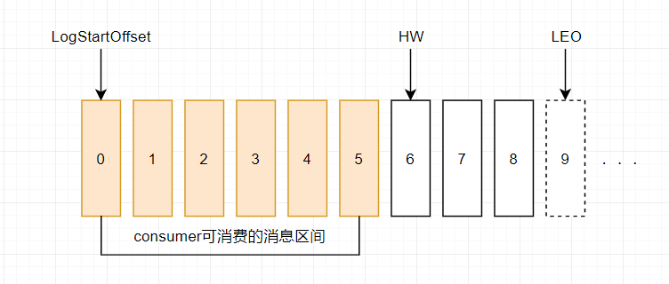
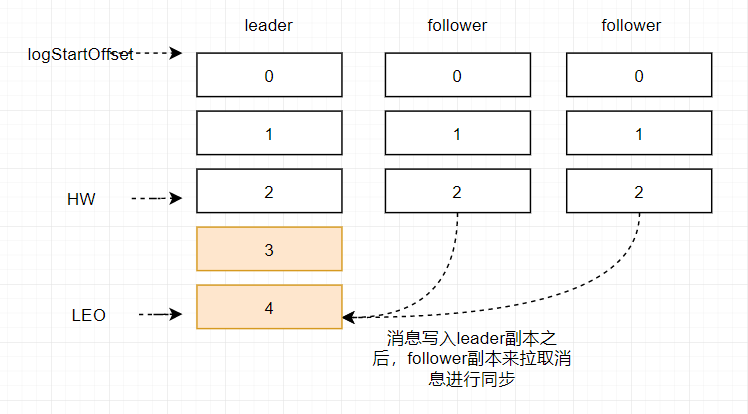
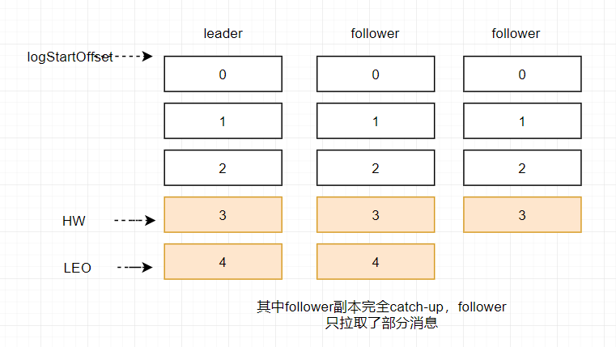
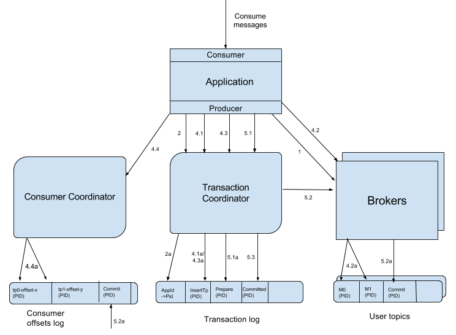

# Kafka 相关知识点

> [《Kafka面试题参考》](https://blog.csdn.net/linke1183982890/article/details/83303003)

## 一. Kafka 的元素，组成，架构

### 1.1 Kafka 的基本组成

Kafka将消息以topic为单位进行归纳
将向Kafka topic发布消息的程序成为producers.
将预订topics并消费消息的程序成为consumer.
Kafka以集群的方式运行，可以由一个或多个服务组成，每个服务叫做一个broker.
producers通过网络将消息发送到Kafka集群，集群向消费者提供消息

### 1.2 Kafka 分区的 HW, LEO

> 参考地址：  
> [《Kafka中的HW、LEO、LSO等分别代表什么？》](https://www.cnblogs.com/yoke/p/11486196.html)

**HW (High Watermark)**，高水位，它标识了一个特定的消息偏移量，消费者只能拉取到这个  offset 之前的消息。**HW 是针对于<font color=red>分区</font>的概念**，对消费者而言，只能消费 HW 之前的消息。   
**LEO (Log End Offset)，待写入日志偏移量**，它标识了当前日志文件中下一条待写入的消息的 offset。**LEO 是针对于<font color=red>ISR 集合中分区副本</font>的概念**，ISR 集合中每个分区的副本都会维护自身的 LEO。此外，**ISR 集合中最小的 LEO，即为分区的 HW**。



上图表示一个日志分区副本文件，这个日志分区副本文件中只有 9 条消息，第一条消息的 offset 为 0，最右一条消息的 offset 为8。offset 为 9 的消息使用虚线表示的，代表下一条待写入的消息。  
日志分区副本文件的 HW 为 6，表示消费者只能拉取 offset 在 0 到 5 之间的消息，offset 为 6 的消息对消费者而言是不可见的。  
上图中 offset 为 9 的位置即为当前日志分区副本文件的 LEO，LEO 的大小相当于**当前日志分区副本中，最后一条消息的 offset + 1**。

下面具体分析一下 ISR 集合和 HW、LEO的关系。  
如下图所示，假设某分区的 ISR 集合中有 3 个副本，即一个 leader 副本和 2 个 follower 副本，此时分区的 LEO 和 HW 都分别为 3 。消息 3 和消息 4 从生产者出发之后，先被存入 leader 副本。在消息被写入 leader 副本之后，follower 副本会发送拉取请求来拉取消息 3 和消息 4 进行消息同步。



在同步过程中不同的副本同步的效率不尽相同，如下图所示。在某一时刻 follower1 完全跟上了 leader 副本而 follower2 只同步了消息 3，如此 **leader 副本的 LEO 为 5，follower1 的 LEO 为 5，follower2 的LEO 为 4**。当前分区的 HW 取 ISR 集合中 LEO 的最小值，即当前分区的 **HW 为 4**，即消费者可以消费到 offset0 至 3 之间的消息。



当所有副本都成功写入消息 3 和消息 4 之后，整个分区的 HW 和 LEO 都变为 5，因此消费者可以消费到 offset 为 4 的消息了。图略。  
由此可见 kafka 的复制机制既不是完全的同步复制，也不是单纯的异步复制。事实上，同步复制要求所有能工作的 follower 副本都复制完，这条消息才会被确认已成功提交，这种复制方式极大的影响了性能。而在异步复制的方式下，follower 副本异步的从 leader 副本中复制数据，数据只要被 leader 副本写入，就会被认为已经成功提交。在这种情况下，如果 follower 副本都还没有复制完而落后于 leader 副本，然后 leader 副本宕机，则会造成数据丢失。  
最终，kafka 使用这种 ISR 的方式有效的权衡了数据可靠性和性能之间的关系。


## 二. Kafka 事务

### 2.1 Kafka 事务简述

Kafka 事务与数据库的事务定义基本类似，主要是一个原子性：**多个操作要么全部成功，要么全部失败**。Kafka 中的事务可以使应用程序将**消费消息、生产消息、提交消费位移**当作原子操作来处理。   
为了实现事务，Producer 应用程序必须做到：

1. 提供唯一的 **transactionalId**
	- <code>properties.put(ProducerConfig.TRANSACTIONAL_ID_CONFIG, "transacetionId");</code>
	- Kafka 可以通过相同的 transactionalId 确定唯一的生产者。对于相同 transactionalId 的新生 Producer，实例被创建且工作时，旧的 Producer 实例将不再工作。即消息跨生产者的的**幂等性**。
2. 要求 Producer **开启幂等特性**
	- 将 enable.idempotence 设置为 true；

> 注：  
> 1. transactionalId 与 PID 一一对应，为了保证新的 Producer 启动之后，具有相同的 transactionalId 的旧生产者立即失效，每个 Producer 通过 transactionalId 获取 PID 的时候，还会获取一个单调递增的 **producer epoch**。
> 2. Kafka 的事务主要是针对 Producer 而言的。对于 Consumer，考虑到日志压缩（相同 Key 的日志被新消息覆盖）、可追溯的 seek() 等原因，Consumer 关于事务语义较弱。
> 3. 对于 Kafka Consumer，在实现事务配置时，一定要关闭自动提交的选项，即 props.put("ConsumerConfig.ENABLE\_AUTO\_COMMIT\_CONFIG, false");

### 2.2 消费-转换-生产模式

消费-转换-生产模式是一种常见的，又比较复杂的情况，由于**同时存在消费与生产**，所以整个过程通常需要事务化。   
通常在实现该模式时，需要同时构建一个用于拉取原消息的 Consumer，一个将原消息处理后，将处理后消息投递出去的 Producer。在代码上主要有五个步骤：

```java
// 初始化事务
producer.initTransactions();
// 开启事务
producer.beginTransaction();
// 消费 - 生产模型
producer.send(producerRecord);
// 提交消费位移
producer.sendOffsetsToTransaction(offsets, "groupId");
// 提交事务
producer.commitTransaction();
```

上述过程全部被 try... catch...，如果中间出现错误，需要在 catch 块中执行：

```java
// 中止事务
producer.abortTransaction();
```

### 2.3 Kafka 事务的实现

实现 Kafka 事务，主要使用到 Broker 端的**事务协调器 (TransactionCoordinator)**。每个 Producer 都会被指定一个特定的 TransactionalCoordinator，用来负责处理其事务，与消费者 Rebalance 时的 GroupCoordinator 作用类似。实现事务的流程如下图所示：   



基本步骤如下：

#### 2.3.1 查找 TransactionalCoordinator

Producer 向 Broker 集群发送 FindCoordinatorRequest，Broker 集群根据 Request 中包含的 transactionalId 查找对应的 TransactionalCoordinator 节点并返回给 Producer。

#### 2.3.2 获取 Producer ID

Producer 向刚刚找到的 TransactionalCoordinator 发送 InitProducerIdRequest 请求，为当前 Producer 分配一个 Producer ID。

> 注：如果 TransactionalCoordinator 第一次收到包含该 transactionalId 的消息，则将相关消息存入主题 \_\_transaction\_state 中。

#### 2.3.3 开启事务

Producer 发送第一条消息，则 TransactionalCoordinator 认为已经发起了事务。

#### 2.3.4 消费-转换-生产

前面的阶段都是开始阶段，该阶段包含了整个事务的处理过程。需要做如下工作：

1. **存储对应关系**
	- Producer 在向新分区发送数据之前，首先向 TransactionalCoordinator 发送请求，使 TransactionalCoordinator 存储对应关系 **(transactionalId, TopicPartition)** 到主题 \_\_transaction\_state 中。
2. **生产者发送消息**
	- 与普通的发送消息相同；
3. **处理消费和发送**
4. **事务位移提交**
5. **提交或终止事务**
	- 在正常结束或者异常结束，都会结束当前事务。Producer 向 TransactionalCoordinator 发送 EndTxnRequest 请求，TransactionalCoordinator 收到请求后执行如下操作：
		1. 将**准备完毕消息 (PREPARE\_COMMIT)** 或 **准备异常消息 (PREPARE\_ABORT)**  消息写入主题 \_\_transaction\_state；
		2. 通过 WriteTxnMarkersRequest 请求，将 COMMIT 或 ABORT 信息写入用户的**普通主题**和**\_\_consumer\_offsets**。
		3. 将**消费成功消息 (COMPLETE\_COMMIT)**  或**消费异常中止消息 (COMPLETE\_ABORT)**  消息写入 \_\_transaction\_state 中；

## 三. Kafka消息是采用Pull模式，还是Push模式？

- 推模式、拉模式：ActiveMQ 推模式可以将消息推送给服务，不需要服务端进行持续的轮询。但是推模式最大的弊端是，如果生产者的生产速度过快，有大量的消息堆积，消费者可能撑不住宕机。
- 反过来，拉模式由于自身通过轮询的方式拉取消息，消费速度相对可控制，所以可以实现一种削峰限流的作用。 

Kafka最初考虑的问题是，customer应该从brokes拉取消息还是brokers将消息推送到consumer，也就是pull还push。在这方面，Kafka遵循了一种大部分消息系统共同的传统的设计：producer将消息推送到broker，consumer从broker拉取消息

一些消息系统比如Scribe和Apache Flume采用了push模式，将消息推送到下游的consumer。这样做有好处也有坏处：由broker决定消息推送的速率，对于不同消费速率的consumer就不太好处理了。消息系统都致力于让consumer以最大的速率最快速的消费消息，但不幸的是，push模式下，当broker推送的速率远大于consumer消费的速率时，consumer恐怕就要崩溃了。最终Kafka还是选取了传统的pull模式

Pull模式的另外一个好处是consumer可以自主决定是否批量的从broker拉取数据。Push模式必须在不知道下游consumer消费能力和消费策略的情况下决定是立即推送每条消息还是缓存之后批量推送。如果为了避免consumer崩溃而采用较低的推送速率，将可能导致一次只推送较少的消息而造成浪费。Pull模式下，consumer就可以根据自己的消费能力去决定这些策略

Pull有个缺点是，如果broker没有可供消费的消息，将导致consumer不断在循环中轮询，直到新消息到达。为了避免这点，Kafka有个参数可以让consumer阻塞知道新消息到达(当然也可以阻塞知道消息的数量达到某个特定的量这样就可以批量发

## 四. Kafka 高效文件存储设计

> 参考地址：[《kafka的消息消费机制、consumer的负载均衡、文件存储机制》](https://blog.csdn.net/qq_37334135/article/details/78598289)

1. Kafka 把 topic 中一个 parition 大文件分成多个小文件段，通过多个小文件段，就容易定期清除或删除已经消费完文件，减少磁盘占用。
2. 通过索引信息可以快速定位 message 和确定 response 的最大大小。
3. 通过 index 元数据全部映射到内存，可以避免 segment 文件的 IO 磁盘操作。
4. 通过索引文件稀疏存储，可以大幅降低 index 文件元数据占用空间大小。

### 4.1 kafka 文件存储基本结构

在 Kafka 文件存储中，同一个 Topic 下有多个不同 partition，每个 partition 为一个目录。partition命名规则为**Topic名称 + 有序序号**。如果 partition 数量为 num，则第一个 partition 序号从 0 开始，序号最大值为 num - 1。  
例如，自己创建一个名为 orderMq 的 Topic：

```bash
[root@mini1 bin]# ./kafka-topics.sh --create --zookeeper mini1:2181 --replication-factor 2 --partitions 3 --topic orderMq
Created topic "orderMq".
```

orderMq 这个 topic 对应的 partitions 在三台机器上名称分别为：

```bash
drwxr-xr-x. 2 root root 4096 11月 21 22:25 orderMq-0
drwxr-xr-x. 2 root root 4096 11月 21 22:25 orderMq-2
```
```bash
drwxr-xr-x. 2 root root 4096 11月 14 18:45 orderMq-1
drwxr-xr-x. 2 root root 4096 11月 14 18:45 orderMq-2
```
```bash
drwxr-xr-x. 2 root root 4096 11月 21 22:25 orderMq-0
drwxr-xr-x. 2 root root 4096 11月 21 22:25 orderMq-1
```

> 注：重复的是副本，partition 名分别为 orderMq-0, orderMq-1, orderMq-2；

每个 partition（即每个目录）相当于一个巨型文件被平均分配到多个**大小相等**的 **segment（段）**数据文件中，但每个 segment **消息数量不一定相等**。这种特性方便旧 segment 文件快速被删除，默认保留7天的数据。例如在 orderMq-0 目录下：

```bash
[root@mini3 orderMq-0]# ll
-rw-r--r--. 1 root root 10485760 11月 21 22:31 00000000000000000000.index
-rw-r--r--. 1 root root      219 11月 22 05:22 00000000000000000000.log
```

由上可知，index 和 log 为后缀名的文件的合称，就是 segment 文件。每个 partition 只需要支持顺序读写就行了，segment 文件生命周期（什么时候创建，什么时候删除）由服务端配置参数决定。

### 4.2 segment 文件

Segment 文件由两大部分组成，分别为**索引文件 (index file)** 和**数据文件 (data file)**，这两个文件一一对应，成对出现。如下图所示：  


Segment 文件命名规则：partition 全局的**第一个 segment 从 0 开始，后续每个 segment 文件名为上一个 segment 文件最后一条消息的 offset 值**。数值最大为 64 位 long 大小，19 位数字字符长度，没有数字用 0 填充。
索引文件存储大量元数据，数据文件存储大量消息。**索引文件中元数据指向对应数据文件中message的物理偏移地址。**如下图所示：


上述图中 index 文件存储大量元数据，log 文件存储大量消息，index 文件中元数据指向对应 log 文件中消息的物理偏移地址。其中以 index 文件中元数据<code>3, 497</code>为例，依次在数据文件中表示第 3 个消息（当前 Segment 的第 3 个，全局 partition 表示第 368769 + 3 = 368772 个消息)，以及该消息在对应 log 文件中的物理偏移地址为 497。

### 4.3 kafka 查找消息

读取 offset=368776 的消息，需要通过下面两个步骤查找。

1. 第一步：查找segment file
- 以起始偏移量命名并排序这些文件，只要根据offset 二分查找文件列表，就可以快速定位到具体文件。
	- 00000000000000000000.index 表示最开始的文件，起始偏移量 (offset) 为 0
	- 00000000000000368769.index 的消息量起始偏移量为 368770 = 368769 + 1
	- 00000000000000737337.index 的起始偏移量为 737338=737337 + 1
- 其他后续文件依次类推。最后 offset=368776 时定位到 00000000000000368769.index 和对应log文件。
2. 第二步：通过 Segment 查找消息
	- 当 offset=368776 时，依次定位到 00000000000000368769.index 的元数据物理位置和 00000000000000368769.log 的物理偏移地址，然后再通过 00000000000000368769.log 顺序查找直到 offset=368776 为止。

## 五. Kafka 与传统消息系统之间的区别

Kafka 与传统消息系统之间有三个关键区别：

1. Kafka 持久化日志，这些日志可以被重复读取和无限期保留
2. Kafka 是一个分布式系统：它以集群的方式运行，可以灵活伸缩，在内部通过复制数据提升容错能力和高可用性
3. Kafka 支持实时的流式处理

## 六. Kafka 的顺序性

> 参考地址：[《消息队列面试热点：如何保证消息的顺序性？》](https://zhuanlan.zhihu.com/p/92622338v)

**问题：**你们线上业务用消息中间件的时候，是否需要保证消息的顺序性？如果不需要保证消息顺序是为什么？假如我有一个场景要保证消息的顺序，你们应该如何保证？

对于这种问题，主要思想是保证消息入队的有序，出队以后的顺序交给消费者自己去保证，没有固定套路。对于笔者的实际项目：

- **问题：**业务修改，数据上报的场景，先删后增；但如果并发量大，可能会出现问题，变成删删增增，结果不正确。此外，存入数据库中的数据应该由收到数据的顺序决定，所以用到了 Kafka 消息队列的顺序性；
- **解决方案**：利用了**<font color=red>分区顺序性</font>**。构建 Topic 时建了 3 个 Partition，在投递消息的时候，按照单位 ID 进行 Hash 计算，相同 ID 的单位保证是进入同一个 Partition，这样就进入了相同的队列，也就保证了消息队列的顺序性。

## 七. Kafka 再均衡原理

### 7.1 消费者再均衡

Kafka 通过 **消费组协调器 (GroupCoordinator)** 与**消费者协调器 (ConsumerCoordinator)**，实现消费者再均衡操作。  

- **消费组协调器 (GroupCoordinator)**：Kafka 服务端中，用于管理消费组的组件；
- **消费者协调器 (ConsumerCoordinator)**：Consumer 客户端中，负责与 GroupCoordinator 进行交互；

> 注：新版消费者客户端将全部消费组分成多个子集，每个消费组的子集在服务端对应一个 GroupCoordinator 进行管理。

ConsumerCoordinator 与 GroupCoordinator 之间最重要的职责就是负责执行**消费者再均衡**操作。导致消费者再均衡的操作：

- 新的消费者加入消费组；
- 消费者宕机下线（不一定是真的下线，令消费组以为消费者宕机下线的本质原因是**消费者长时间未向 GroupCoordinator 发送心跳包**）；
- 消费者主动退出消费组；
- 消费组对应的 GroupCoordinator 节点发生了变更；
- 任意主题或主题分区数量发生变化；

### 7.2 消费者再均衡阶段

#### 7.2.1 阶段一：寻找 GroupCoordinator

消费者需要确定它所述消费组对应 GroupCoordinator 所在 broker，并创建网络连接。向集群中负载最小的节点发送 **FindCoordinatorRequest**；  
Kafka 收到 FindCoordinatorRequest 后，根据请求中包含的 groupId 查找对应的 GroupCoordinator 节点。

#### 7.2.2 阶段二：加入消费组

消费者找到消费组对应的 GroupCoordinator 之后，进入加入消费组的阶段。消费者会向 GroupCoordinator 发送 **JoinGroupRequest** 请求。每个消费者发送的 GroupCoordinator 中，都携带了**各自提案的分配策略与订阅信息**。

Kafka Broker 收到请求后进行处理。  

1. GroupCoordinator 为消费组内的消费者，选举该消费组的 Leader；
	- 如果消费组内还没有 Leader，那么第一个加入消费组的消费者会成为 Leader；对于普通的选举情况，选举消费组 Leader 的算法很随意，基本上可以认为是随机选举；
2. 选举分区分配策略
	- Kafka 服务端收到各个消费者支持的分配策略，构成候选集，所有的消费者从候选集中找到第一个分配策略进行投票，最后票数最多的策略成为当前消费组的分配策略。

> 注：如果有消费者不支持选出的分配策略，会报出异常。

Kafka 处理完数据后，将响应 JoinGroupResponse 返回给各个消费者。JoinGroupResponse 回执中包含着 GroupCoordinator 投票选举的结果，在这些分别给各个消费者的结果中，只有**给 leader 消费者的回执中包含各个消费者的订阅信息**。

#### 7.2.3 阶段三：同步阶段

加入消费者的结果通过响应返回给各个消费者，消费者接收到响应后，开始准备实施具体的分区分配。上一步中只有 leader 消费者收到了包含各消费者订阅结果的回执信息，所以**需要 leader 消费者主导转发同步分配方案**。转发同步分配方案的过程，就是**同步阶段**。  
同步阶段，leader 消费者是**通过“中间人” GroupCoordinator 进行**的。各个消费者向 GroupCoordinator 发送 SyncGroupRequest 请求，其中**只有 leader 消费者发送的请求中包含相关的分配方案**。Kafka 服务端收到请求后交给 GroupCoordinator 处理。处理过程有：

1. 主要是将消费组的元数据信息存入 Kafka 的 \_\_consumer\_offset 主题中；
2. 最后 GroupCoordinator 将各自所属的分配方案发送给各个消费者。

各消费者收到分配方案后，会开启 ConsumerRebalanceListener 中的 onPartitionAssigned() 方法，**开启心跳任务**，与 GroupCoordinator 定期发送心跳请求 HeartbeatRequest，保证彼此在线。

#### 7.2.4 阶段四：心跳阶段

进入该阶段后的消费者，已经属于进入正常工作状态了。消费者通过向 GroupCoordinator 发送心跳，来维持它们与消费组的从属关系，以及对 Partition 的所有权关系。  
心跳线程是一个独立的线程，可以在轮询消息空档发送心跳。如果一个消费者停止发送心跳的时间比较长，那么**整个会话被判定为过期**，GroupCoordinator 会认为这个消费者已经死亡，**则会触发再均衡行为**。

触发再均衡行为的情况：

1. 停止发送心跳请求；（包括消费者发生崩溃的情况）
2. 参数 max.poll.interval.ms 是 poll() 方法调用之间的最大延迟，如果在该时间范围内，poll() 方法没有调用，那么消费者被视为失败，触发再均衡；
3. 消费者可以主动发送 LeaveGroupRequest 请求，主动退出消费组，也会触发再均衡。

### 7.3 频繁再均衡

> 参考地址：[《记一次线上kafka一直rebalance故障》](https://www.jianshu.com/p/271f88f06eb3)

由前面章节可知，有多种可能触发再均衡的原因。下述记录一次 Kafka 的频繁再均衡故障。平均间隔 2 到 3 分钟就会触发一次再均衡，分析日志发现比较严重。主要日志内容如下：

> commit failed   
> org.apache.kafka.clients.consumer.CommitFailedException: Commit cannot be completed since the group has already rebalanced and assigned the partitions to another member. This means that the time between subsequent calls to poll() was longer than the configured max.poll.interval.ms, which typically implies that the poll loop is spending too much time message processing. You can address this either by increasing the session timeout or by reducing the maximum size of batches returned in poll() with max.poll.records.

这个错误意思是消费者在处理完一批 poll 的消息之后，同步提交偏移量给 Broker 时报错，主要原因是**当前消费者线程消费的分区已经被 Broker 节点回收了**，所以 Kafka 认为这个消费者已经死了，导致提交失败。  
导致该问题的原因，主要涉及构建消费者的一个属性 **<font color=red>max.poll.interval.ms</font>**。这个属性的意思是**消费者两次 poll() 方法调用之间的最大延迟**。如果超过这个时间 poll 方法没有被再次调用，则认为该消费者已经死亡，触发消费组的再平衡。该参数的默认值为 300s，但我们业务中设置了 5s。

查询 Kafka 拉取日志后，发现有几条日志由于逻辑问题，单条数据处理时间超过了一分钟，所以在处理一批消息之后，总时间超过了该参数的设置值 5s，导致消费者被踢出消费组，导致再均衡。

解决方法：  

1. **增加 max.poll.interval.ms 值的大小**：将该参数调大至合理值，比如默认的 300s；
2. **设置分区拉取阈值**：通过用外部循环不断拉取的方式，实现客户端的持续拉取效果。消费者每次调用 poll 方法会拉取一批数据，可以通过设置 **max.poll.records** 消费者参数，控制每次拉取消息的数量，从而减少每两次 poll 方法之间的拉取时间。

此外，**再均衡可能会导致消息的重复消费现象**。消费者每次拉取消息之后，都需要将偏移量提交给消费组，如果设置了自动提交，则这个过程在消费完毕后自动执行偏移量的提交；如果设置手动提交，则需要在程序中调用 <code>consumer.commitSync()</code> 方法执行提交操作。  
反过来，如果消费者没有将偏移量提交，那么下一次消费者重新与 Broker 相连之后，该消费者会**从已提交偏移量处开始消费**。问题就在这里，如果处理消息时间较长，消费者被消费组剔除，那么**提交偏移量出错**。消费者踢出消费组后触发了再均衡，分区被分配给其他消费者，其他消费者如果消费该分区的消息时，由于之前的消费者已经消费了该分区的部分消息，所以这里出现了重复消费的问题。

解决该问题的方式在于拉取后的处理。poll 到消息后，消息处理完一条就提交一条，如果出现提交失败，则马上跳出循环，Kafka 触发再均衡。这样的话，重新分配到该分区的消费者也不会重复消费之前已经处理过的消息。代码如下：

```java
        while (isRunning) {
            ConsumerRecords<KEY, VALUE> records = consumer.poll(100);
            if (records != null && records.count() > 0) {

                for (ConsumerRecord<KEY, VALUE> record : records) {
                    // 处理一条消息
                    dealMessage(bizConsumer, record.value());
                    try {
                        // 消息处理完毕后，就直接提交
                        consumer.commitSync();
                    } catch (CommitFailedException e) {
                        // 如果提交失败，则日志记录，并跳出循环
                        // 跳出循环后，Kafka Broker 端会触发再均衡
                        logger.error("commit failed, will break this for loop", e);
                        break;
                    }
                }
            }
        }
```

## 八. Kafka 消息积压

> [《07、完了！生产事故！几百万消息在消息队列里积压了几个小时！》](https://blog.csdn.net/A_BlackMoon/article/details/85197943)

**问题：**如何解决消息队列的延时以及过期失效问题？消息队列满了以后该怎么处理？有几百万消息持续积压几小时，说说怎么解决？

分析该问题，主要需要分析该场景。首先应该分析整体的情况，观察出现该问题的原因：

- 观察 Kafka 消息随时间的消费情况；
- 如果 Kafka 一直都是存在消息堆积的情况，就说明是服务端本身除了问题，需要考虑如何从解决服务本身入手，解决消息堆积的问题。
- **<font color=red>（是否合适？？）</font>**如果情况是只有在某段时间内 Kafka 才会出现峰值的情况，即流量洪峰，这种情况需要扩充磁盘，增大消息的存储容量即可。

如果是服务端本身的情况，那就需要排查服务端本身的故障。

### 8.1 问题 1：服务端故障

**假设服务端出了故障，大量消息再 MQ 里积压**：  

解决方法一：修复消费者的问题，恢复消费速度，然后等待消费完毕。（当然这种方法不能在面试的时候讲）  
**解决方法二**：临时紧急扩容；

1. 先找到并修复 consumer 的问题，恢复消费速度，**然后停掉现有所有 consumer**。
2. 新建一个 topic，具有原先 10 倍的 partition，临时建立好原先 10 到 20 倍的队列数量；
3. 写一个临时分发数据的 consumer 程序，**这个程序部署上去，消费积压的数据**。消费之后不做耗时的处理，<font color=red>**直接均匀轮询，写入临时建好 10 倍数量的队列**</font>。
4. 临时征用 10 倍的机器，部署 consumer，每一批 consumer 消费一个临时队列的数据。
	- 这种做法相当于**<font color=red>临时将队列资源、消费者资源扩大十倍</font>**，以十倍的速度来消费数据；
5. 快速消费完积压的数据之后，恢复原先的架构，重新用修复后的原 consumer 机器来消费消息。

解决方案三：见业务组解决方法。

### 8.2 业务组解决方法

当时出现这个问题，是因为某个 Topic 有多个分区，但只有一个分区里分配了大量消息，另外分区分配基本为空，所以导致所有消息只在一个分区中，单个消费者消费速度有限，最后导致了消息堆积。  
最后解决该问题的方式：通过命令行**<font color=red>（命令行内容？？）</font>**将堆积消息的分区上的消息转义到其他消费压力较小的 broker 上对应的分区。

## 九. 消息中间件的高可用性

实现高可用性的方式一般都是**进行 replication**。对于 kafka，如果没有提供高可用性机制，一旦一个或多个 Broker 宕机，则宕机期间其上所有 Partition 都无法继续提供服务。若该 Broker永远不能再恢复，那么所有的数据也就将丢失，这是不可容忍的。所以 kafka 高可用性的设计也是进行 Replication。  
**Replica 的分布**：为了尽量做好负载均衡和容错能力，需要将同一个 Partition 的 Replica 尽量分散到不同的机器。  
**Replica 的同步**：当有很多 Replica 的时候，一般来说，对于这种情况有两个处理方法：

- **同步复制**：当 producer 向所有的 Replica 写入成功消息后才返回。一致性得到保障，但是延迟太高，吞吐率降低。
- **异步复制**：所有的 Replica 选取一个一个 leader，producer 向 leader 写入成功即返回（即生产者参数 acks = 1）。leader 负责将消息同步给其他的所有 Replica。但是消息同步一致性得不到保证，但是保证了快速的响应。

而 kafka 选取了一个折中的方式：**ISR (in-sync replicas)**。producer 每次发送消息，将消息发送给 leader，leader 将消息同步给他“信任”的“小弟们”就算成功，巧妙的均衡了确保数据不丢失以及吞吐率。具体步骤：

1. 在所有的 Replica 中，**leader 会维护一个与其基本保持同步的 Replica 列表**，该列表称为**ISR (in-sync Replica)**；每个 Partition 都会有一个 ISR，而且是由 leader 动态维护。
2. 如果一个 replica 落后 leader 太多，leader 会将其剔除。如果另外的 replica 跟上脚步，leader 会将其加入。
3. **同步**：leader 向 ISR 中的所有 replica 同步消息，当收到所有 ISR 中 replica 的 ack 之后，leader 才 commit。
4. **异步**：收到同步消息的 ISR 中的 replica，异步将消息同步给 ISR 集合外的 replica。


## 十. 避免消息中间件故障后引发系统整体故障

如果所有的 replica 都不工作了，有两种解决方式：

1. 等待 ISR 中任一个 Replica 恢复，并选取他为 leader；
	- 等待时间较长，降低了可用性；若 ISR 中的所有 Replica 都无法恢复或者数据丢失，则该 partition 将永不可用
2. 选择第一个回复的 Replica 为新的 leader，无论他是否在 ISR 中；
	- 所选 leader 可能并未包含已被之前 leader commit 的消息，因此会造成数据丢失；
	- 可用性较高；


## 十一. Kafka 消息投递（重复消费、可靠性传输）

> 参考地址：  
> [《Kafka消息投递语义-消息不丢失，不重复，不丢不重》](https://www.cnblogs.com/3gods/p/7530828.html)  
> [《消息队列面试题要点》](https://www.cnblogs.com/peteremperor/p/10273077.html)

- **问题 1**：使用 Kafka 的时候，你们怎么保证投递出去的消息一定不会丢失？
- **问题 2**：你们怎么保证投递出去的消息只有一条且仅仅一条，不会出现重复的数据？

上述问题换一种问法，可以翻译为**<font color=red>如何保证消息队列的幂等性？</font>**这个问题可以认为是消息队列领域的基本问题。这个问题的回答可以根据具体的业务场景来答，没有固定的答案。

无论是哪种消息队列，造成重复消费原因其实都是类似的。正常情况下，消费者在消费消息的时候，消费完毕后，会发送一个确认消息给消息队列，消息队列就知道该消息被消费了，就会将该消息从消息队列中删除。只是不同的消息队列发出的确认消息形式不同（例如 RabbitMQ 是发送一个 ACK 确认消息，RocketMQ 是返回一个 CONSUME\_SUCCESS 成功标志），kafka 是通过**<font color=red>提交 offset 的方式</font>**让消息队列知道自己已经消费过了。

造成重复消费的原因，就是**因为网络传输等等故障**，确认信息没有传送到消息队列，导致消息队列不知道自己已经消费过该消息了，再次将消息分发给其他的消费者。

> 注：关于重复消费，还有部分与第七章 Kafka 再均衡相关的内容。  
> 参考地址：[《记一次线上kafka一直rebalance故障》](https://www.jianshu.com/p/271f88f06eb3)

如何解决？这个问题针对业务场景来答，分以下三种情况：

- 实际使用方案：**准备一个第三方介质，来做消费记录**
	- 以 redis 为例，给消息分配一个全局 ID，只要消费过该消息，将 \<id,message\>以 K-V 形式写入 redis。消费者开始消费前，先去 redis 中查询有没有消费记录即可。
- **数据库主键**：拿到这个消息做数据库的 insert 操作，那就容易了，给这个消息做一个唯一的主键，那么就算出现重复消费的情况，就会导致**主键冲突**，避免数据库出现脏数据。
- **Redis Set 操作**：拿到这个消息做 redis 的 set 的操作，那就容易了，不用解决，set 操作无论几次结果都是一样的，因为 set 操作本来就是幂等操作。

### 11.1 Kafka 消息投递语义

kafka 有三种消息投递语义：

- **At most Once**：最多一次；消息不会重复，但可能丢失；
- **At least Once**：最少一次；消息不会丢失，但可能重复；
- <font color=red>**Exactly Once**</font>：最佳情况，只且消费一次；消息不会重复，也不会丢失；

整体的消息投递语义由**生产者、消费者**两端同时保证。

### 11.2 Producer 生产者端

Producer 端保证消息投递重复性，是通过 **Producer 的 <font color=red>acks</font> 参数**与 **Broker 端的 <font color=red>min.insync.replicas</font> 参数**决定的。  

Producer 端的 **acks 参数**值信息如下：

- **acks = 0**：不等待任何响应的发送消息；
- **acks = 1**：**leader 分片写消息成功**，就返回响应给生产者；
- <font color=red>**acks = -1(all)**</font>：要求 ISR 集合至少两个 Replica，而且必须全部 Replica 都写入成功，才返回响应给 Producer；
	- 无论 ISR 少于两个 Replica，或者不是全部 Replica 写入成功，都会抛出异常；

前面 Producer 的 acks = 1 可以保证写入 Leader 副本，对大部分情况没有问题。但如果刚刚一条消息写入 Leader，还没有把这条消息同步给其他 Replica，Leader 就挂了，那么这条消息也就丢失了。所以如果保证消息的完全投递，还是需要令 acks = all；

### 11.3 Broker 节点端

首先上面说到，为了配合 Producer acks 参数为 all，需要令 Broker 端参数 min.insync.replicas = 2；  
min.insync.replicas 参数是用来配合 Producer acks 参数的。因为如果 acks 设置为 all，但某个 Topic 只有 leader 一个 Replica（或者某个 Kafka 集群中由于同步很慢，导致所有 follower 全部被剔除 ISR 集合），这样 acks = -1 就演变成了 acks = 1。  
所以需要 Broker 端设置 min.insync.replicas 参数：当参数值为 2 时，如果副本数小于 2 个，会抛出异常。

> 注：然而在笔者的使用环境中，订阅是 Kafka 主要的使用场景之一，方式是对于想要订阅的某个 Topic，每个用户创建并独享一个不会重复的消费组。所以这样的情况下，环境下的 min.insync.replicas 只能等于 1；

除此之外，broker 端还有一个需要注意的参数 **unclean.leader.election.enable**。该参数为 true 的时候，表示在 leader 下线的时候，可以从非 ISR 集合中选举出新的 Leader。这样的话可能会造成数据的丢失。所以如果需要在 Broker 端的 unclean.leader.election.enable 设置为 false。

### 11.4 Consumer 消费者端

Consumer 端比较麻烦，原因是需要考虑到某个 Consumer 宕机后，同 Consumer Group 会发生负载均衡，同 Group 其他的 Consumer 会重新接管并继续消费。

假设两种场景：

**第一个场景，Consumer 先提交 offset，再处理消息**。代码如下：

```java
List<String> messages = consumer.poll();
consumer.commitOffset();
processMsg(messages);
```

这种情形下，提交 offset 成功，但处理消息失败，同时当前 Consumer 宕机，这时候发生负载均衡，其他 Consumer 从**已经提交的 offset** 之后继续消费。这样的情况保证了 **<font color=red>at most once</font>** 的消费语义，当然也可能会丢消息。

**第二个场景，Consumer 先处理消息，再提交 offset**。代码如下：

```java
List<String> messages = consumer.poll();
processMsg(messages);
consumer.commitOffset();
```

这种情形下，消息处理成功，提交 offset 失败，同时当前 Consumer 宕机，这时候发生负载均衡，其他 Consumer 依旧从同样的 offset 拉取消息消费。这样的情况保证了 **<font color=red>at least once</font>** 的消费语义，可能会重复消费消息。

上述机制的保证都不是直接一个配置可以解决的，而是 Consumer 端代码的处理先后顺序问题完成的。

> 注：关于 Kafka <font color=red>**解耦**</font>作用的思考：  
> 注册中心可以将服务于服务之间解耦，但 Kafka 也可以通过相同的 topic 的消息传递实现业务的解耦。这两种形式都可以实现解耦，但笔者个人理解：
> 
> - 注册中心通过**请求 -> 响应**的模式，等待其他服务处理结果完毕之后的响应；
> - Kafka 的将消息从生产者投递，消费者接收，但消费者的消费结果通常生产者并不需要的，生产者只需要确保将消息投递到 Kafka Broker 节点即可。

## 十二. Kafka新建的分区会在哪个目录下创建

在启动 Kafka 集群之前，我们需要配置好 log.dirs 参数，其值是 Kafka 数据的存放目录，这个参数可以配置多个目录，目录之间使用逗号分隔，通常这些目录是分布在不同的磁盘上用于提高读写性能。  
当然我们也可以配置 log.dir 参数，含义一样。只需要设置其中一个即可。  
如果 log.dirs 参数只配置了一个目录，那么分配到各个 Broker 上的分区肯定只能在这个目录下创建文件夹用于存放数据。  
但是如果 log.dirs 参数配置了多个目录，那么 Kafka 会在哪个文件夹中创建分区目录呢？答案是：Kafka 会在含有分区目录最少的文件夹中创建新的分区目录，分区目录名为 Topic名+分区ID。注意，是分区文件夹总数最少的目录，而不是磁盘使用量最少的目录！也就是说，如果你给 log.dirs 参数新增了一个新的磁盘，新的分区目录肯定是先在这个新的磁盘上创建直到这个新的磁盘目录拥有的分区目录不是最少为止。

## 十三. 消费者负载均衡策略

一个消费者组中的一个分片对应一个消费者成员，他能保证每个消费者成员都能访问，如果组中成员太多会有空闲的成员

## 其他提问

- 说说你们公司线上生产环境用的是什么消息中间件？Kafka。
- 那你们线上系统是有哪些技术挑战，为什么必须要在系统里引入消息中间件？
	- 对某些数据进行增删改后，需要通知其他业务，所以使用到了订阅模式；
	- 在并发量较大的情况下，需要使用消息队列，对流入后台的请求进行缓冲；
- 你们的消息中间件技术选型为什么是 RabbitMQ？为什么不用 RocketMQ 或者是 Kafka？技术选型的依据是什么？
	- 
- 你们用的是Kafka？那你说说Kafka的底层架构原理，磁盘上数据如何存储的，整体分布式架构是如何实现的，如何保证数据的高容错性，零拷贝等技术是如何运用的，高吞吐量下如何优化生产者和消费者的性能？那你看过Kafka的源码没有，说说你对Kafka源码的理解？
- 你们用的是RocketMQ？RocketMQ很大的一个特点是对分布式事务的支持，你说说他在分布式事务支持这块机制的底层原理？RocketMQ的源码看过么，聊聊你对RocketMQ源码的理解？
- 如果让你来动手实现一个分布式消息中间件，整体架构你会如何设计实现？
- Kafka 判断一个节点是否还活着有那两个条件？
	- 节点必须可以维护和 ZooKeeper 的连接，Zookeeper 通过心跳机制检查每个节点的连接
	- 如果节点是个 follower，他必须能及时的同步 leader 的写操作，延时不能太久
- producer 是否直接将数据发送到 broker 的 leader？
	- producer 直接将数据发送到 broker 的 leader，不需要在多个节点进行分发。为了帮助 producer 做到这点，所有的 Kafka 节点都可以及时的告知，哪些节点是活动的，目标 topic 目标分区的 leader 在哪。这样 producer 就可以直接将消息发送到目的地了。
- Kafka 存储在硬盘上的消息格式是什么？
	- 消息由一个固定长度的头部和可变长度的字节数组组成。头部包含了一个版本号和 CRC32 校验码。
		- 消息长度: 4 bytes (value: 1+4+n)
		- 版本号: 1 byte
		- CRC校验码: 4 bytes
		- 具体的消息: n bytes
- Kafka 创建 Topic 时如何将分区放置到不同的 Broker 中
	- 副本因子不能大于 Broker 的个数；
	- 第一个分区（编号为0）的第一个副本放置位置是随机从 brokerList 选择的；
	- 其他分区的第一个副本放置位置相对于第0个分区依次往后移。也就是如果我们有5个 Broker，5个分区，假设第一个分区放在第四个 Broker 上，那么第二个分区将会放在第五个 Broker 上；第三个分区将会放在第一个 Broker 上；第四个分区将会放在第二个 Broker 上，依次类推；
	- 剩余的副本相对于第一个副本放置位置其实是由 nextReplicaShift 决定的，而这个数也是随机产生的
- kafka生产数据时数据的分组策略
	- 生产者决定数据产生到集群的哪个partition中，每一条消息都是以（key，value）格式。Key是由生产者发送数据传入，所以生产者（key）决定了数据产生到集群的哪个partition。