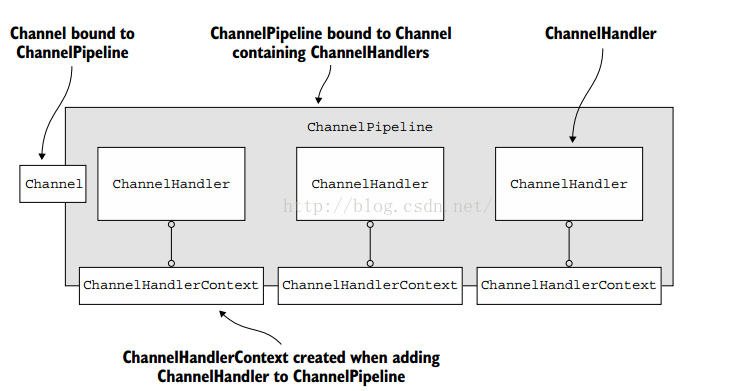
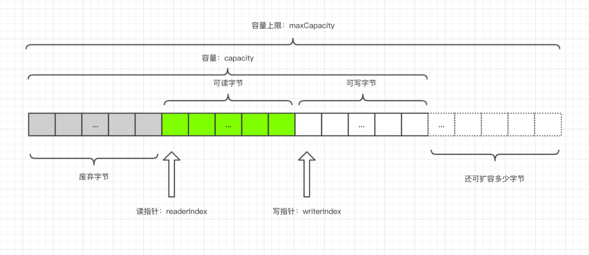

# Netty

Netty 是一个非阻塞（异步）、事件驱动的网络框架，用多线程处理 IO 事件。

# 一. Netty 结构

Netty 服务端与客户端都是由 **Bootstrap** 引导程序开始的，对于服务端，引导类是 **ServerBootstrap**，对于客户端，引导类是 **Bootstrap**。  

从 ServerBootstrap 开始，Netty Server 的结构如下：

- ServerBootstrap
	- EventLoopGroup
		- EventLoop：事件循环线程，通过 Selector 管理多个连接 Channel
			- Channel：连接
				- ChannelPipeline：管道，由多个 ChannelHandler 串联构成，处理连接的逻辑；
					- EventExecutorGroup：
						- EventExecutor：事件执行器，继承于 ExecutorService 接口，用于处理阻塞线程；
				- ChannelHandler：逻辑处理器，处理一部分连接事件；
				- ChannelHandlerContext：Handler 上下文，Pipeline 用 Context 调用每一个方法；
				- ChannelHandlerAdapter：业务逻辑

一个典型的 Netty Server 如下：

```java
public class NettyServer {
    public static void main(String[] args) {
        NioEventLoopGroup bossGroup = new NioEventLoopGroup();
        NioEventLoopGroup workerGroup = new NioEventLoopGroup();

        ServerBootstrap serverBootstrap = new ServerBootstrap();
        serverBootstrap
                .group(bossGroup, workerGroup)
                .channel(NioServerSocketChannel.class)
                .childHandler(new ChannelInitializer<NioSocketChannel>() {
                    protected void initChannel(NioSocketChannel ch) {
                    }
                });

        serverBootstrap.bind(8000);
    }
}
```

## 1.1 Bootstrap

ServerBootstrap 有两个 **EventLoopGroup**：

1. **bossGroup**：包含一个单例的 Server Channel，它持有一个绑定了本地端口的 Socket，用来监听和接收客户端的**连接 (Channel)**，并交给 **workerGroup** 进行处理；
2. **workerGroup**：包含所有接入的客户端连接 (Channel)；

## 1.2 EventLoopGroup 与 EventLoop

EventLoopGroup 是一个事件循环集合，每个 EventLoopGroup 都有一个或多个 EventLoop。EventLoop 是一个事件循环线程，它通过 Java NIO 的 **selector** 管理多个 **Channel**。  

## 1.3 Channel

Channel 接受 socket 传来的数据，进入到每个 Channel 都有的 **ChannelPipeline** 中，使用**责任链模式**，数据经过经过一系列处理器 **ChannelHandler** 逻辑处理，将数据传出。 
ChannelPipeline 是 ChannelHandler 的一个链表，如果一个入站 (inbound) 事件触发，会从第一个 ChannelHandler 开始遍历所有的 ChannelHandler；如果出站 (outbound) 事件触发，则会从最后一个 ChannelHandler 开始反向遍历执行所有逻辑。  
每个 ChannelHandler 添加到 ChannelPipeline 之后，都会创建一个 **ChannelHandlerContext**，并与 ChannelHandler 关联绑定，每个 ChannelHandlerContext 都有 prev, next 指针，与其他的 ChannelHandlerContext 关联，这样就形成了 ChannelPipeline 的链式结构。



## 1.4 EventExecutor

Netty 处理事件 IO 有很多线程，处理时尽量不要阻塞线程，因为阻塞会降低程序的性能。在添加 ChannelHandler 到 ChannelPipeline 时，可以指定一个 **EventExecutorGroup**，可以从中获取 **EventExecutor**。

- **EventExecutor**：可以执行的线程；
- **EventExecutorGroup**：线程组，用于管理和分配多个 EventExecutor；

在 ChannelPipeline 添加 ChannelHandler 时，可以为 ChannelHandler 指定 EventExecutor，用线程的方式执行 ChannelHandler 的方法。

## 1.5 ByteBuf

在 Java NIO 中也有 **ByteBuffer** 的缓冲类，但它读写索引是放在一起的，而且更改读写状态需要使用 **filp()** 方法转换状态，整体使用比较麻烦。  
Netty 对 Java NIO 进行了优化，形成优化后的数据容器 **ByteBuf**。它针对 ByteBuffer 类的缺点进行了优化，分为了读写两部分，可以在任意位置读取数据，开发者只需要调整数据索引位置，以及再次开始读操作即可。所以 ByteBuf 本质就是一个**由不同的索引分别控制读访问和写访问的字节数组**。ByteBuf 的数据结构如下所示：



容器里面的的数据分为三个部分：

1. 已经丢弃的字节：这部分数据是无效的；
2. **可读字节**：这部分数据是 ByteBuf 的主体数据， 从 ByteBuf 里面读取的数据都来自这一部分；
	- 可读字节之前的指针即为**读指针 (readerIndex)**；
3. **可写字节**：所有写到 ByteBuf 的数据都会写到这一段；
	- 可写指针之前的指针为**写指针 (writerIndex)**；
	- **capacity** = 已丢弃字节 + 可读字节 + 可写字节，表示 ByteBuf 底层内存的总容量；
4. 最后一部分虚线表示的是该 ByteBuf 最多还能扩容多少容量；

ByteBuf 有三种模式：

- **堆内存模式**：分配对象都在 Java 堆上；
	- 优点：由于数据存储在 Jvm 堆中，所以可以快速创建和快速释放，并且提供了数组直接快速访问的方法；
	- 缺点：每次数据与I/O进行传输时，都需要将数据拷贝到直接缓冲区
- **直接内存模式**：分配对象都在堆外内存上；
	- 优点：使用 Socket 传递数据时性能很好，避免了数据从 JVM 堆内存拷贝到直接缓冲区的过程，提高了性能；
	- 缺点：相对于堆缓冲区而言，Direct Buffer 分配内存空间和释放更为昂贵；
	- 注：对于涉及大量 I/O 的数据读写，建议使用直接内存；而对于用于后端的业务消息编解码模块建议使用堆内存模式；
- **复合模式**：本质上类似于提供一个或多个 ByteBuf 的组合视图，可以根据需要添加和删除不同类型的 ByteBuf；

# 二. Reactor 模式

Netty 是一个典型的 **反应器设计模式 (Reactor)**。Reactor 模式是一种基于事件响应的模式，将多个客户进行统一的分离和调度，同步、有序的处理请求。  

> 注：在 Netty 中采用了主从线程模型的 Reactor，即 Bootstrap 的两个 NioEventLoopGroup：**bossGroup, workerGroup**。

- 优点：
	- 响应快，不被阻塞；
	- 可扩展性强；
	- 对编程友好；
- 缺点：
	- 不易于调试；
	- 需要底层操作系统支持 select 等多路复用技术；

Reactor 有三种模式：

1. **Reactor 单线程模式**：
	- 同时作为 TCP 客户端与服务端；作为客户端，向服务端发送请求；作为服务端，接受请求并处理；
2. **Reactor 多线程模式**：
	- **一个 Acceptor 线程**用于接受连接，一组 NIO 线程用于处理逻辑；
	- 通常这种模式是使用线程池的方式管理 NIO 线程的；
3. **Reactor 主从模式**：
	- **一组 Acceptor 线程**用于接受连接，一组 NIO 线程用于处理逻辑；
	- 当前 Netty 主要使用的方式，即 bossGroup, workerGroup 的方式；

# 三. TCP 粘包、半包问题

> 参考地址：[《Netty 入门与实战：仿写微信 IM 即时通讯系统》](https://juejin.im/book/5b4bc28bf265da0f60130116/section/5b4db07fe51d451917170338)

尽管我们在应用层面使用了 Netty，但是对于操作系统来说，只认 TCP 协议。尽管我们的应用层是按照 ByteBuf 为 单位来发送数据，但是到了底层操作系统仍然是按照字节流发送数据，因此，数据到了服务端，也是按照字节流的方式读入，然后到了 Netty 应用层面，重新拼装成 ByteBuf。  
而这里的 ByteBuf 与客户端按顺序发送的 ByteBuf 可能是不对等的。因此，我们需要在客户端根据自定义协议来组装我们应用层的数据包，然后在服务端根据我们的应用层的协议来组装数据包，这个过程通常在服务端称为**拆包**，而在客户端称为**粘包**。

Netty 自带的拆包器：

1. **FixedLengthFrameDecoder**：固定长度的拆包器；
	- 应用层协议非常简单，每个数据包的长度都是固定的，比如 100，那么只需要把这个拆包器加到 pipeline 中，Netty 会把一个个长度为 100 的数据包 (ByteBuf) 传递到下一个 channelHandler。
2. **LengthFieldBasedFrameDecoder**：基于长度域拆包器；
	- 最通用的一种拆包器，只要你的自定义协议中包含长度域字段，均可以使用这个拆包器来实现应用层拆包。例如 Dubbo 就有自己定义的协议，在 DubboProtocol 的对象头中包含请求的长度与包的长度，根据这些信息可以计算出来当前请求会出现粘包还是半包现象；

> 注：此外还有不怎么常用的行拆包器和分隔符拆包器；
> 
> 1. 行拆包器 LineBasedFrameDecoder：
> 	- 从字面意思来看，发送端发送数据包的时候，每个数据包之间以换行符作为分隔，接收端通过 LineBasedFrameDecoder 将粘过的 ByteBuf 拆分成一个个完整的应用层数据包。
> 2. 分隔符拆包器 DelimiterBasedFrameDecoder
> 	- DelimiterBasedFrameDecoder 是行拆包器的通用版本，只不过我们可以自定义分隔符。

