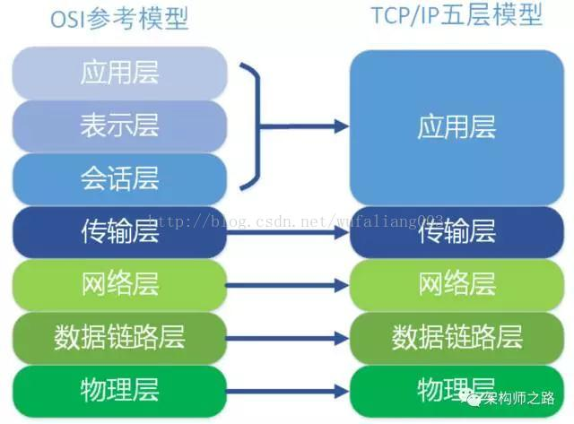

# Nginx 面试汇总

> 参考地址：[《Nginx面试汇总》](https://blog.csdn.net/qq_25934401/article/details/81561001)

## 一. Nginx 的模块与工作原理

Nginx 由**内核**和**模块**组成。其中，内核的设计非常微小和简洁，完成的工作也非常简单，仅仅通过查找配置文件将客户端请求映射到一个 location block（location 是 Nginx 配置中的一个指令，用于 URL 匹配），而在这个 location 中所配置的每个指令，将会启动不同的模块去完成相应的工作。  
Nginx 的模块从结构上分为**核心模块、基础模块和第三方模块**：

- **核心模块**：HTTP 模块、EVENT 模块和 MAIL 模块
- **基础模块**：HTTP Access 模块、HTTP FastCGI 模块、HTTP
- **第三方模块**：HTTP Upstream Request Hash 模块、Notice 模块和 HTTPAccess Key 模块；
	- 用户根据自己的需要开发的模块都属于第三方模块。正是有了这么多模块的支撑，Nginx 的功能才会如此强大。 

Nginx 的模块从功能上分为如下三类：

- **Handlers**：即处理器模块。此类模块直接处理请求，并进行输出内容和修改 headers 信息等操作。Handlers 处理器模块一般只能有一个。
- **Filters**：即过滤器模块。此类模块主要对其他处理器模块输出的内容进行修改操作，最后由 Nginx 输出。 
- **Proxies**：即代理类模块。此类模块是 Nginx 的 HTTP Upstream 之类的模块，这些模块主要与后端一些服务比如 FastCGI 等进行交互，实现服务代理和负载均衡等功能。

下图展示了 Nginx 模块常规的 HTTP 请求和响应的过程。 


Nginx 本身做的工作实际很少。当它接到一个 HTTP 请求时，它仅仅是通过查找配置文件，将此次请求映射到一个 location block，而此 location 中所配置的各个指令则会启动不同的模块去完成工作，因此模块可以看做 Nginx 真正的劳动工作者。通常一个 location 中的指令会涉及一个 handler 模块和多个 filter 模块（当然，多个 location 可以复用同一个模块）。  

> 注：模块属于静态编译方式，因为可以直接被编译进 Nginx。启动 Nginx 后，Nginx 的模块被自动加载（不像 Apache，首先将模块编译为一个 so 文件，然后在配置文件中指定是否进行加载）。在解析配置文件时，Nginx 的每个模块都有可能去处理某个请求，但是同一个处理请求只能由一个模块来完成。

## 二. Nginx 的进程模型

Nginx 的进程模型，可以由下图来表示： 


在工作方式上，Nginx 分为**单工作进程**和**多工作进程**两种模式。

- **单工作进程模式**：除主进程外，还有一个工作进程，工作进程是单线程的；
- **多工作进程模式**：每个工作进程包含多个线程。Nginx 默认为单工作进程模式；

Nginx 在启动后，会有**一个 master 进程和多个 worker 进程**。

### 2.1 master 进程

master 进程主要用来管理 worker 进程，包含：接收来自外界的信号，向各 worker 进程发送信号，监控 worker 进程的运行状态，当异常情况下 worker 进程退出后，会自动重新启动新的 worker 进程。   
master 进程充当整个进程组与用户的交互接口，同时对进程进行监护。它**不需要处理网络事件，不负责业务的执行**，只会通过**管理 worker 进程**来实现重启服务、平滑升级、更换日志文件、配置文件实时生效等功能。 
我们要控制 Nginx，只需要通过 kill 向 master 进程发送信号就行了。比如 kill -HUP pid，我们一般用这个信号来重启 Nginx，或重新加载配置。因为是从容地重启，因此服务是不中断的。master 进程在接收到 HUP 信号后是怎么做的呢？首先 master 进程在接到信号后，会先重新加载配置文件，然后再启动新的 worker 进程，并向所有老的 worker 进程发送信号，告诉他们可以光荣退休了。新的 worker 在启动后，就开始接收新的请求，而老的 worker 在收到来自 master 的信号后，就不再接收新的请求，并且在当前进程中的所有未处理完的请求处理完成后，再退出。

> 注：  
> 直接给 master 进程发送信号，这是比较老的操作方式。Nginx 在 0.8 版本之后，引入了一系列命令行参数，来方便我们管理。比如：
> 
> - <code>./nginx -s reload</code>：重启 nginx；
> - <code>./nginx -s stop</code>：停止nginx的运行；
> 
> 如何做到的呢？我们还是拿 reload 来说，我们看到，执行命令时，我们是启动一个新的 nginx 进程，而新的 nginx 进程在解析到 reload 参数后，就知道我们的目的是控制 nginx 来重新加载配置文件了，它会向 master 进程发送信号，然后接下来的动作，就和我们直接向 master 进程发送信号一样了。 

### 2.2 Worker

基本的网络事件，则是放在 worker 进程中来处理了。**多个 worker 进程之间是对等的**，他们同等竞争来自客户端的请求，各进程互相之间是独立的，**一个请求只可能在一个 worker 进程中处理**。worker 进程的个数是可以设置的，一般我们会**设置与机器 CPU 核数一致**，这里面的原因与 Nginx 的**进程模型**以及**事件处理模型**是分不开的。   
worker 进程之间是平等的，每个进程，处理请求的机会也是一样的。当我们提供 80 端口的 HTTP 服务时，一个连接请求过来，每个进程都有可能处理这个连接，怎么做到的呢？步骤如下：

1. 每个 worker 进程都是从 master 进程 fork 过来，在 master 进程里面，建立好需要 listen 的 socket (listenfd) 之后；

2. fork 出多个 worker 进程；

3. 所有 worker 进程的 listenfd 会在新连接到来时变得可读，为保证只有一个进程处理该连接，**所有 worker 进程在注册 listenfd 读事件前抢 accept_mutex**，抢到互斥锁的 worker 进程注册 listenfd 读事件；在读事件里调用 accept 接受该连接。

4. 当一个 worker 进程在 accept 这个连接之后，就开始读取请求，解析请求，处理请求。产生数据后，再返回给客户端，最后才断开连接；

一个完整的请求就是这样的了。  

我们可以看到，一个请求，完全由 worker 进程来处理，且只在一个 worker 进程中处理。

## 三. Nginx 的多进程 IO 模型 

> 参考地址：[《为啥性能高？Nginx架构初探》](http://mp.weixin.qq.com/s?__biz=MjM5NTg2NTU0Ng==&mid=407889757&idx=3&sn=cfa8a70a5fd2a674a91076f67808273c&scene=23&srcid=0401aeJQEraSG6uvLj69Hfve#rd)

### 3.1 多进程 IO 模型的优点

首先，对于每个 worker 进程来说，独立的进程不需要加锁，所以省掉了锁带来的开销，同时在编程以及问题查找时，也会方便很多。   
其次，采用独立的进程，可以让互相之间不会影响，一个进程退出后，其它进程还在工作，服务不会中断，master 进程则很快启动新的 worker 进程。当然，worker 进程的异常退出，肯定是程序漏洞导致异常退出，这样会导致当前 worker 上的所有请求失败，不过不会影响到所有请求，所以降低了风险。

### 3.2 异步非阻塞

Nginx 采用了异步非阻塞的方式来处理请求。也就是说，Nginx 是可以同时处理成千上万个请求的。  
一个 worker 进程可以同时处理的请求数只受限于内存大小，而且在架构设计上，不同的 worker 进程之间处理并发请求时几乎没有同步锁的限制，worker 进程通常不会进入睡眠状态，因此，当 Nginx 上的进程数与 CPU 核心数相等时（最好每一个 worker 进程都绑定特定的 CPU 核心），进程间切换的代价是最小的。

而 Apache 的常用工作方式，是每个进程在一个时刻只处理一个请求。因此，当并发数上到几千时，就同时有几千的进程在处理请求了。这对操作系统来说，进程带来的内存占用非常大，进程的上下文切换带来的 CPU 开销很大，性能自然就上不去了，同时这些开销完全是没有意义的。

为什么 Nginx 可以采用异步非阻塞的方式来处理？一个请求的完整过程，首先请求过来要建立连接，然后再接收数据，接收数据后再发送数据。  
具体到系统底层，就是读写事件，而当读写事件没有准备好时，必然不可操作。如果不用非阻塞的方式来调用，那就得阻塞调用了。阻塞调用的情况下，事件没有准备好，那就只能等到事件准备好了再继续。阻塞调用会进入内核等待，CPU 就会让出去给别人用了，对单线程的 worker 来说，显然不合适。当网络事件越多时，大家都在等待呢，CPU 空闲下来没人用，利用率自然上不去了，更别谈高并发了。阻塞明显是不适合的，那么考虑非阻塞。  
非阻塞就是，事件没有准备好，马上返回 EAGAIN，就是等到时间准备好再进行通知，或者过一会再来检查一下事件，直到事件准备好了为止，在这期间，你就可以先去做其它事情，然后再来看看事件好了没。虽然不阻塞了，但你得不时地过来检查一下事件的状态，你可以做更多的事情了，但带来的开销也是不小的。

### 3.3 epoll

Epoll 相关内容见[《Redis 篇》](./Redis.md) 的详解。

## 四. 解释 Nginx

Nginx是一个高性能的HTTP和反向代理服务器，及电子邮件（IMAP/POP3）代理服务器，同时也是一个非常高效的反向代理、负载均衡服务器。主要用 HTTP、HTTPS、SMTP、POP3 和 IMAP 协议。

## 五. 正向代理与反向代理

- **正向代理**：对于**<font color=red>正向代理，代理端代理的是用户</font>**；
	- 比如需要访问某些国外网站，我们可能需要购买 vpn，vpn 是在我们的用户浏览器端设置的，并不是在远端的服务器设置。浏览器先访问 vpn 地址，vpn 地址转发请求，并最后将请求结果原路返回来。
	- 或者打个不恰当的比方，用户在家访问小黄网，而我们不希望小黄网 trace 到我们真实的 IP，所以我们找了一个 Proxy 访问，网站以为 Proxy 的 IP 是用户的真实 IP。
	- 
- **反向代理 (Reverse Proxy)**：对于**<font color=red>反向代理，代理端代理的是被访问的服务器</font>**；
	- 比如 Web-server 希望对用户屏蔽高可用、扩展、内网 IP 等细节，于是找了一个 Proxy 在中间。这时候 Proxy 代表的是服务器集群，用户以为 Proxy 就是被访问的 web-server 的 IP
	- 

使用反向代理服务器的优点在于，**反向代理服务器可以隐藏源服务器的存在和特征**。它充当互联网云和 web 服务器之间的中间层。这对于安全方面来说是很好的，特别是当您使用web托管服务时。

## 六. 集群和负载均衡的算法与实现？

### 6.1 负载均衡器

、可以是专用设备，也可以是在通用服务器上运行的应用程序。 分散请求到拥有相同内容或提供相同服务的服务器。 专用设备一般只有以太网接口，可以说是多层交换机的一种。 负载均衡器一般会被分配虚拟IP地址，所有来自客户端的请求都是针对虚拟IP地址完成的。负载均衡器通过负载均衡算法将来自客户端的请求转发到服务器的实际IP地址上。

### 6.2 负载均衡算法
```java
private Map<String,Integer> serverMap = new HashMap<String,Integer>(){{
        put("192.168.1.100",1);
        put("192.168.1.101",1);
        put("192.168.1.102",4);
        put("192.168.1.103",1);
        put("192.168.1.104",1);
        put("192.168.1.105",3);
        put("192.168.1.106",1);
        put("192.168.1.107",2);
        put("192.168.1.108",1);
        put("192.168.1.109",1);
        put("192.168.1.110",1);
    }};
```

#### 6.2.1 随机算法

Random随机，按权重设置随机概率。在一个截面上碰撞的概率高，但调用量越大分布越均匀，而且按概率使用权重后也比较均匀，有利于动态调整提供者权重。

```java
public void random(){
        List<String> keyList = new ArrayList<String>(serverMap.keySet());
        Random random = new Random();
        int idx = random.nextInt(keyList.size());
        String server = keyList.get(idx);
        System.out.println(server);
    }
```

WeightRandom

```java
public void weightRandom(){
        Set<String> keySet = serverMap.keySet();
        List<String> servers = new ArrayList<String>();
        for(Iterator<String> it = keySet.iterator();it.hasNext();){
            String server = it.next();
            int weithgt = serverMap.get(server);
            for(int i=0;i<weithgt;i++){
                servers.add(server);
            }
        }
        String server = null;
        Random random = new Random();
        int idx = random.nextInt(servers.size());
        server = servers.get(idx);
        System.out.println(server);
    }
```

### 6.2.2 轮询及加权轮询

轮询及加权轮询 (Round Robin) 算法是一种**平滑权重轮询算法**。普通的权重轮询方法有时会发生某个节点突然被连续频繁选中，流量暴增的情况，而平滑权重轮询的 RoundRobin 算法的优点是将连续频繁的节点分配更加均匀。通常的 RoundRobin 算法比较简单，总共 N 个服务节点，传来一个 key 值，计算：

```java
int n = hash(key) % N;
```

以 Dubbo 的 RoundRobin 负载均衡算法为例，它参考了 Nginx 的 RoundRobin 算法，有三个核心参数：

1. **int weight**：对 Invoker 设定的权重；
2. **AtomicLong current**：考虑到并发场景下的某个 Invoker 会被同时选中，表示该节点被**所有线程选中的权重总和**；
3. **long lastUpdate**：最后一次更新时间；

每次请求进行负载均衡时，算法操作如下：

1. 遍历所有可调用 Invoker 列表：
	- 根据 <code>weight</code> 值更新当前 <code>current</code> 值：<code>current = current + weight;</code>
	- 累加每个 Invoker 的权重<code> weight</code> 到总权重 <code>totalWeight</code>；
2. 遍历结束后，选取最大的 <code>current</code> 值作为本次要选的节点，同时对其更新，减去 <code>totalWeight</code>。

比如有三个 Invoker 节点 **A, B, C**，它们权重分别为 **[A, B, C]=[4, 2, 1]**，初始 current 值都为 0，所以平滑轮询过程如下表所示：

|请求次数|选中前 Invoker 的 current 值|被选中节点|选中后 Invoker 的 current 值|
|:--|:--|:--|:--|
|1|[4,2,1]|A|[-3,2,1]|
|2|[1,4,2]|B|[1,-3,2]|
|3|[5,-1,3]|A|[-2,-1,3]|
|4|[2,1,4]|C|[2,1,-3]|
|5|[6,3,-2]|A|[-1,3,-2]|
|6|[3,5,-1]|B|[3,-2,-1]|
|7|[7,0,0]|A|[0,0,0]|

对上述过程进行解释，以第一次到第二次请求过程为例，经过了如下几次计算：

1. 首先初始值为 **[A, B, C] = [0, 0, 0]**，对每个节点分别加上权重 **[4, 2, 1]**，即第一次请求时的 <code>current</code> 值分别为 **[A, B, C] = [4, 2, 1]**；
2. 第一次请求中，最大的 <code>current</code> 节点为 **A=4**，所以第一次请求选中 A 节点；
3. 第一次请求选中后，更新三个节点的 <code>current</code> 值：对此次被选中的 A 节点减去总权重值 7，此时<code>current</code> 值分别为 **[A, B, C] = [-3, 2, 1]**；
4. 第二次请求来临，再对每个节点分别加上权重 **[4, 2, 1]**，第二次请求时的 <code>current</code> 值分别为 **[A, B, C] = [1, 4, 2]**；
5. 此后重复步骤 2, 3, 4；

由上表结果，每 7 次循环中，A 被选中了 4 次，B 被选中了 2 次，C 被选中了 1 次，满足 4:2:1 的权重分配，同时 A 节点也没有被连续分配。  

### 6.2.3 最小连接及加权最小连接

- 最少连接 (Least Connections) 在多个服务器中，与处理连接数（会话数）最少的服务器进行通信的算法。即使在每台服务器处理能力各不相同，每笔业务处理量也不相同的情况下，也能够在一定程度上降低服务器的负载。
- 加权最少连接 (Weighted Least Connection) 为最少连接算法中的每台服务器附加权重的算法，该算法事先为每台服务器分配处理连接的数量，并将客户端请求转至连接数最少的服务器上。

### 6.2.4 哈希算法

**普通哈希**

```java
public void hash(){
        List<String> keyList = new ArrayList<String>(serverMap.keySet());
        String remoteIp = "192.168.2.215";
        int hashCode = remoteIp.hashCode();
        int idx = hashCode % keyList.size();
        String server = keyList.get(Math.abs(idx));
        System.out.println(server);
    }
```

**一致性哈希一致性Hash**，相同参数的请求总是发到同一提供者。当某一台提供者挂时，原本发往该提供者的请求，基于虚拟节点，平摊到其它提供者，不会引起剧烈变动。

### 6.2.5 IP地址散列

通过管理发送方IP和目的地IP地址的散列，将来自同一发送方的分组(或发送至同一目的地的分组)统一转发到相同服务器的算法。当客户端有一系列业务需要处理而必须和一个服务器反复通信时，该算法能够以流(会话)为单位，保证来自相同客户端的通信能够一直在同一服务器中进行处理。

### 6.2.6 URL散列

通过管理客户端请求URL信息的散列，将发送至相同URL的请求转发至同一服务器的算法。

## 6.3 负载均衡算法的手段

负载均衡算法的手段 (DNS->数据链路层->IP层->Http层)

### 6.3.1 DNS域名解析负载均衡(延迟)


利用DNS处理域名解析请求的同时进行负载均衡是另一种常用的方案。在DNS服务器中配置多个A记录，如：www.mysite.com IN A 114.100.80.1、www.mysite.com IN A 114.100.80.2、www.mysite.com IN A 114.100.80.3.

每次域名解析请求都会根据负载均衡算法计算一个不同的IP地址返回，这样A记录中配置的多个服务器就构成一个集群，并可以实现负载均衡。

DNS域名解析负载均衡的优点是将负载均衡工作交给DNS，省略掉了网络管理的麻烦，缺点就是DNS可能缓存A记录，不受网站控制。

事实上，大型网站总是部分使用DNS域名解析，作为第一级负载均衡手段，然后再在内部做第二级负载均衡。

### 6.3.2 数据链路层负载均衡(LVS)


数据链路层负载均衡是指在通信协议的数据链路层修改mac地址进行负载均衡。

这种数据传输方式又称作三角传输模式，负载均衡数据分发过程中不修改IP地址，只修改目的的mac地址，通过配置真实物理服务器集群所有机器虚拟IP和负载均衡服务器IP地址一样，从而达到负载均衡，这种负载均衡方式又称为直接路由方式（DR）.

在上图中，用户请求到达负载均衡服务器后，负载均衡服务器将请求数据的目的mac地址修改为真是WEB服务器的mac地址，并不修改数据包目标IP地址，因此数据可以正常到达目标WEB服务器，该服务器在处理完数据后可以经过网管服务器而不是负载均衡服务器直接到达用户浏览器。

使用三角传输模式的链路层负载均衡是目前大型网站所使用的最广的一种负载均衡手段。在linux平台上最好的链路层负载均衡开源产品是LVS(linux virtual server)。

### 6.3.3 IP负载均衡(SNAT)


IP负载均衡：即在网络层通过修改请求目标地址进行负载均衡。

用户请求数据包到达负载均衡服务器后，负载均衡服务器在操作系统内核进行获取网络数据包，根据负载均衡算法计算得到一台真实的WEB服务器地址，然后将数据包的IP地址修改为真实的WEB服务器地址，不需要通过用户进程处理。真实的WEB服务器处理完毕后，相应数据包回到负载均衡服务器，负载均衡服务器再将数据包源地址修改为自身的IP地址发送给用户浏览器。

这里的关键在于真实WEB服务器相应数据包如何返回给负载均衡服务器，一种是负载均衡服务器在修改目的IP地址的同时修改源地址，将数据包源地址改为自身的IP，即源地址转换（SNAT），另一种方案是将负载均衡服务器同时作为真实物理服务器的网关服务器，这样所有的数据都会到达负载均衡服务器。

IP负载均衡在内核进程完成数据分发，较反向代理均衡有更好的处理性能。但由于所有请求响应的数据包都需要经过负载均衡服务器，因此负载均衡的网卡带宽成为系统的瓶颈。

### 6.3.4 HTTP重定向负载均衡(少见)


HTTP重定向服务器是一台普通的应用服务器，其唯一的功能就是根据用户的HTTP请求计算一台真实的服务器地址，并将真实的服务器地址写入HTTP重定向响应中（响应状态吗302）返回给浏览器，然后浏览器再自动请求真实的服务器。

这种负载均衡方案的优点是比较简单，缺点是浏览器需要每次请求两次服务器才能拿完成一次访问，性能较差；使用HTTP302响应码重定向，可能是搜索引擎判断为SEO作弊，降低搜索排名。重定向服务器自身的处理能力有可能成为瓶颈。因此这种方案在实际使用中并不见多。

### 6.3.5 反向代理负载均衡(nginx)


传统代理服务器位于浏览器一端，代理浏览器将HTTP请求发送到互联网上。而反向代理服务器则位于网站机房一侧，代理网站web服务器接收http请求。

反向代理的作用是保护网站安全，所有互联网的请求都必须经过代理服务器，相当于在web服务器和可能的网络攻击之间建立了一个屏障。

除此之外，代理服务器也可以配置缓存加速web请求。当用户第一次访问静态内容的时候，静态内存就被缓存在反向代理服务器上，这样当其他用户访问该静态内容时，就可以直接从反向代理服务器返回，加速web请求响应速度，减轻web服务器负载压力。

另外，反向代理服务器也可以实现负载均衡的功能。


由于反向代理服务器转发请求在HTTP协议层面，因此也叫应用层负载均衡。优点是部署简单，缺点是可能成功系统的瓶颈。

## 七. Nginx 的四层/七层负载均衡模型

> 参考地址：  
> [《一分钟了解四层/七层反向代理》](https://blog.csdn.net/wufaliang003/article/details/78395941)  
> [《nginx四层和七层负载均衡的区别》](https://blog.csdn.net/friends99/article/details/79803638)

四层/七层负载均衡的模型是来自于 **OSI 七层模型**。



由图看出，四层指**传输层**，通过**<font color=red>用户 IP + port</font>** 的方式接收请求，然后再分配到真实的服务器。七层指**应用层**，通过虚拟的 URL、主机名等**<font color=red>HTTP 协议的属性</font>**接收请求，然后分配到真实的服务器。  
负载均衡器通常被称为**四层交换机**或**七层交换机**。

- 四层负载均衡在 OSI 第四层，即 TCP 层工作。这种负载均衡不能理解如 HTTP, FTP, MySQL 之类的应用协议；
- 七层负载均衡在 OSI 第七层，即应用层。这种负载均衡可以理解应用协议。

同时也有二、三层的负载均衡。二层负载均衡在数据链路层，根据 **<font color=red>MAC 地址</font>**完成数据交换，会通过一个虚拟的 MAC 地址接受请求，然后分配到真实的 MAC 地址。三层负载均衡在网络层，根据 **<font color=red>IP 地址</font>**完成数据交换，通过一个虚拟的 IP 地址接收请求，然后分配到真实的 IP 地址。但没有中间五六的几层，因为 OSI 应用层、表示层、会话层已经合并到了 TCP/IP 的应用层了。

3、nginx和apache的区别？
1）轻量级，同样起web 服务，比apache 占用更少的内存及资源 
2）抗并发，nginx 处理请求是异步非阻塞的，而apache 则是阻塞型的，在高并发下nginx 能保持低资源低消耗高性能 
3）高度模块化的设计，编写模块相对简单 
4）最核心的区别在于apache是同步多进程模型，一个连接对应一个进程；nginx是异步的，多个连接（万级别）可以对应一个进程

4.nginx是如何实现高并发的
一个主进程，多个工作进程，每个工作进程可以处理多个请求，每进来一个request，会有一个worker进程去处理。但不是全程的处理，处理到可能发生阻塞的地方，比如向上游（后端）服务器转发request，并等待请求返回。那么，这个处理的worker继续处理其他请求，而一旦上游服务器返回了，就会触发这个事件，worker才会来接手，这个request才会接着往下走。由于web server的工作性质决定了每个request的大部份生命都是在网络传输中，实际上花费在server机器上的时间片不多。这是几个进程就解决高并发的秘密所在。即@skoo所说的webserver刚好属于网络io密集型应用，不算是计算密集型。

5、请解释Nginx如何处理HTTP请求。
Nginx使用反应器模式。主事件循环等待操作系统发出准备事件的信号，这样数据就可以从套接字读取，在该实例中读取到缓冲区并进行处理。单个线程可以提供数万个并发连接。

6、在Nginx中，如何使用未定义的服务器名称来阻止处理请求?
只需将请求删除的服务器就可以定义为： 
Server { 
listen 80; server_name “ “ ; 
return 444; 
} 
这里，服务器名被保留为一个空字符串，它将在没有“主机”头字段的情况下匹配请求，而一个特殊的Nginx的非标准代码444被返回，从而终止连接。

8、请列举Nginx服务器的最佳用途。
Nginx服务器的最佳用法是在网络上部署动态HTTP内容，使用SCGI、WSGI应用程序服务器、用于脚本的FastCGI处理程序。它还可以作为负载均衡器。

10、请解释你如何通过不同于80的端口开启Nginx?
答：为了通过一个不同的端口开启Nginx，你必须进入/etc/Nginx/sites-enabled/，如果这是默认文件，那么你必须打开名为“default”的文件。编辑文件，并放置在你想要的端口： 
Like server { 
listen 81; 
}

11、请解释是否有可能将Nginx的错误替换为502错误、503?
502 =错误网关 503 =服务器超载 有可能，但是您可以确保fastcgi_intercept_errors被设置为ON，并使用错误页面指令。 
Location / { fastcgi_pass 127.0.01:9001; fastcgi_intercept_errors on; error_page 502 =503/error_page.html; #… }

12、在Nginx中，解释如何在URL中保留双斜线?
要在URL中保留双斜线，就必须使用merge_slashes_off; 
语法:merge_slashes [on/off] 
默认值: merge_slashes on 
环境: http，server

13、请解释ngx_http_upstream_module的作用是什么?
ngx_http_upstream_module用于定义可通过fastcgi传递、proxy传递、uwsgi传递、memcached传递和scgi传递指令来引用的服务器组。

14、请解释什么是C10K问题?
C10K问题是指无法同时处理大量客户端(10,000)的网络套接字。

15、请陈述stub_status和sub_filter指令的作用是什么?
1）Stub_status指令：该指令用于了解Nginx当前状态的当前状态，如当前的活动连接，接受和处理当前读/写/等待连接的总数 2）Sub_filter指令：它用于搜索和替换响应中的内容，并快速修复陈旧的数据

16、解释Nginx是否支持将请求压缩到上游?
您可以使用Nginx模块gunzip将请求压缩到上游。gunzip模块是一个过滤器，它可以对不支持“gzip”编码方法的客户机或服务器使用“内容编码:gzip”来解压缩响应。

17、解释如何在Nginx中获得当前的时间?
要获得Nginx的当前时间，必须使用SSI模块、dategmt和dategmt和date_local的变量。Proxy_set_header THE-TIME $date_gmt;

18、用Nginx服务器解释-s的目的是什么?
用于运行Nginx -s参数的可执行文件。

19、解释如何在Nginx服务器上添加模块?
在编译过程中，必须选择Nginx模块，因为Nginx不支持模块的运行时间选择。 
nginx 的 upstream目前支持 4 种方式的分配 
1)、轮询（默认） 
每个请求按时间顺序逐一分配到不同的后端服务器，如果后端服务器down掉，能自动剔除。 
2)、weight 
指定轮询几率，weight和访问比率成正比，用于后端服务器性能不均的情况。 
2)、ip_hash 
每个请求按访问ip的hash结果分配，这样每个访客固定访问一个后端服务器，可以解决session的问题。 
3)、fair（第三方） 
按后端服务器的响应时间来分配请求，响应时间短的优先分配。 
4)、url_hash（第三方） 
nginx内置策略包含加权轮询和ip hash 
加权轮询算法分为先深搜索和先广搜索，那么nginx采用的是先深搜索算法，即将首先将请求都分给高权重的机器，直到该机器的权值降到了比其他机器低，才开始将请求分给下一个高权重的机器；

缺省安装的 nginx + php-fpm 环境，假设用户浏览一个耗时的网页，但是却在服务端渲染页面的中途关闭了浏览器，那么请问服务端的 php 脚本是继续执行还是退出执行？
正常情况下，如果客户端client异常退出了，服务端的程序还是会继续执行，直到与IO进行了两次交互操作。服务端发现客户端已经断开连接，这个时候会触发一个user_abort，如果这个没有设置ignore_user_abort，那么这个php-fpm的程序才会被中断。 
拓展阅读：http://www.cnblogs.com/yjf512/p/5362025.html?foxhandler=RssReadRenderProcessHandler

首先，Nginx 日志格式中的 timelocal表示的是什么时间？请求开始的时间？请求结束的时间？其次，当我们从前到后观察日志中的timelocal表示的是什么时间？请求开始的时间？请求结束的时间？其次，当我们从前到后观察日志中的time_local 时间时，有时候会发现时间顺序前后错乱的现象，请说明原因。
$time_local：在服务器里请求开始写入本地的时间，因为请求发生时间有前有后，所以会时间顺序前后错乱。

在Nginx+PHP环境中，Web错误日志里偶尔会出现如下错误信息：「recv() failed (104: Connection reset by peer) while reading response header from upstream」，请分析可能的原因是什么。
遇到这种情况，第一解决方法是重启php服务，service php5-fpm restart，但是这个治标不治本，相对治本的方法是把php的pm.max_requests值改大一点，比如500;第二个方法，修改php-fpm的request_terminate_timeout，把值改成=0。 
这个情况要看后端的php，要么是链接不上，要么是php服务挂了，要么就是链接超时。 
worker数不够挂掉就会504，worker处理超时就会502。 
拓展阅读：http://serverfault.com/questions/543999/nginx-errors-recv-failed-104-connection-reset-by-peer-while-reading-respon

已知Nginx和PHP-FPM安装在同一台服务器上，Nginx连接PHP-FPM有两种方式：一种是类似127.0.0.1:9000的TCP socket；另一种是类似/tmp/php-fpm.sock的Unix domain socket。请问如何选择，需要注意什么。
Unix domain socket的流程不会走到TCP 那层，直接以文件形式，以stream socket通讯。如果是TCP socket,则需要走到IP层。说的通俗一点，追求可靠性就是tcp（需要占用一个端口，更稳），追求高性能就是Unix Socket（不需要占用端口，更快）。 
拓展阅读：https://blog.linuxeye.com/364.html 
http://www.cnxct.com/default-configuration-and-performance-of-nginx-phpfpm-and-tcp-socket-or-unix-domain-socket/ (这篇文章强烈推荐，写得特别好！）

在Nginx中，请说明Rewrite模块里break和last的区别。
官方文档的定义如下： 
last：停止执行当前这一轮的ngx_http_rewrite_module指令集，然后查找匹配改变后URI的新location； 
break：停止执行当前这一轮的ngx_http_rewrite_module指令集； 
千言万语举个例子： 
location /test1.txt/ { 
rewrite /test1.txt/ /test2.txt break; 
}

location ~ test2.txt { 
return 508; 
} 
使用break会匹配两次URL，如果没有满足项，就会停止匹配下面的location,直接发起请求www.xxx.com/test2.txt，由于不存在文件test2.txt，则会直接显示404。 
使用last的话，会继续搜索下面是否有符合条件(符合重写后的/test2.txt请求)的location，匹配十次，如果十次没有得到的结果，那么就跟break一样了。返回上面的例子，/test2.txt刚好与面location的条件对应上了，进入花括号{}里面的代码执行，这里会返回508。（这里的508是我自己随便设定的）

事件驱动框架：
nginx事件驱动框架（书本p254）：所谓事件驱动架构，简单来说，就是由一些事件发生源来产生事件，由一个或多个事件收集器（epolld等）来收集、分发事件，然后许多事件处理器会注册自己感兴趣的事件，同时会“消费”这些事件。nginx不会使用进程或线程作为事件消费者，只能是某个模块，当前进程调用模块。

传统web服务器（如Apache）的，所谓事件局限在TCP连接建立、关闭上，其他读写都不在是事件驱动，这时会退化成按序执行每个操作的批处理模式，这样每个请求在连接建立后都将始终占用系统资源，直到连接关闭才会释放资源。大大浪费了内存、cpu等资源。并且把一个进程或线程作为事件消费者。 
传统web服务器与Nginx间重要差别： 
前者每个事件消费者独占一个进程资源，后者只是被事件分发者进程短期调用而已。

请求的多阶段异步处理
请求的多阶段异步处理只能基于事件驱动框架实现，就是把一个请求的处理过程按照事件的触发方式分为多个阶段，每个阶段都可以有事件收集、分发器（epoll等）来触发。比如一个http请求可以分为七个阶段

一个master进程（管理），多个work（工作）进程。
master对work进程采用信号进行控制

平台无关的代码实现：
在核心代码都使用了与操作系统无关的代码实现，在与操作系统相关的系统调用上则分别针对各个操作系统都有独立实现，这最终造就了Nginx的可移植性。

内存池的设计
为了减少避免出现内存碎片、减少向操作系统申请内存的次数、降低各个模块的开发复杂度，Nginx采用了简单的内存池（统一申请，统一释放）。比如为每个http请求分配一个内存池，请求结束时销毁整个内存池。

多进程异步非阻塞事件处理机制：运用了epoll模型

为什么要用Nginx？
优点： 
跨平台、配置简单 
非阻塞、高并发连接：处理2-3万并发连接数，官方监测能支持5万并发 
内存消耗小：开启10个nginx才占150M内存，Nginx采取了分阶段资源分配技术 
nginx处理静态文件好,耗费内存少 
内置的健康检查功能：如果有一个服务器宕机，会做一个健康检查，再发送的请求就不会发送到宕机的服务器了。重新将请求提交到其他的节点上。 
节省宽带：支持GZIP压缩，可以添加浏览器本地缓存 
稳定性高：宕机的概率非常小 
master/worker结构：一个master进程，生成一个或者多个worker进程 
接收用户请求是异步的：浏览器将请求发送到nginx服务器，它先将用户请求全部接收下来，再一次性发送给后端web服务器，极大减轻了web服务器的压力 
一边接收web服务器的返回数据，一边发送给浏览器客户端 
网络依赖性比较低，只要ping通就可以负载均衡 
可以有多台nginx服务器 
事件驱动：通信机制采用epoll模型

为什么Nginx性能这么高？
得益于它的事件处理机制： 
异步非阻塞事件处理机制：运用了epoll模型，提供了一个队列，排队解决

为什么不使用多线程？
Apache: 创建多个进程或线程，而每个进程或线程都会为其分配cpu和内存（线程要比进程小的多，所以worker支持比perfork高的并发），并发过大会榨干服务器资源。

Nginx: 采用单线程来异步非阻塞处理请求（管理员可以配置Nginx主进程的工作进程的数量）(epoll)，不会为每个请求分配cpu和内存资源，节省了大量资源，同时也减少了大量的CPU的上下文切换。所以才使得Nginx支持更高的并发。

Nginx是如何处理一个请求的呢？
首先，nginx在启动时，会解析配置文件，得到需要监听的端口与ip地址，然后在nginx的master进程里面 
先初始化好这个监控的socket，再进行listen 
然后再fork出多个子进程出来, 子进程会竞争accept新的连接。 
此时，客户端就可以向nginx发起连接了。当客户端与nginx进行三次握手，与nginx建立好一个连接后 
此时，某一个子进程会accept成功，然后创建nginx对连接的封装，即ngx_connection_t结构体 
接着，根据事件调用相应的事件处理模块，如http模块与客户端进行数据的交换。 
最后，nginx或客户端来主动关掉连接，到此，一个连接就寿终正寝了


动态资源、静态资源分离
动态资源、静态资源分离是让动态网站里的动态网页根据一定规则把不变的资源和经常变的资源区分开来，动静资源做好了拆分以后，我们就可以根据静态资源的特点将其做缓存操作，这就是网站静态化处理的核心思路 
动态资源、静态资源分离简单的概括是：动态文件与静态文件的分离

为什么要做动、静分离？
在我们的软件开发中，有些请求是需要后台处理的（如：.jsp,.do等等），有些请求是不需要经过后台处理的（如：css、html、jpg、js等等文件） 
这些不需要经过后台处理的文件称为静态文件，否则动态文件。因此我们后台处理忽略静态文件。这会有人又说那我后台忽略静态文件不就完了吗 
当然这是可以的，但是这样后台的请求次数就明显增多了。在我们对资源的响应速度有要求的时候，我们应该使用这种动静分离的策略去解决 
动、静分离将网站静态资源（HTML，JavaScript，CSS，img等文件）与后台应用分开部署，提高用户访问静态代码的速度，降低对后台应用访问 
这里我们将静态资源放到nginx中，动态资源转发到tomcat服务器中

负载均衡
负载均衡即是代理服务器将接收的请求均衡的分发到各服务器中 
负载均衡主要解决网络拥塞问题，提高服务器响应速度，服务就近提供，达到更好的访问质量，减少后台服务器大并发压力