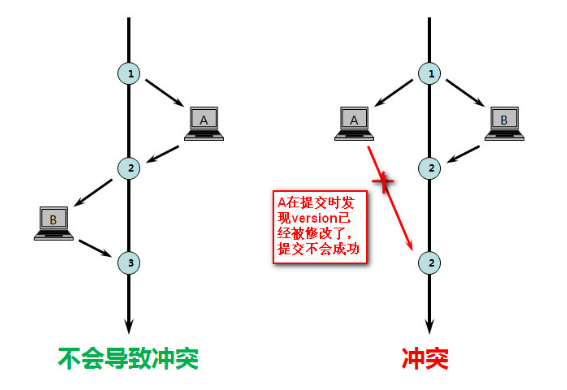

#  乐观锁在电商系统中的典型应用

> 参考地址：
> 
> [《使用mysql乐观锁解决并发问题》](https://www.cnblogs.com/laoyeye/p/8097684.html)  
> [《实战高并发秒杀实现（2）：防止库存超卖问题（超详细）》](https://blog.csdn.net/RuiKe1400360107/article/details/104731775)  
> [《【MySQL】悲观锁&乐观锁》](https://www.cnblogs.com/zhiqian-ali/p/6200874.html)  
> [《数据库并发控制 你选乐观锁还是悲观锁？》](http://database.51cto.com/art/201008/219908.htm)

# 一. 悲观锁与乐观锁

乐观锁与悲观锁是概念上的意义，主要解决的问题是对于并发冲突的检测。在电商场景中会出现很多并发引起的问题。  
比如典型的操作用户场景：A, B 操作员同时对同一个余额为 1000 元的账户操作，操作员 A 向账户中打入 100 元，操作员 B 向账户中扣除 200 元，A 先于 B 提交。最后实际账户余额应该为 1000 + 100 - 200 = 900，但最后实际操作时，变成了 1000 - 200 = 800，过程中跳过了 A 转入的操作，出现了并发问题。  
该问题可以分别通过悲观锁与**乐观锁**进行解决。

## 1.1 乐观锁

乐观锁本质上并不属于锁，它只是一种**冲突检测机制**。乐观锁允许并发的获取内容进行读写，但在提交的时候会进行并发控制。比如 A, B 同时获得了一个数据，而且都要对其进行处理，A 先提交了该条数据，B 后来也要提交该条数据，这时候乐观锁的策略检测到两者发生了冲突，便会拒绝 B 提交的内容，并抛出冲突，交给 B 进行处理。  
乐观锁的处理策略，通常是**版本控制**，或者是**时间戳控制**（本质与前者相同）。对数据进行一个版本的记录，每次提交后都标上版本号。当提交时的版本号小于等于当前版本号，则抛出异常，待解决冲突后重新执行。  
看到这里，笔者就想到了一个开发过程中一个很常见的乐观锁——即笔者开发项目过程中使用的 git。我和同事分别编辑两个在不同分支上的同一个 java 文件，是被允许的；但如果我们两个人提交后合并，发现该文件有冲突，则 git 进行版本控制时会提示我们冲突，并让我们决定如何解决冲突（采用谁的内容，或者如何合并内容），然后再提交（再提交就是将冲突抛出后再解决的过程）。  
此外前面提到的转账操作场景，可以通过添加**版本号 (version)** 字段解决。为数据库中的账户信息表中添加一个 **version 字段**，初始值为 1，对于刚才提到的账户，余额为 1000 元。假设 A 的扣除操作先于 B 完成：

1. 操作员 A 根据用户 ID 获取到用户余额，执行增加 100 元余额的操作，此时 version = 1；
2. 同时操作员 B 也尝试 200 元余额扣除的操作，此时对于操作员 B， version = 1；
3. 操作员 A 完成修改工作，数据版本加一，version = 2，余额当前为 1100；
4. 操作员 B 完成操作，余额为 800，也将版本号 version + 1 = 2，试图提交给数据库；
5. 操作员 B 提交数据库时发现，**提交的版本 version = 2，并不大于当前的版本 version = 2，说明修改过程中该数据被修改过**，所以操作员 B 的提交被驳回。

这样就解决了乐观锁的操作修改。可以通过如下的图来解释：



> 注：
>   
> 1. 除了版本号之外，也可以使用**时间戳 (timestamp)** 的方式解决；
> 2. 乐观锁的更新操作，最好用**主键**或者唯一索引来更新，这样的锁粒度是行锁，否则会在更新的时候锁表。

## 1.2 悲观锁

悲观锁本质上属于锁，它相对于乐观锁，属于**冲突避免机制**。悲观锁不允许并发时统一的对数据进行修改，A, B 同时获取数据且都要对其进行修改时，如果 A 首先开启修改的事务且添加了悲观锁，则 B 就不能开启修改事务，直到 A 将事务修改完成并提交。  
这样联想一下，悲观锁的策略虽然也是可以在版本控制器的实现上套用，但明显没有乐观锁的策略方便。生活中比较常用的悲观锁，比如 Word。如果一个进程打开了某个 Word 文档的编辑模式，则其他进程被禁止进入该文档的编辑模式，直到第一个进程将 Word 退出；或者其他进程只允许进入文档的只读模式（只允许读，不允许写）。

**乐观锁与悲观锁的选择策略：**

选择重点在于比较冲突发生的<font color=red>**频率**</font>与<font color=red>**后果严重性**</font>。在冲突发生频率不高，或者冲突发生后的后果不严重（以 SVN 举例，冲突发生后仅仅是告知用户冲突的位置，用户处理一下冲突的部分即可）的情况下，适合使用乐观锁。   

但如果冲突发生**频率过高**，则抛出冲突的次数过多，即需要多次重复的提交事务，这样会加大处理量。这种情况下适合用悲观锁。  
此外如果冲突发生后的**后果比较严重**，也比较适合使用悲观锁。比如填写信息时，如果用户在填写内容出现错误而不提示，则用户费了老大劲儿后提交时发现填写内容错误而需要重新填写，会令用户很不爽。但如果在出现填写的错误时，就禁止用户继续往下填写，直至填写正确为止，这样虽然降低了灵活性，但冲突发生后继续填写的那部分内容是没有意义的，使用悲观锁策略可以令用户可以避免无用功的付出。

> 注：SQL 实现的悲观锁实现：例如 select \* for update，或者常规的 update 语句，这种带有行锁的语句，本质上就是一种悲观锁的实现，数据库执行 select \* for update 时首先获得了该行的排他锁，如果其他事务也执行了 select \* for update 语句，则需要等第一个 select for update 语句结束完毕后将锁释放（通过锁达到了互斥效果），然后才能执行。  
> SQL 的乐观锁已经在前面提过，在执行事务过程中，只对需要被锁的数据添加一个版本号，事务正常执行。在事务提交时，比较数据对应的数据库版本与待提交版本，如果数据库版本在待提交版本之后，说明在事务执行过程中该数据已经被并发修改过了，此次事务不能执行，所以需要回滚。

# 二. 秒杀系统中乐观锁的使用

秒杀系统需要两张数据库表：记录了用户秒杀行为信息的**秒杀订单明细表**，以及商品基本信息与库存数量的**库存数据表**。  
秒杀订单明细表主要字段如下：

- **entity\_id**：秒杀商品 ID；
- **user\_id**：用户 ID（或者其他能够表示一个唯一用户的信息）；
- **seckill\_time**：秒杀时间，date 类型；
- **seckill\_status**：秒杀订单状态，int 类型；
	- 订单状态包括*已下单、已支付、已发货、无效*等；

库存数据表主要字段如下：

- **entity\_id**：商品 ID；用来与秒杀订单明细表做关联；
- **entity\_name**：商品名称；
- **inventory**：库存数量；
- **<font color=red>version：版本号</font>**；乐观锁实现关键，用来控制并发状态下的修改数据；

执行更新库存的 sql 如下：

```sql
update SHOP_SECKILL 
set
  inventory = inventory - 1,
  version = version + 1 
where 
  entity_id=#{entityId}
  and inventory > 0
  and version = #{version};
```

这样多个线程同时执行 update 的时候，只有一个线程能够成功，成功的线程会获取到该商品的行锁。成功的线程修改成功后，版本号加 1，行锁释放，其他线程再获取到行锁执行更新操作时，版本号已经改变了，所以就无法再次更新了。