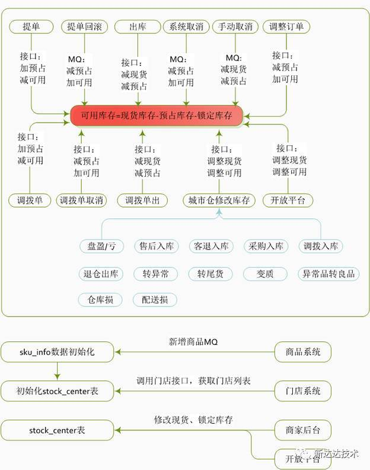

# 库存系统架构设计

> 参考地址：
> 
> [《库存系统架构设计》](https://www.cnblogs.com/ada-openmind/p/7446512.html)  
> [《库存系统设计》](https://blog.csdn.net/bonj2011/article/details/81842588)  
> [《手把手教你设计库存管理系统》](https://m.sohu.com/a/296888768_753266)

接口图：

**1. 库存预占的时机：**

提交订单时。

- 如果在加入购物车时预占库存，会出现一种情况：有一些人并不一定想买，但把它放到了购物车里，这些用户如果因为加入了购物车而预占了库存，真正想买的客户反而抢不到货，结果可能是这些库存始终不能被清空，对商家造成损失；
- 如果在支付时预占库存，那么对于热销商品，可能会出现大家抢购的情况。有的用户会发起支付后尝试预占库存，却发现库存中没有货，这样对用户体验不太友好。

**2. 重复提交订单，导致库存重复扣减**

1. **善意行为**：用户点击【提交订单】按钮后发现没有反应，再次点击按钮；
	- 点击【提交订单】按钮后，将按钮置灰；
2. **恶意刷单**：用户绕过前台，获取提交订单的请求地址，使用刷单工具执行订单提交；
	- 使用**令牌 (Token) 机制**：进入结算页后，给页面提供一个全局唯一的 Token ID，提交订单时将该 Token ID 提交上去。只有当 **Token ID 存在**且**Token ID 访问次数为 1 时**，才会通过后台逻辑进行处理；
3. **提单系统重试**：如果提交订单失败，可能会引起系统的重试执行；
	- 将订单号作为提交订单时的传入参数，可以利用订单号做幂等性处理。

**3. 库存回滚**

如果出现**用户未支付、用户支付后取消、风控判定取消、异常订单**几种场景，都会造成订单取消。订单中心发出取消订单的 MQ 消息给下游系统（包括库存系统），只需要保证能够正确消费取消订单的 MQ 消息即可。  
回滚库存时，可以根据每一个订单的唯一 ID，**记录库存操作流日志**。库存回滚时，可以根据唯一编号进行库存的返还，同时也需要保证回滚过程中的事务性和幂等性。  
回滚操作使用**同步回滚 + 异步重试**的策略。回滚操作是正常操作的逆向执行，过程需要同步执行。对于失败了的回滚任务，将该任务的 ID 记录下来，通过异步定时任务进行重试。

> 注：对于多次重试失败的任务，依旧需要留下人工干预操作的接口。