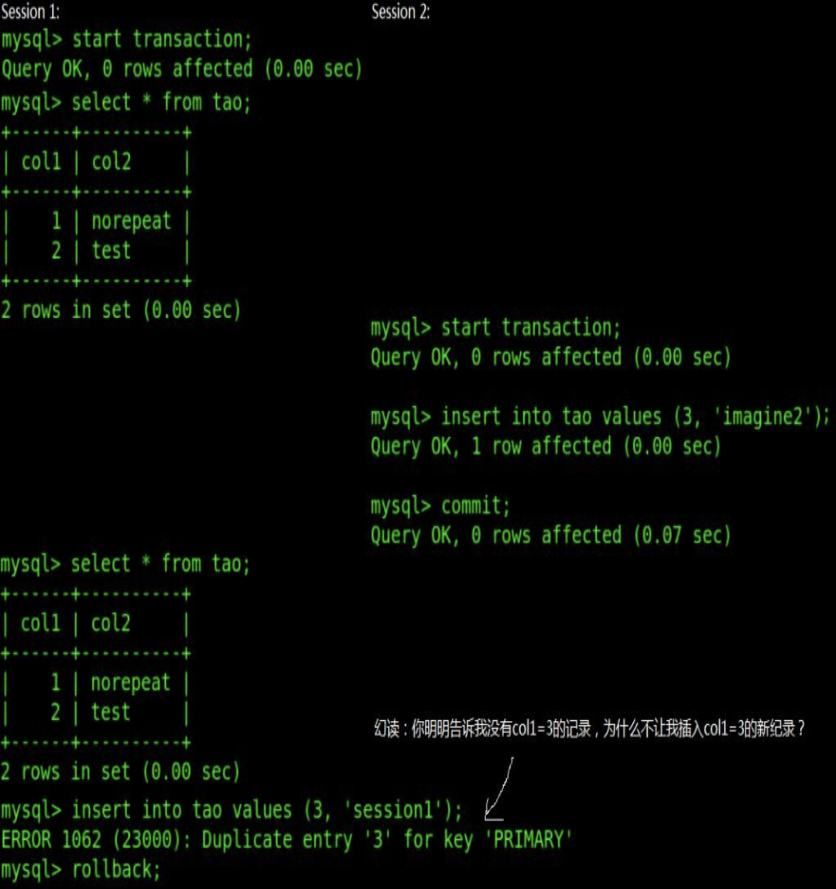

# 一. MySql / Oracle 的存储逻辑结构

> 注：见《InnoDB 存储引擎》第四章

- **表空间 (Tablespace)**：由段 (Segment) 组成；一个或多个文件组成；主要的段有：
	- **数据段**：作为 B+ Tree 的叶子节点；
	- **索引段**：作为 B+ Tree 的非叶子节点；
	- **回滚段**：包含回滚用的信息；
	- **其他信息段**；
- **段 (Segment)**：由区 (Extent) 组成；
- **区 (Extent)**：由数据块 (Block/Page) 组成，每个区固定 1M；
- **块 (Block/Page)**：默认一个块的大小为 16KB，所以默认情况下一个数据区有 64 个数据块（64 \* 16KB = 1M）；也可设定一个块为 2, 4, 8KB，那么一个数据区对应的块数量就是 512, 256, 128 个；

# 二. InnoDB 事务隔离级别

> 参考网址：  
> [《MySQL/InnoDB中的事务隔离级别》](https://www.cnblogs.com/flythinking/p/8514133.html)  
> [《MySQL隔离级别》](https://blog.csdn.net/taylor_tao/article/details/7063639)  
> [《innodb当前读 与 快照读》](https://blog.csdn.net/silyvin/article/details/79280934?depth_1-utm_source=distribute.pc_relevant.none-task&utm_source=distribute.pc_relevant.none-task)  
> [《MySQL的InnoDB的幻读问题》](http://blog.sina.com.cn/s/blog_499740cb0100ugs7.html)

## 2.1 数据异常现象

数据异常现象主要分三种：

- **脏读**：事务 A 修改了数据但没有提交，事务 B 查询数据时可以查到事务 A 提交的数据，此时事务 A 回滚，此时事务 B 读取的数据与数据库中的数据不一致，即为脏读现象；
- **不可重复读**：事务 A 查询数据，事务 B 修改 (update 或 delete) 了数据并提交，事务 A 再次用同样的语句查询，前后两次查询的数据不一致，即为不可重复读现象；
- **幻读**：保证了同一个事务里查询的结果无论如何都是事务刚开始时的状态，保证了一致性，不会出现不可重复读的现象。但是，如果**另一个事务同时提交了新数据，本事务再更新时**，就会“惊奇的”发现了这些新数据，貌似之前读到的数据是“鬼影”一样的幻觉。

幻读比较难以理解，如下图所示，可以很好的解释幻读现象：



## 2.2 隔离级别

> 参考地址：[《快照读、当前读和MVCC》](https://www.cnblogs.com/AlmostWasteTime/p/11466520.html)

SQL 的隔离级别有四种：

- **读未提交 (Read uncommitted)**：会出现脏读、不可重复读、幻读；
- **读已提交 (Read committed)**：会出现不可重复读、幻读；
  - Oracle 默认隔离级别；
	- 一个事务内操作一条数据，可以查询到另一个已提交事务操作同一条数据的最新值；
- **可重复读 (Repeatable Read)**：会出现幻读；
	- Mysql 默认隔离级别；
  - 每个事务只关注自己事务开始查询到的数据值，无论事务查询同一条数据多少次，该数据被改了多少次，都只查询到事务开始之前的数据值；
	- 在 InnoDB 中用多版本控制 MVCC 的方式，保证了可重复读，而且可以防止幻读；但是 InnoDB 幻读时保证的数据一致性是**快照读**，也就是历史数据（见[第十六章](# 十六. 当前读与快照读)）；
- **串行 (Serializable)**：无；
	- 注：串行化是悲观锁的理论实现，它对读加共享锁，对写加排他锁，读写分离。并发能力很差。

> 注：隔离级别与事务视图 readView 的关系，在[第十六章](# 十六. 当前读与快照读)中说明。

标准的隔离级别中，Oracle 只有 Read committed, Serializable 两种，此外还有 ReadOnly, WriteOnly 两种级别。其中 ReadOnly 是 Serializable 的子集。

# 二. 事务的特性

事务是一组 SQL 语句组成的，基本含义是一组 SQL 语句要么全都执行，要么全都不执行。有 ACID 四种特性：

- **Atomicity 原子性**：一组 SQL 语句要么全都执行，要么全都不执行；
- **Consistency 一致性**：事务执行之前数据库的数据时一致的，事务执行之后也是一致的；
- **Isolation 隔离性**：<font color=red>数据库允许多个并发的事务同时对数据库进行读写</font>；
- **Durability 持久性**：事务执行的结果，对数据库是永久性的；

# 三. 谈一谈对慢查询的分析？MySQL常用的优化方法有哪些？

> 参考地址：  
> [《MySQL索引失效的几种情况》](https://www.cnblogs.com/shynshyn/p/7887742.html)  
> [《Mysql的慢查询优化方式》](https://blog.csdn.net/qq_35571554/article/details/82800463)

**慢查询**：在 Mysql 中可以设置一个全局的搜索时间作为阈值，如果在 Mysql 执行查询语句的时间超过该阈值，则说明该条查询语句的执行时间过长，相关信息记录到慢查询记录日志中。  
通常慢查询的原因在于**索引**，常见的待优化出发点如下：

1. <font color=red>**索引没有生效**</font>
	- 前导模糊查询。在 WHERE 语句中如果有用到 LIKE 语句，则 LIKE 语句不能以 "%" 开头，否则索引会失效；可以令模糊查询的 "%" 写在后面，比如 WHERE ID LIKE "300%"；
	- 如果是多列的联合索引，必须该联合索引的第一个列，该索引才会生效；
	- 条件中带有 "or"，即使条件中某些数据列有索引，也不会使用，除非 or 条件中的所有列都有索引；
	- NULL 值。索引是不能存储 NULL 值的（单列索引无法存储 NULL 值，多列索引无法存储所有列都为 NULL 的值）；
	- 重复索引值太多的列。
2. **数据库结构优化**
	- 数据库多列索引拆分。对于一个大的数据表，通常会存在一些使用频率较低的数据列，可以将这些使用频率较低的数据列单独分出来形成一个表。因为一个表过大时，会因为使用频率不高的数据列影响效率。
	- 添加中间表。对于经常需要联合查询的表，可以建立一个中间表，通过中间表与其他表之间的关联进行查询，这样可以提高查询效率。
3. **关联查询优化**
	- ？？？
4. **LIMIT 分页优化**
	- ？？？

# 四. 谈一谈悲观锁和乐观锁以及SQL的实现

> 参考地址：  
> [《【MySQL】悲观锁&乐观锁》](https://www.cnblogs.com/zhiqian-ali/p/6200874.html)  
> [《数据库并发控制 你选乐观锁还是悲观锁？》](http://database.51cto.com/art/201008/219908.htm)

乐观锁与悲观锁是概念上的意义，主要解决的问题是对于并发冲突的检测。

乐观锁本质上并不属于锁，它只是一种**冲突检测机制**，但被这样称呼的时间比较长，就被称为乐观锁。乐观锁允许并发的获取内容进行读写，但在提交的时候会进行并发控制。比如 A, B 同时获得了一个数据，而且都要对其进行处理，A 先提交了该条数据，B 后来也要提交该条数据，这时候乐观锁的策略检测到两者发生了冲突，便会拒绝 B 提交的内容，并抛出冲突，交给 B 进行处理。  
乐观锁的处理策略，通常是**版本控制**，或者是**时间戳控制**（本质与前者相同）。对数据进行一个版本的记录，每次提交后都标上版本号。当提交时的版本号小于等于当前版本号，则抛出异常，待解决冲突后重新执行。  
笔者看到这里，就想到了一个很常见的乐观锁——即笔者项目中使用的 SVN 源代码版本控制器。我和同事一起编辑同一个 java 文件，是被允许的，但如果我们两个人提交的内容有冲突，则 SVN 会提示我们冲突，并让我们决定如何解决冲突（采用谁的内容，或者如何合并内容），然后再提交（再提交就是将冲突抛出后再解决的过程）。

悲观锁本质上属于锁，它相对于乐观锁，属于**冲突避免机制**。悲观锁不允许并发时统一的对数据进行修改，A, B 同时获取数据且都要对其进行修改时，如果 A 首先开启修改的事务且添加了悲观锁，则 B 就不能开启修改事务，直到 A 将事务修改完成并提交。  
这样联想一下，悲观锁的策略虽然也是可以在版本控制器的实现上套用，但明显没有乐观锁的策略方便。生活中比较常用的悲观锁，比如 Word。如果一个进程打开了某个 Word 文档的编辑模式，则其他进程被禁止进入该文档的编辑模式，直到第一个进程将 Word 退出；或者其他进程只允许进入文档的只读模式（只允许读，不允许写）。

**乐观锁与悲观锁的选择策略：**

选择重点在于比较冲突发生的<font color=red>**频率**</font>与<font color=red>**后果严重性**</font>。在冲突发生频率不高，或者冲突发生后的后果不严重（以 SVN 举例，冲突发生后仅仅是告知用户冲突的位置，用户处理一下冲突的部分即可）的情况下，适合使用乐观锁。   

但如果冲突发生**频率过高**，则抛出冲突的次数过多，即需要多次重复的提交事务，这样会加大处理量。这种情况下适合用悲观锁。  
此外如果冲突发生后的**后果比较严重**，也比较适合使用悲观锁。比如填写信息时，如果用户在填写内容出现错误而不提示，则用户费了老大劲儿后提交时发现填写内容错误而需要重新填写，会令用户很不爽。但如果在出现填写的错误时，就禁止用户继续往下填写，直至填写正确为止，这样虽然降低了灵活性，但冲突发生后继续填写的那部分内容是没有意义的，使用悲观锁策略可以令用户可以避免无用功的付出。

SQL 实现：

- 悲观锁：select \* for update，使用这种带有行排他锁的语句，本质上就是一种悲观锁的实现，数据库执行 select \* for update 时首先获得了该行的排他锁，如果其他事务也执行了 select \* for update 语句，则需要等第一个 select for update 语句结束完毕后将锁释放（通过锁达到了互斥效果），然后才能执行。
- 乐观锁：在执行事务过程中，只对需要被锁的数据添加一个版本号，事务正常执行。在事务提交时，比较数据对应的数据库版本与待提交版本，如果数据库版本在待提交版本之后，说明在事务执行过程中该数据已经被并发修改过了，此次事务不能执行，所以需要回滚。

# 五. MySql 的 JOIN 操作

> 参考地址：  
> [《MySQL的JOIN（一）：用法》](https://www.cnblogs.com/fudashi/p/7491039.html)

JOIN 有几种不同的类型，如下面的韦恩图所示：


如果有两个表 A, B 且分别定义两者在 ON 子语句的左右侧，则 JOIN 可以具体分为如下几种：

1. **笛卡尔积 (Cartesian Product)**：强行将 A, B 表两两关联，比如 A 有 m 行，B 有 n 行，则两者的 Cartesian Product 的大小为 n \* m；
2. **内连接 (INNER JOIN)**：数学上相当于交集，笛卡尔积上相当于笛卡尔积的 ON 子语句成立的结果；包括 WHERE, INNER JOIN, STRAIGHT_JOIN, JOIN 四种语句；
	- 例：select * from A INNER JOIN B ON A.type_id=B.typeId
3. **外连接 (OUTER JOIN)**：数学上相当于并集，笛卡尔积上相当于笛卡尔积的 ON 子语句成立的结果；包括 OUTER JOIN 语句；
	- 对于 Mysql 数据库并不支持外连接，但可以使用 UNION 语句实现相同的效果；
	- 例：select * from A OUTER JOIN B ON A.type_id=B.typeId
4. **左连接 (LEFT JOIN)**：数学上相当于交集 + A 表剩下的内容；
	- 例：select * from A LEFT JOIN B ON A.type_id=B.typeId
5. **右连接 (RIGHT JOIN)**：数学上相当于交集 + B 表剩下的内容；
	- 例：select * from A RIGHT JOIN B ON A.type_id=B.typeId
6. **USING**：类似于内连接，但内连接是统计 INNER JOIN ... ON ... 中满足 ON 子句后面的内容，而 ON 子句条件的自由度比较高。但 USING 是针对 A, B 两表具有相同的字段，比如 A, B 都有 key 字段，才可以使用 USING 关键字，否则在执行数据库语句时会报错。

# 六. 简述分库与分表设计？

> 参考地址：  
> [《sharding：谁都能读懂的分库、分表、分区》](https://www.cnblogs.com/f-ck-need-u/p/9388407.html)  
> 
> 注：JOIN 见上面的解析。

以高考为业务例程：全国有海量的考生（比如有 3000 万），每个考生都有六门课程，每门课程都有自己的成绩。那么总共有 1.8 亿条数据。我们可以几个思路对高考相关的数据库及数据表进行切分。

<font color=red>**分库**</font>角度上，首先可以进行**业务拆分**。高考可以分为两部分：<font color=red>**考生**</font>和<font color=red>**成绩**</font>。其中成绩又可以分为**学科**和**成绩**。所以可以分为考生 (stu_db) 和成绩 (grade_db) 两个数据库，而且 grade_db 中应该由成绩和学科两个部分（因为学科最多只有 9 个学科，是一个很小的表，可以和成绩表进行关联即可）。

<font color=red>**分表**</font>角度上，可以考虑进行**垂直切分**。垂直切分是按照字段来切分的，它将一个表按照字段分成多表，每个表存储一部分字段，而且表可以放在不同存储设备上。举个例子，比如高考是全国性的，那么就可以按照 34 个省市进行切分，即将 stu_db, grade_db 按照省市分别切分成 34 份。  
此外，对于字段比较多，数据量比较大的数据表，可以考虑对字段进行分析，分为热门和冷门字段，热门冷门字段通过主键进行关联，将单个大表拆分成不同的小表。

**分表**角度上还可以考虑**水平切分**，水平切分就是对一张表按片进行切分。通常有两种方式：按区间切分和按模取余切分。比如对于高考，区间切分就是讲编号为 1~10000 的分一张考生表，10001~20000 的分一张考生表；取模切分就是编号对某值（如 6）取余，则分成 6 个考生表。

此外还可以按字段条件切分，依旧例如按照地域切分，新疆西藏等边缘地区考生少，可以考虑将多个边缘地区的学生放在一个学生表中，河南山东的考生多，可以考虑将这种类型的省份考生放在一个或多个表中。

# 七. 分库分表带来的分布式困境与对应之策有哪些？

> 参考地址：  
> [《分库分表需要考虑的问题及方案》](https://www.jianshu.com/p/32b3e91aa22c)

具体没有处理过，而且文章感觉比较晦涩难懂，所以仅仅知道问题所在即可。

- 分库分表本身的业务逻辑复杂性；
- 分库分表由于可能在业务和数据库之间添加一层中间层，所以数据库结构变得复杂。而且中间层压力很大，一定不能崩溃（虽然可以通过添加 master / slave 的方式实现备份，但依旧添加了分库分表的复杂度）；
- 跨节点之间的 JOIN 连接。跨了不同的服务器实例，将不可以使用 JOIN 操作。
- 扩容和数据迁移困难。有的业务使用了双倍扩容的方案，这样只需要迁移 50% 的数据，而且可以稳定提升 100% 的性能，但对于以后的数据迁移，需要考虑扩容的成本。

# 八. MySQL主键和索引的区别？

主键和聚集索引在概念上有一定的相似，也有很多不同。不同之处在于：

- **概念**：
	- 主键是为了确保数据表的完整性，每一张表必须显式或隐式的定义一个主键；
	- 聚集索引是为了搜索数据的效率，本质上根据聚集索引为数据行进行排列；
- **唯一性与 NULL 值**：
	- 主键定义时，即要求 NOT NULL 且值必须唯一不可重复；
	- 聚集索引允许值为 NULL，且值可以重复；

相同：

- **数量**：一个数据表中，主键和聚集索引都只能定义一个；
- **定义**：主键可以定义一个或多个数据列，聚集索引也是可以定义一个或多个数据列；

# 九. MySQL实现事务的原理

# 十. 数据库与分布式锁

# 十一. 事务的二段提交机制？

# 十二. 聚簇索引和非聚簇索引

> 注：参考地址  
> [《和刚入门的菜鸟们聊聊--什么是聚簇索引与非聚簇索引》](https://www.cnblogs.com/auxg/p/Cluster-and-NonCluster-index.html)  
> [《MYSQL索引：对聚簇索引和非聚簇索引的认识》](https://blog.csdn.net/alexdamiao/article/details/51934917)  
>
> [《通俗易懂 索引、单列索引、复合索引、主键、唯一索引、聚簇索引、非聚簇索引、唯一聚簇索引 的区别与联系》](https://www.cnblogs.com/heqiyoujing/p/11229260.html)

## 12.1 聚簇索引、非聚簇索引

聚簇索引规定了一个数据表的排序方式，**一个数据表只能有一个聚簇索引**，通常使用聚簇索引的是数据表的主键。  
聚簇索引和数据行是存放在一起的，所以使用聚簇索引的查询效率很高。同时由于聚簇索引已经进行了排序，所以范围查找的效率很高。但是聚簇索引插入删除的代价可能会比较高，可能会引起页分裂的情况（B+Tree 的数据结构特性，因为 B+Tree 的一个节点的度通常是数据页的大小，向一个满度的节点插入数据，就会导致分页）。  
非聚簇索引又称二级索引，可以有多个，它也是一个 B+Tree 结构，它的叶节点指向的是行的 **key 字段和主键值**。所以通过非聚簇索引搜索时，首先通过非聚簇索引获取到行的主键值（先获取到数据表的聚簇索引值），然后根据主键值获取到数据行信息，相当于比聚簇索引多了一倍的 IO。  
聚簇索引和非聚簇索引不是矛盾关系。  

## 12.2 聚簇索引、唯一索引、主键的关系

- **聚簇索引与唯一索引**：一个表只允许有一个聚簇索引（通常主键作为聚簇索引），但允许有多个唯一索引（通常只有主键作为唯一索引）；
- **唯一索引与主键**：唯一索引允许有 null 值，主键不允许有 null 值；

# 十三. 举例说一下索引的应用场景和注意事项？

# 十四. MyBatis 是如何执行的？

> 参考网址：[《深入浅出Mybatis系列（十）---SQL执行流程分析（源码篇）》](https://www.cnblogs.com/dongying/p/4142476.html)
MyBatis 执行一次指令的过程有两个阶段，**获取 Mapper**与**执行语句**。

## 14.1 获取 Mapper

**SqlSession 是 MyBatis 的灵魂。**获取 Mapper 的操作也是在 SqlSession 接口中执行的。但首先应该考虑的是 SqlSession 如何创建。


## 14.1.1 SqlSession 的构建

首先，SqlSessionFactoryBuilder 用来构建 SqlSessionFactory。  
通常由于我们使用的是 Spring 与 Mybatis 共同使用，所以使用到了 org.apache.ibatis.spring 中的 **SqlSessionFactoryBean**。在该类中指定一个 xml 文件，同时 SqlSessionFactoryBean 中有一个 SqlSessionFactoryBuilder。将 XML 文件传入 builder，即可构建 SqlSessionFactory。  
SqlSessionFactory 全局基本上只有一个（如果有多个，说明系统设计是有问题的），通过 SqlSessionFactory 构建 SqlSession。SqlSessionFactory 最重要的方法就是 openSession() 方法。通过 openSession() 方法一系列的调用，最终会创建一个包装了 Statement 的 executor，以及一个 DefaultSqlSession。

每一个线程都有一个 SqlSession，用于执行 Sql 的增删改查、事务、获取 Mapper 接口等基本操作。

## 14.1.2 获取 Mapper

获取 Mapper 接口也是 SqlSession 的主要功能。Mapper.getMapper() 方法执行过程中，经过多次调用，在 **MapperProxyFactory** 中通过代理方式 newInstance() 真正的获取 Mapper 方法。

```java
  @SuppressWarnings("unchecked")
  protected T newInstance(MapperProxy<T> mapperProxy) {
    //动态代理我们写的dao接口
    return (T) Proxy.newProxyInstance(mapperInterface.getClassLoader(), new Class[] { mapperInterface }, mapperProxy);
  }
  
  public T newInstance(SqlSession sqlSession) {
    final MapperProxy<T> mapperProxy = new MapperProxy<T>(sqlSession, mapperInterface, methodCache);
    return newInstance(mapperProxy);
  }
```

## 14.2 执行语句

获取了 Mapper 之后就可以执行语句了。  

## 14.2.1 MapperProxy


获取的 Mapper 接口并不完全是接口本身，而是被 **MapperProxy** 类代理的接口。MapperProxy 是实现了动态代理接口 InvocactionHandler 的实现类，所以执行这里的 query 语句也是通过代理类通过反射调用执行的。

```java
  @Override
  public Object invoke(Object proxy, Method method, Object[] args) throws Throwable {
    if (Object.class.equals(method.getDeclaringClass())) {
      try {
        return method.invoke(this, args);
      } catch (Throwable t) {
        throw ExceptionUtil.unwrapThrowable(t);
      }
    }
    final MapperMethod mapperMethod = cachedMapperMethod(method);
    //主要交给MapperMethod自己去管
    return mapperMethod.execute(sqlSession, args);
  }
```

## 14.2.2 Executor


在 MapperMethod 的 execute 方法中进行判断，准备真正执行语句，执行过程还是会交给 SqlSession。比如执行 selectList 方法，selectList 方法会在前面 SqlSessionFactory 中构建的 executor 中调用 query 方法，然后再经过层层调用，到达 doQuery 方法。doQuery 方法中获取到了 StatementHandler，执行 query 方法：

```java
public <E> List<E> doQuery(MappedStatement ms, Object parameter, RowBounds rowBounds, ResultHandler resultHandler, BoundSql boundSql) throws SQLException {
    Statement stmt = null;
    try {
      Configuration configuration = ms.getConfiguration();
      StatementHandler handler = configuration.newStatementHandler(wrapper, ms, parameter, rowBounds, resultHandler, boundSql);
      stmt = prepareStatement(handler, ms.getStatementLog());
      //StatementHandler封装了Statement, 让 StatementHandler 去处理
      return handler.<E>query(stmt, resultHandler);
    } finally {
      closeStatement(stmt);
    }
  }
```

在 StatementHandler 中执行的 query 如下：

```java
  public <E> List<E> query(Statement statement, ResultHandler resultHandler) throws SQLException {
     // 到此，原形毕露， PreparedStatement, 这个大家都已经滚瓜烂熟了吧
    PreparedStatement ps = (PreparedStatement) statement;
    ps.execute();
    // 结果交给了ResultSetHandler 去处理
    return resultSetHandler.<E> handleResultSets(ps);
  }
```

最后到了 PreparedStatement 的执行，就到了 JDBC 真正执行的地方。至此一次 SQL 执行流程完毕。

# 十五. 索引设计的原则

> 参考地址：[《深入理解MySQL索引原理和实现——为什么索引可以加速查询？》](https://blog.csdn.net/tongdanping/article/details/79878302#%E5%85%AD%E3%80%81%E7%B4%A2%E5%BC%95%E7%9A%84%E4%BC%98%E5%8C%96)

## 15.1 键选择原则

1. 键设计4 原则
	- 为关联字段创建外键；
	- 所有的键都必须唯一；
	- 避免使用复合键；
	- 外键总是关联唯一的键字段；
2. 使用系统生成的主键
	- 设计数据库的时候采用系统生成的键作为主键，那么实际控制了数据库的索引完整性。这样，数据库和非人工机制就有效地控制了对存储数据中每一行的访问；
	- 采用系统生成键作为主键还有一个优点：当拥有一致的键结构时，找到逻辑缺陷很容易。
3. 不要使用用户可以编辑的键：不让主键具有可更新性
	- 在确定采用什么字段作为表的键的时候，可一定要小心用户将要编辑的字段。通常的情况下不要选择用户可编辑的字段作为键。
4. 可选键有时可做主键
	- 把可选键进一步用做主键，可以拥有建立强大索引的能力。

## 15.2 索引使用原则

**什么时候要使用索引？**

- 主键自动建立唯一索引；
- **经常作为查询条件的列要建立索引**，比如 WHERE 或者 ORDER BY 语句；
- 作为**排序的列**要建立索引；
- 查询中**与其他表关联的字段**，外键关系建立索引；
- 高并发条件下倾向**组合索引**（ 多个列组合构建的索引 ）；
	- **“最左前缀”原则**：对于语句 <code>ALTER TABLE 'table_name' ADD INDEX index_name('col1','col2','col3')；</code>
	- 把**最常用作为检索或排序的列放在最左**，依次递减，组合索引相当于建立了[col1], [col1, col2], [col1, col2, col3] 三个索引，而 col2 或者 col3 是不能使用索引的。
- **用于聚合函数的列**可以建立索引；例如使用了 max(column_1) 或者 count(column_1) 时的column_1就需要建立索引

**什么时候不要使用索引？**

- **经常增删改的列**不要建立索引；
- **有大量重复的列**不建立索引；
- **表记录太少**不要建立索引；
	- 只有当数据库里已经有了足够多的测试数据时，它的性能测试结果才有实际参考价值。如果在测试数据库里只有几百条数据记录，它们往往在执行完第一条查询命令之后就被全部加载到内存里，这将使后续的查询命令都执行得非常快--不管有没有使用索引。只有当数据库里的记录超过了1000条、数据总量也超过了 MySQL 服务器上的内存总量时，数据库的性能测试结果才有意义。

**索引失效的情况：**

- 在**组合索引中不能有列的值为 NULL**，如果有，那么这一列对组合索引就是无效的。
- 在一个 SELECT 语句中，索引只能使用一次，如果在 WHERE 中使用了，那么在 ORDER BY 中就不要用了。
- **模糊查询**：LIKE 操作中，<code>'%aaa%'</code> 不会使用索引，也就是索引会失效，但是 <code>‘aaa%’'</code> 可以使用索引。
- 在**索引的列上使用表达式或者函数**会使索引失效；
	- 例如：<code>select * from users where YEAR(adddate)>2007</code>，将在每个行上进行运算，这将导致索引失效而进行全表扫描，因此我们可以改成：<code>select * from users where adddate > ’2007-01-01′</code>。其它通配符同样，也就是说，在查询条件中使用正则表达式时，只有在**搜索模板的第一个字符不是通配符**的情况下才能使用索引。
- 在**查询条件中使用不等表达式**，以及 IS NULL 或者 IS NOT NULL 时会导致索引失效；
	- 特别的是，如果对主键索引使用 !=，则不会使索引失效，如果对主键索引或者整数类型的索引使用 \< 或者 \>，不会使索引失效。
- 字符串不加单引号会导致索引失效，更准确的说是类型不一致会导致失效；
	- 比如字段 email 是字符串类型的，使用 WHERE email=99999 则会导致失败，应该改为WHERE email='99999'。
- 在查询条件中**使用 OR 连接多个条件**会导致索引失效；
	- 除非 OR 链接的每个条件都加上索引，这时应该改为两次查询，然后用 UNION ALL 连接起来。
- 尽量不要包括多列排序，如果一定要，最好为这队列构建组合索引；

**索引的优化**

1. 最左前缀，见前面的解析；
2. 带索引的模糊查询优化，见前面的解析；
3. 为检索的条件构建全文索引，然后使用
	- <code>SELECT * FROM tablename MATCH(index_colum) ANGAINST(‘word’);</code>
4. 使用短索引
	- 对串列进行索引，如果可能应该指定一个前缀长度；
	- 例如，如果有一个CHAR(255)的 列，如果在前 10 个或20 个字符内，多数值是惟一的，那么就不要对整个列进行索引；
	- 短索引不仅可以提高查询速度，而且可以节省磁盘空间和 I/O 操作。

# 十六. 当前读和快照读

> 参考地址：  
> [《innodb当前读 与 快照读》](https://blog.csdn.net/silyvin/article/details/79280934?depth_1-utm_source=distribute.pc_relevant.none-task&utm_source=distribute.pc_relevant.none-task)  
> [《MySQL的InnoDB的幻读问题》](http://blog.sina.com.cn/s/blog_499740cb0100ugs7.html)  
> [《快照读、当前读和MVCC》](https://www.cnblogs.com/AlmostWasteTime/p/11466520.html)  
> [《MYSQL（04）-间隙锁详解》](https://www.jianshu.com/p/32904ee07e56)

## 16.1 readView

快照读指的是读取一瞬间的数据，它在 InnoDB 中是通过**多版本控制 MVCC** 实现的，而 MVCC 是由**事务视图 readView** 实现的。Read View 查询同一条数据，因为 readView 是针对同一条数据生成的视图，每个 sql 语句查询某条数据时，都是查询最新 readView 的该条数据的值。  

## 16.2 快照读

快照读的意思如字面意思一样，拿到的数据像是照片一样，反映了一瞬间的数据情况。快照读通常在普通的 select 方法中使用，且通常 select 方法不加 <code>lock inshare mode</code> 之类的锁。快照读是基于事务视图 readView 实现的，对于不同的事务隔离级别，readView 实现如下：

1. **读已提交**：事务中每个 SQL 语句生成一个 readView，这样事务内多个 SQL 语句会生成多个 readView，其中每条 SQL 执行时，都是查询最新 readView 的值；
	- 所以会出现**不可重复读**的现象：事务 A 查询数据，事务 B 修改 (update 或 delete) 了数据并提交，事务 A 再次用同样的语句查询，前后两次查询的数据不一致；
2. **可重复读**：在事务开始的时候生成一个 readView，同一个事务内的多条查询 SQL 查询同一条数据时，读取到的 readView 都是同一个，查询某条数据的值也是同一个值；
	- 比如事务 A 查询主键 id = 1 的行数据列 age = 10，不管事务 B 是否对该 age 值做出改变，事务 A 的多条查询 SQL 语句，查询 age 的值一定一直都是 age = 10；

在可重复读级别下，快照读是基于 MVCC 和 undo log 实现的，多个 readView 组成一个**回滚日志 undo log**。在该级别下，MVCC 完全解决了重复读，也在一定程度上避免了幻读，但是这种避免幻读的方式，是利用快照读的特性，在某事务开始时的第一个 select 生成一个 readView，该 readView 某种意义上算是第一个 select 时的**历史数据**。对事务 A 使用快照读的方式，表面上看避免了幻读，但如果其他事务 B 修改了数据，事务 A 再修改数据，然后事务 A 再查询数据，这时候事务 A 就会出现由事务 B 修改的数据，即事务 B 修改的数据并没有实时显示。   
要完全避免这种现象，需要使用当前读的方式。

## 16.3 当前读

当前读可以读取最新的数据，完全避免了可重复读和幻读现象，它保证数据的一致性，同一个事务内部读取某一条数据时，数据都是一样的。  
在可重复读级别下，当前读是通过**行锁 (record lock)** 与**间隙锁 (gap lock)** 实现的。以两个正在进行的事务 A, B 进行举例，其中事务 A 两条 SQL 语句，且第二条是 insert 语句，事务 B 是一个 insert 语句：

1. 事务 A 开始时生成一个 readView (id = n)，执行第一个 SQL 语句时，读取的是当前的 readView 值 (id = n)；
2. 事务 B 开始，首先生成 id = n+1 的 readView；
3. 事务 B **使用索引**进行插入（或 update 等操作）时，InnoDB 会在事务 B 中将当前行与上一个行加锁，对当前行用**行锁 (record lock)** 加锁，对上一行用**间歇锁 (gap lock)** 加锁（锁住一部分区域数据）；
4. 事务 A 执行第二个 SQL 即 insert 语句，这时候由于事务 B 还没有提交，所以没有释放数据锁，此时阻塞等待；
5. 事务 B 执行完毕，释放锁，事务 A 的第二个 SQL 获取锁，读到当前最新的数据 (readView id = n+1)；  

这样就实现了读取最新的数据，即当前读。

典型的当前读操作：

- update
- delete
- insert
- select ... lock in share mode
- select ... for update
