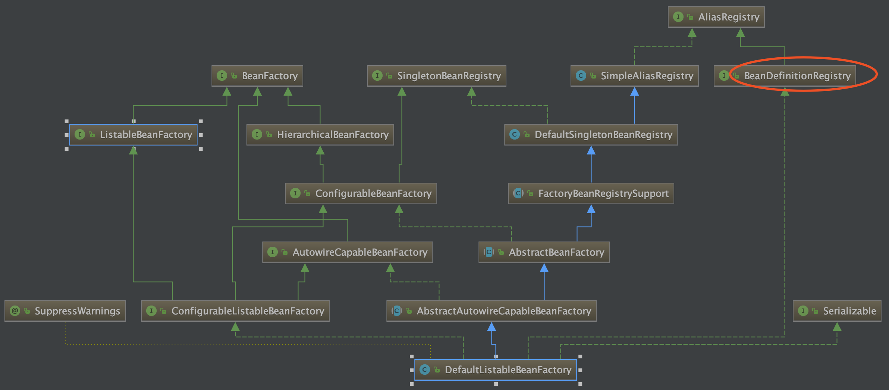

# 一. Spring IOC 如何管理 Bean 之间的依赖关系，怎么样避免循环依赖？

> 参考地址：  
> [《Spring IOC 容器源码分析 - 循环依赖的解决办法》](http://www.imooc.com/article/34150)  
> [《Spring IOC循环依赖解决方案分析》](https://blog.csdn.net/codingtu/article/details/79515414)  
> [《Spring5源码阅读－－如何解决循环依赖？》](https://blog.csdn.net/Q_AN1314/article/details/79613214)

在 Spring 中获取一个 Bean，是通过获取 BeanDefinition 实现的：在定义 Bean 信息的 XML 文件中，BeanDefinitionReader 读取指定路径下的 XML 文件，获取 Bean 定义信息并封装成 BeanDefinition 对象，该实例对象包含依赖关系信息 dependsOn。通常依赖关系是在 XML 的 p:xxx-ref，或者通过类的 @Autowired 等手段实现的。

循环依赖，就是在 classA 和 classB 的属性中，都互相包含彼此。Spring 避免循环依赖出现的错误，使用了三层缓存：

- **单例缓存 <font color=red>singletonObjects</font>**：存放填充完毕的，实际的 BeanDefinition
- **Bean 定义缓存 <font color=red>earlySingletonObjects</font>**：存放未填充的 BeanDeinition (属性值全为 null)，用于解决循环依赖问题；
- **工厂缓存 <font color=red>singletonFactories</font>**：存放单例 Bean 的工厂对象，在循环依赖问题中用来辅助解决问题；
	- singletonFactories 的 key 为 beanName，value 为该 bean 对应的 bean 工厂；这样一个 bean 就可以通过 beanName 从对应的 bean 工厂中找到对应的 bean。

分析 <code>getSingleton()</code> 方法：

```java
public Object getSingleton(String beanName){
    //参数true设置标识允许早期依赖
    return getSingleton(beanName,true);
}
protected Object getSingleton(String beanName, boolean allowEarlyReference) {
    //检查缓存中是否存在实例
    Object singletonObject = this.singletonObjects.get(beanName);
    if (singletonObject == null && isSingletonCurrentlyInCreation(beanName)) {
        //如果为空，则锁定全局变量并进行处理。
        synchronized (this.singletonObjects) {
            //如果此bean正在加载，则不处理
            singletonObject = this.earlySingletonObjects.get(beanName);
            if (singletonObject == null && allowEarlyReference) {  
                //当某些方法需要提前初始化的时候则会调用addSingleFactory 方法将对应的ObjectFactory初始化策略存储在singletonFactories
                ObjectFactory<?> singletonFactory = this.singletonFactories.get(beanName);
                if (singletonFactory != null) {
                    //调用预先设定的getObject方法
                    singletonObject = singletonFactory.getObject();
                    //记录在缓存中，earlysingletonObjects和singletonFactories互斥
                    this.earlySingletonObjects.put(beanName, singletonObject);
                    this.singletonFactories.remove(beanName);
                }
            }
        }
    }
    return (singletonObject != NULL_OBJECT ? singletonObject : null);
}
```

依旧以 classA 和 classB 为例，假设两个实例对象存在循环依赖关系，且 classA 对象首先在 Spring 容器中初始化。

1. 构建 classA 对象的未填充 BeanDefinition 对象，**<font color=red>并置入 earlySingletonObjects</font>**，同时**<font color=red>将该 bean 从工厂缓存 singletonFactories 中除掉</font>**，为解决循环依赖做准备；
2. 尝试向 classA 对象中填充内容，且填充过程到需要填充 classB 对象；
3. 首先分别尝试从完全实例化完毕的单例缓存 singletonObjects 和不完全实例化的 earlySingletonObjects 中获取 classB 对象，都获取失败；
4. 尝试初始化 classB 对象的 BeanDefinition。在初始化过程中，classB 对象需要引用到 classA 对象实例，此时出现了循环依赖的情况；
5. classB 对象尝试从 singletonObjects 中获取 classA，但获取失败（因为此时 classA 当前还在初始化过程中，所以没有放入 singletonObjects 中）；**<font color=red>然后从 earlySingletonObjects 中获取 classA 的引用</font>**。
6. classB 获取到 classA 的引用后，可以继续完成实例化过程；
7. classB 实例化完成后，实例对象返回给 classA，然后 classA 完成其实例化过程。

至此，循环依赖的 classA 和 classB 都完成了实例化。

# 二. AOP 的实现原理

> 参考地址：  
> [《Spring AOP 的实现原理》](http://www.importnew.com/24305.html)  
> [《Spring service 本类中方法调用另一个方法事务不生效问题》](https:// blog.csdn.net/dapinxiaohuo/article/details/52092447)  

AOP 的基本是使用代理实现的。通常使用的是 AspectJ 或者 Spring AOP 切面。  

AspectJ 使用静态编译的方式实现 AOP 功能。对于一个写好的类，对其编写 aspectj 脚本，然后对该 \*.java 文件进行编译指令，如 <code>ajc -d . Hello.java TxAspect.aj</code>，即可编译生成一个类，该类会比原先的类多一些内容，通过这种方式实现切面。

原始类：

```java
public class Hello {
    public void sayHello() {
        System.out.println("hello");
    }
 
    public static void main(String[] args) {
        Hello h = new Hello();
        h.sayHello();
    }
}
```

编写的 aspectj 语句：

```java
public aspect TxAspect {
    void around():call(void Hello.sayHello()){
        System.out.println("开始事务 ...");
        proceed();
        System.out.println("事务结束 ...");
    }
}
```

执行 aspectj 语句 <code>ajc -d . Hello.java TxAspect.aj</code> 编译后生成的类：

```java
public class Hello {
    public Hello() {
    }
 
    public void sayHello() {
        System.out.println("hello");
    }
 
    public static void main(String[] args) {
        Hello h = new Hello();
        sayHello_aroundBody1$advice(h, TxAspect.aspectOf(), (AroundClosure)null);
    }
}
```

Spring AOP 是通过**<font color=red>动态代理</font>**的形式实现的，其中又分为通过 **JDK 动态代理**，以及 **CGLIB 动态代理**。

- **JDK 动态代理**：使用反射原理，对实现了接口的类进行代理；
- **CGLIB 动态代理**：字节码编辑技术，对没有实现接口的类进行代理；

如果使用 Spring AOP，使用过程中可能会出现一个问题：<font color=red>**自身调用切面注解方法，切面失效**</font>。这是因为 AOP 的实现是通过代理的形式实现的，所以自身调用方法不满足代理调用的条件，所以不会执行切面。切面的调用流程如下 (注：事务的实现原理也是切面)：


所以，对于自身调用切面的情况，可以将调用自身方法的方式改变，改为使用代理调用方法的形式。可以在 Spring 的 XML 中对 aop 进行配置：

```xml
<!—- 注解风格支持 -->
<aop:aspectj-autoproxy expose-proxy="true"/>
<!—- xml 风格支持 -->
<aop:config expose-proxy="true"/>
```

然后在方法中通过 Spring 的 AopContext.currentProxy 获取代理对象，然后通过代理调用方法。例如有自身方法调用如下：

```java
this.b();
```

变为：

```java
((AService) AopContext.currentProxy()).b();
```

# 三. 手写 SpringMVC DispatcherServlet 的大致实现？

> 参考网址：  
> [《SpringMVC 常见面试题总结（超详细回答）》](https://blog.csdn.net/a745233700/article/details/80963758)  
> 类似于使用大全的文章，比较长，适合查询：[《深入理解 Spring MVC 思想》](https://www.cnblogs.com/baiduligang/p/4247164.html)

SpringMVC 请求执行流程：

## 3.1 获取处理方法

1. Spring 容器在启动时，会载入若干 HandlerMapping 实例到 DispatcherServlet 中，根据 request 信息，调用接口方法 getHandler，该方法会在初始化后的**映射注册器 MappingRegistry** 中寻找匹配的**处理器方法 HandlerMethod**；
	- 服务获取客户端发来的 HTTP 请求，进入 DispatcherServlet#service() 方法，然后进入 **doDispatch()** 方法；
2. 根据 HandlerMethod，封装得到**统一的接口处理器 HandlerAdapter** 中；
	- HandlerMethod 经过处理后包装为 HandlerExecutionChain 类型；

## 3.2 执行 Controller 方法

1. 预处理：如果注册了**拦截器 (HandlerInterceptor interceptor)**，则逐个执行拦截器的预处理方法，
2. 执行处理器适配器 HandlerAdapter 中的方法，通过反射调用对应的 Controller 方法，进行逻辑处理并返回，处理返回值；返回值为 ModelAndView 类；
	- ModelAndView 中有数据结果 (ModelMap model) 以及视图 (Object view)；其中 **view 并不是真实的视图，而是逻辑视图名**，ViewResolver 可以通过逻辑视图名获取真正的视图对象；
3. 后处理：如果注册了**拦截器 (HandlerInterceptor interceptor)**，则逐个执行拦截器的后处理方法；

## 3.3 渲染视图

1. 根据处理结果 ModelAndView 中的逻辑视图，在视图解析器集合中匹配 ViewResolver，通过匹配到的视图解析器获取真实的视图对象 (View view)；
2. 视图根据数据结果 model 渲染；
3. 将渲染的最后结果存入响应 response，返回客户端；

> 注：关于容器启动了之后做了哪些主要工作，见本文容器初始化部分；

# 四. Spring Bean 的注入过程

Spring ioc 容器的核心类是 AbstractApplicationContext，入口是 <code>refresh()</code> 方法，该方法是个模板方法，定义了加载到容器的全部过程。

```java
@Override
	public void refresh() throws BeansException, IllegalStateException {
		synchronized (this.startupShutdownMonitor) {
			prepareRefresh();
			ConfigurableListableBeanFactory beanFactory = obtainFreshBeanFactory();
			prepareBeanFactory(beanFactory);
			try {
				postProcessBeanFactory(beanFactory);
				// 注册 BeanDefinition 到 BeanDefinitionRegistry 中
				invokeBeanFactoryPostProcessors(beanFactory);
				registerBeanPostProcessors(beanFactory);
				initMessageSource();
				initApplicationEventMulticaster();
				onRefresh();
				registerListeners();
				// 将 BeanDefinition 转换为 Bean 实例
				finishBeanFactoryInitialization(beanFactory);
				finishRefresh();
			} catch (BeansException ex) {
				if (logger.isWarnEnabled()) {
					logger.warn("Exception encountered during context initialization - " +
							"cancelling refresh attempt: " + ex);
				}
				destroyBeans();
				cancelRefresh(ex);
				throw ex;
			}
			finally {
				resetCommonCaches();
			}
		}
	}
```
注入 Spring Bean 的逻辑主要在 <code>refresh()</code> 方法的两个方法中。

1. <code>invokeBeanFactoryPostProcessors</code>：注册 BeanDefinition 到 BeanDefinitionRegistry 中；
2. <code>finishBeanFactoryInitialization</code>：将 BeanDefinition 转换为 Bean 实例；

## 4.1 BeanDefinition 的注册

通常使用到的 <code>BeanFactory</code> 类是 <code>DefaultListableBeanFactory</code>，如下图的继承图所示，它实现了 <code>BeanDefinitionRegistry</code> 类，所以也实现了 <code>BeanDefinitionRegistry#registerBeanDefinition()</code> 方法，该方法将所有的 BeanDefinition 注册到 <code>DefaultListableBeanFactory</code> 中。



1. 对于 XML 文件配置的 Bean，读取 bean 的 xml 配置文件，将 bean 元素分别转换成一个 BeanDefinition 对象；
2. 对于注解类的 Bean 对象，AnnotationConfigApplicationContext 很关键，它是 spring 加载、管理 bean 的最重要的类。主要包括：
	- **AnnotatedBeanDefinitionReader**：用来加载 class 类型的配置信息，在它初始化的时候，会**预先注册一些 BeanPostProcessor 和 BeanFactoryPostProcessor**，为后续解析 Bean 和 Configuration 注解做准备；
	- **ClasspathBeanDefinitionScanner**：将指定包下的类通过一定规则过滤后，将 Class 信息包装成 BeanDefinition 的形式，注册到 IOC 容器中；
3. 然后通过 BeanDefinitionRegistry 将这些 bean 注册到beanFactory中，保存在它的一个 ConcurrentHashMap 中。

> 注：将 BeanDefinition 注册到了 beanFactory 之后，在这里 Spring 为我们提供了一个扩展的切口，允许我们通过实现接口 BeanFactoryPostProcessor 来插入我们定义的代码。  
> 典型的例子就是：PropertyPlaceholderConfigurer，我们一般在配置数据库的 dataSource 时使用到的占位符的值，就是它注入进去的。

## 4.2 BeanDefinition 到 Bean 的实例化

在后面的 <code>finishBeanFactoryInitialization</code> 中，调用了方法<code>DefaultListableBeanFactory.preInstantiateSingletons()</code>，该方法中会根据注册的 BeanDefinition 信息依此调用 getBean(beanName) ，将 bean 内容实例化。

> 注：实例化中可能出现循环依赖问题，见[本篇《第一章》](# 一. Spring IOC 如何管理 Bean 之间的依赖关系，怎么样避免循环依赖？)。

# 五. SpringBean 创建过程中的设计模式？

见[《设计模式》篇](./设计模式.md)。

# 六. Spring Bean 的生命周期

BeanFactory 中 Bean 的生命周期：

- **实例化**：以 InstantiationAwareBeanPostProcessor 接口方法为包装，进行实例化过程。该接口主要功能有三个：实例化前预处理、实例化后预处理、设置属性值预处理；
	- 实例化前预处理：InstantiationAwareBeanPostProcessor # postProcessBeforeInstantiation();
	- **实例化**；
	- 实例化后预处理：InstantiationAwareBeanPostProcessor # postProcessAfterInstantiation();
- **填充属性值**：同样以 InstantiationAwareBeanPostProcessor 接口方法为包装；
	- 设置属性值预处理：InstantiationAwareBeanPostProcessor # postProcessPropertyValues();
	- **设置属性值**；
		- 注：<font color=red>循环依赖问题</font>的解决在该部分实现。具体过程见前面的解析；
		- 注：只有 Singleton 允许循环依赖；Prototype 的 Bean 在发现循环依赖会抛出异常；
- **初始化**：进行一系列初始化接口 (比如用于预处理 Bean 的 **BeanPostProcessor** 接口等) 的方法，完成初始化；
	- 设置 BeanName: BeanNameAware # setBeanName();
	- 设置 BeanFactoryName: BeanFactoryNameAware # setBeanFactoryName();
	- **<font color=red>（对于 ApplicationContext）</font>** 设置应用上下文 (ApplicationContext): ApplicationContextAware # setApplicationContext;
	- 初始化前预处理：BeanPostProcessor # postProcessBeforeInstantiation();
	- 初始化接口方法：InitializingBean # afterPropertiesSet();
	- XML init-method 初始化方法；
	- 初始化后预处理：BeanPostProcessor # postProcessAfterInstantiation();
	- 注：
		- Spring AOP 的功能就是基于 BeanPostProcessor 实现的；
- **生命周期管理**：Spring Bean 的生命周期有单例 (Singleton) 与复数 (Prototype) 两种（WebApplicationContext 又添加了其他三种）；只有 Singleton 有缓存管理的功能；
	- prototype: 构造完毕之后直接返回，Spring 不再管理该 Bean 的生命周期；
	- singleton: 将构造完成的 Bean 放入 Spring IoC 的缓存池中，将该 Bean 的引用返回给调用者，Spring 继续对该 Bean 进行生命周期的管理。
- **销毁**：容器销毁时对 Bean 执行的操作；
	- DisposableBean # afterPropertiesSet();
	- XML destroy-method 销毁方法；

# 七. Servlet 生命周期

> 参考地址：[《什么是Servlet(原理，从访问到方法)》](https://www.cnblogs.com/rolandlee/p/10756573.html)

Servlet 是 SUN 公司提供的一种用于开发动态 WEB 资源的技术，SUN 公司在其 API 中提供了一个 **Servlet** 接口。如果用户想要开发一个 Java Web 服务，需要完成两个步骤：

1. 编写一个实现了 Servlet 接口的 Java 类；
2. 将该 Java 类放到 Servlet 容器中（通常是 Tomcat）；

通常我们写好的实现了 Servlet 接口的 Java 程序就称为 Servlet，它的路径在 %{TOMCAT_HOME}$/webapp/应用名/WEB_INF/classes/ 下。

## 7.1 Servlet 生命周期

Servlet 主要有三个接口：**init(), service(), destroy()**；Servlet 生命周期可以分为 5 个步骤：

1. **加载 Servlet**；当 Tomcat 第一次访问 Servlet 的时候，Tomcat 负责创建 Servlet 的实例；
	- 只有第一次访问 Servlet 时会创建 Servlet 实例，第一次之后就会检查已经装载了的该 Servlet 实例对象；
2. **初始化**：当 Servlet 实例化时，Tomcat 调用 **init()** 方法初始化对象；
3. **执行服务**：接收浏览器传来的请求，调用 **service()** 方法处理请求并返回响应；
	- service() 方法通常是开发者需要重新实现的方法；
4. **销毁 Servlet**：当 Tomcat 关闭，或者检测到 Servlet 要从 Tomcat 中删除时，调用 Servlet 的 **destroy()** 接口，释放该 Servlet 实例占的资源；
5. **卸载**：Servlet 调用 destroy() 方法后等待垃圾回收。

在三个主要接口中，只要访问 Servlet，service() 方法就会被调用；init() 方法只有第一次访问 Servlet 的时候才会被调用；destroy() 方法只有在 Tomcat 关闭销毁时才会被调用。

## 7.2 Servlet 的配置

配置 Servlet 时，我们需要将 Servlet 所用 Jar 包加载到 classpath 路径下，然后在 WEB-INF 目录中新建一个 **web.xml** 文件，配置 Servlet 对外访问路径。web.xml 文件中配置 Servlet 主要需要两个标签：**servlet**, **servlet-mapping**。

```xml
<?xml version="1.0" encoding="UTF-8"?>
<web-app xmlns="http://xmlns.jcp.org/xml/ns/javaee"
  xmlns:xsi="http://www.w3.org/2001/XMLSchema-instance"
  xsi:schemaLocation="http://xmlns.jcp.org/xml/ns/javaee
                      http://xmlns.jcp.org/xml/ns/javaee/web-app_3_1.xsd"
  version="3.1">
  
  <!-- Servlet 名称与实现类信息 -->
  <servlet>
    <servlet-name>DispatcherServlet</servlet-name>
    <servlet-class>org.springframework.web.servlet.DispathcerServlet</servlet-class>
  </servlet>
  
  <!-- Servlet 名称与 URL 映射 -->
  <servlet-mapping>
    <!-- 与前文的 servlet 名称匹配 -->
    <servlet-name>DispatcherServlet</servlet-name>
    <!-- URL 映射路径 -->
    <url-pattern>/home</url-pattern>
  </servlet-mapping>
</web-app>
```

由于浏览器客户端是通过 URL 地址访问 Web 服务器的资源，所以 Servlet 程序如果想被外界访问，必须将 Servlet 程序映射到 URL 地址上。  
servlet 元素用于注册 Servlet，它包含有两个主要的子元素：servlet-name 和 servlet-class，分别用于设置 Servlet 的注册名称和 Servlet 的完整类名。一个 servlet-mapping 元素用于映射一个已注册的 Servlet 的一个对外访问路径，它包含有两个子元素：servlet-name 和 url-pattern，分别用于指定 Servlet 的注册名称和 Servlet 的对外访问路径。

## 7.3 Servlet 的实现

通常开发人员不会实现 Servlet 接口内容，因为 SUN 公司已经提供了两个默认实现类：**GenericServlet**, **HttpServlet**。开发人员在开发时通常只需要继承这两个 Servlet 实现类中的某一个，然后重新实现其中的主要方法即可。例如对于继承 HttpServlet，开发人员只需要重写 **doGet(), doPost()** 方法即可，不需要复写 service() 方法。

## 7.4 缺省 Servlet

如果某个 Servlet 的映射路径仅仅为一个正斜杠 (/)，那么这个 Servlet 就成为当前 Web 应用程序的缺省 Servlet。凡是在 web.xml 文件中找不到匹配的 servlet-mapping 元素的 URL，它们的访问请求都将交给缺省 Servlet 处理。也就是说，缺省 Servlet 用于处理所有其他 Servlet 都不处理的访问请求。  
通常在 <code>Tomcat 安装目录\conf\web.xml</code> 中注册了一个名为 <code>org.apache.catalina.servlets.DefaultServlet</code> 的 Servlet，在该配置文件中被设置成了缺省 Servlet。

```xml
<?xml version="1.0" encoding="UTF-8"?>
<web-app xmlns="http://xmlns.jcp.org/xml/ns/javaee"
  xmlns:xsi="http://www.w3.org/2001/XMLSchema-instance"
  xsi:schemaLocation="http://xmlns.jcp.org/xml/ns/javaee
                      http://xmlns.jcp.org/xml/ns/javaee/web-app_3_1.xsd"
  version="3.1">
    <servlet>
        <servlet-name>default</servlet-name>
        <servlet-class>org.apache.catalina.servlets.DefaultServlet</servlet-class>
        <init-param>
            <param-name>debug</param-name>
            <param-value>0</param-value>
        </init-param>
        <init-param>
            <param-name>listings</param-name>
            <param-value>false</param-value>
        </init-param>
        <load-on-startup>1</load-on-startup>
    </servlet>

    <servlet-mapping>
        <servlet-name>default</servlet-name>
        <url-pattern>/</url-pattern>
    </servlet-mapping>

    <!-- JSP Servlet 略 -->

    <!-- 海量 mime-mapping 标签略 -->

    <welcome-file-list>
        <welcome-file>index.html</welcome-file>
        <welcome-file>index.htm</welcome-file>
        <welcome-file>index.jsp</welcome-file>
    </welcome-file-list>

</web-app>
```

## 7.6 Servlet 线程安全问题

当多个客户端并发访问同一个 Servlet 时，Web 服务器会**为每个访问创建一个连接**。所以如果不涉及 Servlet 实例中的共享资源，就不会涉及线程安全问题；但如果涉及共享资源，就需要考虑通过同步等手段解决线程安全问题。  

# 八. Tomcat 的基本架构是什么？

> 参考地址：  
> [《tomcat架构》](https://www.cnblogs.com/diegodu/p/5915300.html)  
> [《四张图带你了解Tomcat系统架构》](https://blog.csdn.net/qq_38245537/article/details/79009448)

## 8.1 Tomcat 的结构


一个 Tomcat 中有一个 Server，每个 Server 中**至少有一个 Service**。**一个 Service 由至少一个 Connector 与一个 Container 组成**。

Service 的结构主要可以被分为两部分：**<font color=red>Connector</font>** 与 **<font color=red>Container</font>**。  

- **Connector**: 用于接受客户端传来的数据，解析其协议，将解析后的数据传输给 Servlet；
- **Container**: 封装和管理 Servlet，接收传来的请求，并完成处理逻辑；

### 8.1.1 Connector


一个 Connector 又由三部分组成：**EndPoint**, **Processor**, **Adapter**；

- **EndPoint**: 监听 TCP 请求，处理监听到的 socket；
	- Acceptor: 调用方法 accept() 监听 TCP 请求，捕获 socket；
	- Handler: 处理接收到的 socket；
- **Processor**: 将 socket(TCP 协议，传输层) 转为 HttpRequest(HTTP 协议，应用层)；
- **Adapter**: 将 HttpRequest 传给 Servlet 容器，进行逻辑处理；

### 8.1.2 Container


Container 用来封装和管理 Servlet，并处理逻辑过程。Container 被分为四种类型：

- **Engine**: 引擎，一个 Service 只有一个 Engine，可以管理多个站点 host；
- **Host**: 站点，或者成为虚拟主机；
- **Context**: 应用上下文
	- 通常对应着 webapp 目录下的一个文件夹；
	- 一个 host 可以有多个 context；
- **Wrapper**: 每一个 wrapper 对应一个 Servlet；

根据 Tomcat 的文件目录可以对照几个 Container 的内容：


由于 Container 是一个实现了 LifeCycle 的接口，LifeCycle 接口中包含了初始化 init(), start(), stop(), destroy() 方法（生命周期方法），所以 engine, host, context, wrapper 都需要实现自己的生命周期方法。  
四种类型的 Container 是通过**组合**的方式进行调用的。具体关系见下文的 Tomcat 启动流程。

## 8.2 Tomcat 如何处理请求？

首先客户端发送请求，被 Connector 捕获，处理为 HTTP 请求，发送到 Container。Container 使用**责任链**进行处理；  
**责任链**可以理解为 Engine, Host, Context, Wrapper 四条 Pipeline 串行后的一条链，传入的请求首先传入 EnginePipeline 的第一个 Engine，最后传到 WrapperPipeline 的最后一个 Wrapper(StandardWrapperValue)。  
值得一提的是，执行到最后的 **StandardWrapperValue** 时，会创建一个 FilterChain 用于匹配我们创建的 Filter 和 Servlet。FilterChain 的作用是通过其 **doFilter** 方法依次调用：

1. 所有 Fitler#doFilter() 方法；
2. 所有 servlet#service() 方法；

经过这样一系列链式处理，请求处理完毕，即可将结果通过响应 Response 返回给客户端。

# 九. Tomcat 容器、Spring 容器、Servlet 容器、SpringMVC 容器的关系与区别

## 9.1 Tomcat 的启动

> 参考地址：  
> [《Tomcat启动过程源码解读》](https://www.cnblogs.com/z941030/p/8524882.html)

Tomcat 启动的时序图如下所示：


Tomcat 启动的入口类：**org.apache.catalina.startup.Bootstrap#main**；

在 main 方法中调用 bootstrap#init() 方法，其中通过反射的方式初始化 **Catalina** 类，然后调用 Catalina 的 start() 方法，Tomcat 开始启动：

```java
public void start() {
 
    if (getServer() == null) {
        load();
    }
 
    if (getServer() == null) {
        log.fatal("Cannot start server. Server instance is not configured.");
        return;
    }
 
    long t1 = System.nanoTime();
 
    // Start the new server
    try {
        getServer().start();
    } catch (LifecycleException e) {
        log.fatal(sm.getString("catalina.serverStartFail"), e);
        try {
            getServer().destroy();
        } catch (LifecycleException e1) {
            log.debug("destroy() failed for failed Server ", e1);
        }
        return;
    }
 
    long t2 = System.nanoTime();
    if(log.isInfoEnabled()) {
        log.info("Server startup in " + ((t2 - t1) / 1000000) + " ms");
    }
 
    // Register shutdown hook
    if (useShutdownHook) {
        if (shutdownHook == null) {
            shutdownHook = new CatalinaShutdownHook();
        }
        Runtime.getRuntime().addShutdownHook(shutdownHook);
 
        // If JULI is being used, disable JULI's shutdown hook since
        // shutdown hooks run in parallel and log messages may be lost
        // if JULI's hook completes before the CatalinaShutdownHook()
        LogManager logManager = LogManager.getLogManager();
        if (logManager instanceof ClassLoaderLogManager) {
            ((ClassLoaderLogManager) logManager).setUseShutdownHook(
                    false);
        }
    }
 
    if (await) {
        await();
        stop();
    }
}
```

Catalina#start() 方法中的调用流程：

1. server#start() -> StandardServer#startInternal();
	- 遍历当前 server 的所有 service，逐个调用 service#start()；
2. service#start() -> StandardService#startInternal();
	- 执行当前 service 的 engine 的 start() 方法；
3. engine#start() -> StandardEngine#startInternal();
	- 遍历当前 engine 的所有 host，逐个调用 host#start();
4. host#start() -> StandardHost#startInternal();
	- 遍历当前 host 的所有 context，逐个调用 context#start();
5. context#start() -> <font color=red>**StandardContext#startInternal()**</font>;
	- 遍历当前 context 的所有 wrapper，逐个调用 wrapper#start();
	- 在 StandardContext#startInternal() 执行过程中，会调用 **listenerStart()** 方法，该方法中会发布**容器初始化完毕事件 ServletContextEvent**，包括 **ContextLoaderListener** 在内的监听器接受到该事件之后进行响应；**<font color=red>SpringMVC 就是在接收到该事件之后开始进行 SpringMVC 容器的初始化的</font>**。

## 9.2 Tomcat 启动 Spring MVC 的过程

Tomcat 启动过程中会调用 org.apache.catalina.core.StandardContext # **listenterStart()** 方法，方法过程中会调用 **listener.contextInitialized(event)** 方法，其中的 event 类型是 ServletContextEvent。即 Tomcat 在启动时，会发送容器初始化事件。  
通常在使用 Spring MVC 进行 web 部署时，web.xml 里面经常配置的一个监听器 **ContextLoaderListenr**，如下所示：

```xml
<listener>  
    <listener-class>org.springframework.web.context.ContextLoaderListener</listener-class>  
</listener>
```

这个 ContextLoaderListener 就在这时候监听到该事件，于是配合 web.xml 中其他的配置项，执行 Spring 容器和 SpringMVC 容器的初始化。其他配置项如下：

```xml
<context-param>  
    <!-- 用来指定 Spring 需要加载的配置文件 -->
    <param-name>contextConfigLocation</param-name>  
    <param-value>/WEB-INF/dispatcherServlet-servlet.xml</param-value>  
</context-param>  
  
<!-- Spring MVC -->  
<servlet>  
    <servlet-name>dispatcherServlet</servlet-name>  
    <servlet-class>org.springframework.web.servlet.DispatcherServlet</servlet-class>  
    <load-on-startup>1</load-on-startup>  
</servlet>  
<servlet-mapping>  
    <servlet-name>dispatcherServlet</servlet-name>  
    <url-pattern>*.action</url-pattern>  
</servlet-mapping>
```

配合 ContextLoaderListener 一起使用的，经常是 **context-param**，用来指定 Spring 需要加载的配置文件；而下面的 servlet 指定了 DispatcherServlet 作为具体的 Servlet 实现类，DispatcherServlet 是 SpringMVC 的核心调度器。dispatcherServlet-servlet.xml 中存储了配置 SpringMVC 的视图解析器等信息。

回到前面调用 ContextLoaderListener#contextInitialized 方法，观察源码可知主要的方法实现还是在 **ContextLoader#initWebApplicationContext()** 方法中。该方法的主要功能，就是创建一个 WebApplicationContext，并将其存入<font color=red>**Tomcat WEB 应用的唯一全局上下文环境 ServletContext 中**</font>。    

# 十. Spring 事务传播等级

Spring 事务传播有七个等级，假设有 methodA 调用 methodB，根据事务传播等级的设置，methodA 与 methodB 有如下效果：

1. **PROPAGATION\_REQUIRED**：默认等级，支持事务，如果没有事务，则新建一个事务；
2. **PROPAGATION\_SUPPORTED**：支持事务，如果没有事务，则不新建事务；
3. **PROPAGATION\_MANDATORY**：支持事务，如果没有事务，则抛出异常；
4. **PROPAGATION\_REQUIRED\_NEW**：支持事务，如果当前正在一个事务中，则新建一个事务；
5. **PROPAGATION\_NOT\_SUPPORTED**：不支持事务，如果当前正在一个事务之中，则把该事务挂起后，执行当前内容，执行结束后再重新执行事务；
6. **PROPAGATION\_NEVER**：不支持事务，如果当前正在一个事务之中，则抛出异常；
7. **PROPAGATION\_NESTED**：支持嵌套事务；