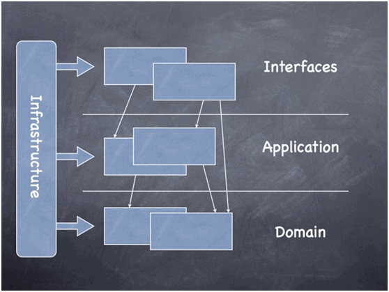

# 领域驱动设计 DDD

> 参考地址：  
> [《DDD领域驱动设计基本理论知识总结》](https://www.cnblogs.com/netfocus/archive/2011/10/10/2204949.html)  
> [《关于领域驱动设计（DDD）中聚合设计的一些思考》](https://www.cnblogs.com/netfocus/p/3307971.html)  
> [《基于 MVC 实践领域驱动（DDD）的思考》](https://zhuanlan.zhihu.com/p/82601831)  
> [《【DDD】领域驱动设计实践 —— 限界上下文识别》](https://www.cnblogs.com/daoqidelv/p/7518533.html)  

## 一. DDD 简述

**DDD (Domain-Driven Design)**，即**领域驱动设计**是思考问题的方法论，用于对实际问题建模，它以一种领域专家、设计人员、开发人员都能理解的**通用语言**作为相互交流的工具，然后将这些概念设计成一个领域模型。**由领域模型驱动软件设计，用代码来实现该领域模型**。所以，DDD 的核心是**建立正确的领域模型**。  

## 二. 领域模型

### 2.1 领域模型

定义上说，领域模型是对**具有某个边界**的领域的一个抽象，反映了领域内用户业务需求的本质；领域模型是有边界的，只反映了我们在领域内所关注的部分，确保了我们的软件的业务逻辑都在一个模型中，这样对提高软件的**可维护性**、**业务可理解性**以及**可重用性**方面都有很好的帮助。领域模型只反映业务，和任何技术实现无关，它不仅能反映领域中的一些实体概念（如货物，书本，应聘记录，地址等），还能反映领域中的一些过程概念（如资金转账等）。  
领域模型贯穿软件分析、设计，以及开发的整个过程，领域专家、设计人员、开发人员通过领域模型进行交流，彼此共享知识与信息。了让领域模型看的见，我们需要用一些方法来表示它。**图**是表达领域模型最常用的方式，但并不是唯一的表达方式，**代码、文字描述**也能表达领域模型。  

### 2.2 通用语言

领域驱动设计的一个核心的原则是使用一种**基于模型的语言**。因为模型是软件满足领域的共同点，它很适合作为这种通用语言的构造基础。使用模型作为语言的核心骨架，要求团队在进行所有的交流是都使用一致的语言（包括演讲、文字和图形），需要确保团队使用的语言在所有的交流形式中看上去都是一致的，这种语言被称为**通用语言 (Ubiquitous Language)**。在建模过程中，通用语言广泛尝试于推动软件专家和领域专家之间的沟通，从而发现要在模型中使用的主要的领域概念。

### 2.3 领域建模思考问题

1. 我们设计领域模型时**不能以用户为中心作为出发点去思考问题**，不能老是想着用户会对系统做什么；而应该从一个客观的角度，**根据用户需求挖掘出领域内的相关事物，思考这些事物的本质关联及其变化规律作为出发点**去思考问题。  
2. **领域模型是排除了人之外的客观世界模型**。
	- 虽然领域模型包含人所扮演的参与者角色，但是一般情况下**不要让参与者角色在领域模型中占据主要位置**。如果以人所扮演的参与者角色在领域模型中占据主要位置，那么各个系统的领域模型将变得没有差别。因为软件系统就是一个人机交互的系统，都是以人为主的活动记录或跟踪。比如：
		- 论坛中如果以人为主导，那么领域模型就是：人发帖，人回帖，人结贴，等等；
		- DDD的例子中，如果是以人为中心的话，就变成了：托运人托运货物，收货人收货物，付款人付款等等；
	- 因此，当我们谈及领域模型时，已经默认把人的因素排除开了，因为领域只有对人来说才有意义，即**人是在领域范围之外的**，如果人也划入领域，领域模型将很难保持客观性。
	- 领域建模是建立虚拟模型让我们现实的人使用，而不是建立虚拟空间，去模仿现实。

> 例：以 DDD 之父的货物运输系统为例，他描述领域模型如下：
> 
> 1. 一个货物 (Cargo) 涉及多个客户（Customer，比如托运人、收货人、付款人），每个客户承担不同的角色；
> 2. 货物只有一个运送目标；
> 3. 由一系列规格 (Specification) 的运送动作 (Carrier Movement) 来完成目标的运输。

由上面可以看到，上述这段描述完全以货物为中心，把客户看成是货物在某个场景中可能会涉及到的关联角色。他完全没有从用户的角度去描述领域模型，而是以领域内的相关事物为出发点，考虑这些事物的本质关联及其变化规律的。  
其实如果以用户为中心来思考领域模型的思维，这只是停留在需求的表面，而没有挖掘出真正的需求的本质。我们在做领域建模时需要努力挖掘用户需求的本质，这样才能真正实现用户需求。

## 三. 领域驱动分层架构

1. **用户界面/展现层**：负责向用户展现信息以及解释用户命令。更细的方面来讲就是：
	- 请求应用层以获取用户所需要展现的数据；
	- 发送命令给应用层要求其执行某个用户命令；
2. **应用层**：很薄的一层，定义软件要完成的所有任务。对外为展现层提供各种应用功能（包括查询或命令），对内调用领域层（领域对象或领域服务）完成各种业务逻辑，应用层不包含业务逻辑。
3. **领域层**：负责表达业务概念，业务状态信息以及业务规则，领域模型处于这一层，是**业务软件的核心**。
4. **基础设施层**：本层**为其他所有层提供通用的技术能力**，包括提供了层间的通信，为领域层实现持久化机制等。总之，基础设施层可以通过架构和框架来支持其他层的技术需求；

## 四. 领域驱动设计的模式

### 4.1 关联的设计

关联本身不是一个模式，但它在领域建模的过程中非常重要，所以需要在探讨各种模式之前，先讨论一下对象之间的关联该如何设计。我觉得对象的关联的设计可以遵循如下的一些原则：

1. 关联尽量少，对象之间的复杂的关联容易形成对象的关系网，这样对于我们理解和维护单个对象很不利，也很难划分对象与对象之间的边界；反过来，减少关联有助于简化对象之间的遍历；
2. 对多的关联也许在业务上是很自然的，通常我们会用一个集合来表示一对多的关系。但我们往往也需要考虑到性能问题，尤其是当集合内元素非常多的时候，此时往往需要通过单独查询来获取关联的集合信息；
3. 关联尽量保持单向的关联；
4. 在建立关联时，我们需要深入去挖掘是否存在关联的限制条件，如果存在，那么最好把这个限制条件加到这个关联上；往往这样的限制条件能将关联化繁为简，即可以将多对多简化为一对多，或将一对多简化为一对一；

### 4.2 实体 (Entity)

实体就是领域中**需要唯一标识**的领域概念。假设有两个实体，如果唯一标识不一样，那么即便实体的其他所有属性都一样，我们也认为他们两个不同的实体。因为实体有生命周期，实体从被创建后可能会被持久化到数据库，然后某个时候又会被取出来。所以，如果我们不为实体定义一种可以唯一区分的标识，那我们就无法区分到底是这个实体还是哪个实体。  
我们不应该给实体定义太多的属性或行为，而应该寻找关联，发现其他一些实体或值对象，将属性或行为转移到其他关联的实体或值对象上。

> 例：  
> 
> - 比如客户 (Customer) 实体，他有一些地址信息，由于地址信息是一个完整的有业务含义的概念，所以我们可以定义一个地址 (Address) 对象，然后把客户的地址相关的信息转移到地址对象上。
> - 如果没有地址对象，而把这些地址信息直接放在客户对象上，并且如果对于一些其他的类似地址的信息也都直接放在客户上，会导致客户对象很混乱，结构不清晰，最终导致它难以维护和理解；

### 4.3 值对象 (Value Object)

在领域中，并不是每一个事物都必须有一个唯一标识，也就是说我们不关心对象是哪个，而只关心对象是什么，这种事物被称为**值对象 (Value Object)**。值对象与实体的区别在于：

1. **Value Object 没有唯一标识**，这是它和 Entity 的最大不同。
2. 判断 Value Object 是否是同一个对象时，需要判断它们的所有属性是否相同，如果相同则认为是同一个 Value Object。而我们在区分是否是同一个 Entity 时，只看 Entity 的唯一标识是否相同，而不管 Entity 的属性是否相同；Value Object 另外一个明显的特征是不可变，即所有属性都是只读的。

> 例：  
> 就以上面的地址对象为例，如果有两个客户的地址信息是一样的，我们就会认为这两个客户的地址是同一个。**也就是说只要地址信息一样，我们就认为是同一个地址**。用程序的方式来表达就是，如果两个对象的所有的属性的值都相同我们会认为它们是同一个对象的话，那么我们就可以把这种对象设计为 Value Object。  
> 我们应该给值对象设计的尽量简单，不要让它引用很多其他的对象，因为他只是一个值，就像 int a = 3 一样，”3” 就是一个我们传统意义上所说的值，而值对象其实也可以和这里的 ”3” 一样，理解为一个对象形式的值。所以，当我们在 Java 语言中比较两个值对象是否相等时，会**重写 hashCode 和 equals 这两个方法，目的就是为了比较对象的值**；  
> 虽然 Value Object 是只读的，但是可以被整个替换掉。

### 4.4 领域服务 (Domain Service)

领域中的一些概念不太适合建模为对象，因为它们本质上就是一些**操作或者动作**，而不是事物。这些操作或动作往往会**涉及到多个领域对象**，并且需要**协调这些领域对象共同完成这个操作或动作**，所以我们需要寻找一种新的模式来表示这种**跨多个对象的操作**。DDD 认为**服务**是一个用来对应这种跨多个对象的操作，同时又是很自然的范式，所以就有了领域服务这个模式。  
一般的领域对象都是有状态和行为的，而领域服务没有状态只有行为。它存在的意义就是协调领域对象共完成某个操作，所有的状态还是都保存在相应的领域对象中。模型（实体）与服务（场景）是对领域的一种划分，模型关注领域的个体行为，场景关注领域的群体行为；模型关注领域的静态结构，场景关注领域的动态功能。这也符合了现实中出现的各种现象，有动有静，有独立有协作。  
领域服务还有一个很重要的功能，就是可以**避免领域逻辑泄露到应用层**。因为如果没有领域服务，那么应用层会直接调用领域对象，完成本该是属于领域服务该做的操作，这样一来，领域层可能会把一部分领域知识泄露到应用层。对于应用层来说，通过调用领域服务，提供的简单易懂但意义明确的接口肯定也要比直接操纵领域对象容易的多。

> 注：软件中一般有三种服务，以转账业务为例：
> 
> 1. **应用层服务**：
> 	- 获取输入；
> 	- 发送消息给领域层，要求领域层实现业务逻辑（转账操作）；
> 	- 领域层服务处理成功，则调用基础层服务，发送 Email 通知；
> 2. **领域层服务**：
> 	- 获取源账号与目标账号，分别通知源账号和目的账号，进行扣除金额与增加金额的操作；
> 	- 提供返回结果给应用层；
> 3. **基础层服务**：
> 	- 按照应用层的请求，发送 Email 通知；

### 4.5 聚合 (Aggregate)、聚合根 (Aggregate Root)

**聚合 (Aggregate)** 通过定义对象之间清晰的所属关系和边界，实现领域模型的内聚，并避免了错综复杂的、难以维护的对象关系网的形成。通过聚合，可以定义一组具有内聚关系的相关对象集合，我们把聚合看作是一个修改数据的单元。  
对于一个聚合，用一个实体作为唯一表示，那么这个实体就是**聚合根 (Aggregate Root)**。聚合根负责与外部其他对象打交道，并维护自己内部的业务规则。换句话说，聚合根对于聚合而言，相当于数据库表的主键字段。  

聚合与聚合根的特点如下：

1. 每个聚合有一个根和一个边界，边界定义了一个聚合内部有哪些实体或值对象，根是聚合内的某个实体；
2. 聚合内部对象可以直接相互引用，但聚合外部要访问聚合内部对象时，**必须通过聚合根进行导航**；
3. 基于聚合的以上概念，我们可以推论出从数据库查询时的单元也是以聚合为一个单元，也就是说我们不能直接查询聚合内部的某个非根的对象；
4. 删除一个聚合根时，必须同时删除该聚合内的所有相关对象，因为他们都同属于一个聚合，是一个完整的概念；

在辨别聚合与聚合根时，可以通过如下角度思考问题：

1. **是否有独立存在的意义？即该实体是否在不依赖于其他对象的存在时，也同样是有意义的？**如果是，则为聚合根；如果不是，则为聚合；
2. **是可以被独立访问到的，还是必须通过某个其他对象导航得到的？**如果是独立访问到，则为聚合根；如果需要间接导航，则为聚合。

> 注：  
> 
> 1. 当我们在修改一个聚合时，我们必须在**事务 (Transactional) 级别**确保整个聚合内的所有对象满足这个固定规则，即原子性操作；
> 2. 聚合尽量不要太大，否则即便能够做到在事务级别保持聚合的业务规则完整性，也可能会带来一定的性能问题；
> 3. 通常在大部分领域模型中，有 70% 的聚合通常只有一个实体，即聚合根，该实体内部没有包含其他实体，只包含一些值对象；另外 30% 的聚合中，基本上也只包含两到三个实体。这意味着大部分的聚合都只是一个实体，该实体同时也是聚合根。

### 4.6 工厂 (Factory)

DDD 中引入工厂模式的原因是，有时创建一个领域对象是一件比较复杂的事情，不仅仅是简单的 new 操作。正如对象封装了内部实现一样（我们无需知道对象的内部实现就可以使用对象的行为），工厂则是用来封装**创建一个复杂对象尤其是聚合时所需的知识**，它将创建对象的细节隐藏起来。客户传递给工厂一些简单的参数，然后工厂可以在内部创建出一个复杂的领域对象，然后返回给客户。  
工厂在创建一个复杂的领域对象时，通常会知道该满足什么业务规则（它知道先怎样实例化一个对象，然后在对这个对象做哪些初始化操作，这些知识就是创建对象的细节），如果传递进来的参数符合创建对象的业务规则，则可以顺利创建相应的对象；但是如果由于参数无效等原因不能创建出期望的对象时，应该抛出一个异常，以确保不会创建出一个错误的对象。  
我们也并不总是需要通过工厂来创建对象，事实上大部分情况下领域对象的创建都不会太复杂，所以我们只需要简单的使用构造函数创建对象就可以了。隐藏创建对象的好处是显而易见的，这样可以不会让领域层的业务逻辑泄露到应用层，同时也减轻了应用层的负担，它只需要简单的调用领域工厂创建出期望的对象即可。

### 4.7 仓库 (Repository)

领域模型中的对象自从被创建出来后不会一直留在内存中活动的，当它**不活动时会被持久化到数据库中**，然后当需要的时候我们会重建该对象；重建对象就是根据数据库中已存储的对象的状态重新创建对象的过程；所以，可见重建对象是一个和数据库打交道的过程。从更广义的角度来理解，我们经常会像集合一样，从某个类似集合的地方，根据某个条件获取一个或一些对象，往集合中添加对象或移除对象。也就是说，我们需要提供一种机制，**可以提供类似集合的接口来帮助我们管理对象**。**仓库 (Repository)** 就是基于这样的思想被设计出来的。  
**仓库里面存放的对象一定是聚合**。原因是之前提到的领域模型中是以聚合的概念去划分边界的；聚合是我们更新对象的一个边界，事实上我们把整个聚合看成是一个整体概念，要么一起被取出来，要么一起被删除。我们永远不会单独对某个聚合内的子对象进行单独查询或做更新操作。因此，我们只对聚合设计仓库。此外，尽管仓库可以像集合一样在内存中管理对象，但是仓库一般不负责事务处理。一般事务处理会交给**工作单元 (Unit Of Work)**。关于工作单元的详细信息我在下面的讨论中会讲到。  

## 五. 领域模型的设计步骤

领域建模是一个不断重构，持续完善模型的过程，是领域专家、设计人员、开发人员之间沟通交流的过程，是工作和思考问题的基础。大家会在讨论中将变化的部分反映到模型中，从而使模型不断细化，并朝正确的方向走。设计领域模型的一般步骤如下：

1. **建立一个初步的领域模型**
	- 根据需求，识别出一些明显的领域概念，以及它们的关联；
	- 可以用文字精确的、没有歧义的描述出没给领域概念的含义，以及包含的主要信息；
	- 关联可以暂时没有方向，但需要有 <code>1:1, 1:N, M:N</code> 这些关系。
2. 分析主要的软件应用功能，识别出主要的**应用层**的类；
	- 有助于及早发现哪些是应用层，哪些是领域层的职责。
3. 进一步**分析领域模型**，识别出哪些是实体 (Entity)，哪些是值对象 (Value Object)，哪些是领域服务 (Domain Service)；
4. **分析关联**
	- 通过对业务更深入的分析，以及各种软件设计原则与性能之间的权衡，明确关联的方向，或者去掉一些不需要的关联；
5. **找出聚合边界，以及聚合根**
	- 这个过程比较有困难，因为在分析过程中往往会碰到很多模棱两可的选择问题；
6. 为聚合根**配备仓库**
	- 通常是为一个聚合分配一个仓库，所以需要设计好仓库的接口；
7. **走查场景**，确定设计的领域模型能够有效的解决业务需求；
8. 考虑如何创建实体或值对象，是通过工厂，还是直接通过构造函数；
9. **停下来重构模型**；
	- 寻找模型中觉得有疑问，或者是蹩脚的地方；
	- 比如思考：一些对象应该通过关联导航得到，还是应该从仓库获取？聚合设计是否正确？模型的性能怎么样？等等问题；

## 六. 聚合设计原则

### 6.1 不变性的封装

这个原则强调了聚合的真正用途：除了封装我们本身所关心的信息外，聚合最主要的目的是为了**封装业务规则，保证数据的一致性**。当我们在设计聚合时，要多想想当前聚合封装了哪些业务规则，实现了哪些数据一致性。  

> 注：业务规则比如：一个银行账号的余额不能小于 0，订单中的订单明细的个数不能为 0，订单中不能出现两个明细对应的商品 ID 相同，订单明细中的商品信息必须合法，商品的名称不能为空，回复被创建时必须要传入被回复的帖子等；

### 6.2 小聚合设计

这个原则更多的是从技术的角度去考虑的。举个例子，某个聚合在一开始时设计的很大，包含了很多实体，但是后来发现因为该聚合包含的东西过多，导致多人操作时并发冲突严重，导致系统可用性变差。后来开发团队将原来的大聚合拆分为多个小聚合，当然拆分为小聚合后，原来在大聚合中维护的业务规则同样在多个小聚合上有所体现，所以既能解决并发冲突的问题，也能保证让聚合来封装业务规则，实现模型级别的数据一致性。  
小聚合的设计还有一个好处，就是**业务决定聚合，业务改变聚合**。小聚合的设计除了可以降低并发冲突的可能性之外，同样**减少了业务改变时聚合的拆分个数**，降低了聚合大幅重构（拆分）的可能性，从而能让我们的领域模型更能适应业务的变化。

### 6.3 通过 ID 关联聚合

这个原则是考虑到，聚合之间无需通过对象引用的方式来关联。

1. 聚合内中只包含**只属于自己的 Entity 或 Value Object**，使每个聚合的边界清晰。
2. 如果通过**引用关联**，那需要实现**懒加载 (LazyLoad)** 的效果；
	- 当我们加载一个聚合的时候，就会把其关联的其他聚合也一起加载，而实际上我们有时在加载一个聚合时，不需要用到关联的那些聚合，所以在这种时候，就给性能带来一定影响；
	- 通常我们现在的 ORM 都支持懒加载，所以这点问题相对不是很大；
3. 聚合间交互：
	- 如果聚合之间通过对象引用来关联，那聚合之间的交互就比较方便，因为这种方式下，开发者可以很方便的直接拿到关联的聚合引用；如果聚合之间要交互，在经典DDD的架构下，一般可以通过两种方式解决：
		- (1) 如果 A 聚合的某个方法需要依赖于 B 聚合对象，则我们可以将 B 聚合对象以参数方式传递给 A 聚合，这样 A 对 B 只是参数上的依赖，没有属性上的关联；
		- (2) 如果两个聚合之间需要交互，那么这两个聚合只需要关注自己的逻辑即可，通过引入领域服务 (Domain Service) 来协调跨聚合的逻辑即可。
			- 典型的例子就是银行转账，该业务中涉及源账号的转出和目标账号的转入，针对该业务会设计一个转账的领域服务。但源账号和目标账号本身只需要关注自己的转入或转出逻辑即可，源账号和目标账号两个聚合实例不需要相互关联引用，只需要引入领域服务来协调跨聚合的逻辑即可；
4. 通过 ID 关联，也是达到设计小聚合的目标的一种方式；

### 6.4 一致性

**聚合内强一致性，聚合之间最终一致性**。聚合如果只需要关注如何实现业务规则，不需要考虑实现查询需求所带来的好处，也就是说，我们不需要在 domain 里维护各种统计信息，而只要维护各种业务规则所潜在的必须依赖的状态信息即可。  
举个例子，假如一个论坛，有版块和帖子，以前，我们可能会在版块对象上有一个帖子总数的属性，当新增一个帖子时，会对这个属性加 1；而在 CQRS 架构下，领域层聚合根无需维护总帖子数的统计信息了，总帖子数会通过某些查询条件，通过数据库的查询语句获得，领域层只需要提供查询条件即可。

> 注：该部分指的是，数据录入可以看作是一个聚合，汇总统计可以看作另外一个聚合。

## 七. 与领域层的交互

上图为经典的领域驱动设计分层架构，图中领域层 (Domain) 的上层是应用层 (Application)，下层是基础设施层 (Infrastructure)，那么领域层与其他层如何交互？

### 7.1 应用层的交互

对于应用层，首先会启动一个工作单元，然后分情况进行操作：

1. **修改领域对象**：通过仓库获取领域对象，调用领域对象的相关业务方法，完成业务逻辑处理；
2. **新增领域对象**：通过构造函数，或者工厂创建出领域对象（如果需要还可以继续对该新建的领域对象做一些后续操作），然后将新建领域对象添加到仓库中；
3. **删除领域对象**：
	- 可以先把领域对象从仓库中取出来，然后将其从仓库中删除；
	- 也可以直接传递已给要删除的领域对象唯一标识，通知仓库将其移除；
4. 如果一个业务逻辑涉及多个领域对象，**调用领域层中相关领域服务完成操作**；

> 注：
> 
> 1. 上述所有领域对象都是指**聚合根**；
> 2. 应用层需要获取仓库接口，以及领域服务接口时，都可以通过 IoC 容器获取；

### 7.2 工作单元的实现方法

前面说到**工作单元 (Unit of Work)**，实现方法如下：

1. **基于快照实现**
	- 类似于乐观锁的思想，领域对象被取出来后，先备份该对象，然后在做持久化操作时，将最新对象的状态和备份对象的状态进行比较。如果不相同，则认为被修改，然后进行持久化。
	- 这种设计的好处是，对象不用主动告诉工作单元自己的状态修改；缺点是备份对象（深拷贝），以及比较对象状态的操作如果比较复杂，可能会影响性能；
2. **基于仓库通知**
	- 在仓库的增删改接口被调用时，将操作通知给工作单元某个对象，这样工作单元在做持久化时，同样可以知道需要持久化哪些对象。
	- 这种方法理论上不需要 ORM 框架的支持，对领域模型没有侵入性，同时也很好的支持了工作单元的模式；
3. **基于 AOP 思想**
	- 类似于 Spring AOP 的思想，通过代理的方式进行拦截。
	- 这种方法使工作单元知道需要持久化哪些对象，对领域模型的侵入性不大，同样能很好的支持工作单元模式；

## 八. 限界上下文 (Bounded Context)

**限界上下文 (Bounded Context)** 是一个显式的边界，领域模型便存在于这个边界之内。在边界内通用语言中，所有术语和词组都有特定的含义，而模型需要准确地反映通用语言。  
不要试图去创建一个“大而全”的软件模型，导致每个概念在全局范围内只有一种定义。最好的方法是正视这种不同，然后用限界上下文对领域模型进行分离。

> 注：简单点考虑，可以将限界上下文想象成技术组件，但技术组件并不能定义限界上下文。比如在 IDEA 中，一个限界上下文通常就是一个工程项目。

## 九. 上下文图 (Context Map)

> 参考地址：[《【DDD】领域驱动设计实践 —— 限界上下文识别》](https://www.cnblogs.com/daoqidelv/p/7518533.html)  

### 9.1 上下文图类型

多个系统之间会发生关系，存在交互，这也必然会在各自的限界上下文有所表现。**上下文图 (Context Map)** 便是表示各个系统之间关系的总体视图。上下文图有如下几种形式来表示限界上下文之间的关系。

#### 9.1.1 共享内核 (Shared Kernel)

当不同团队开发一些紧密相关的应用程序时，团队之间需要进行协调，通常可以将**两个团队共享的子集剥离出来形成共享内核 (Shared Kernel)**，双方进行持续集成。由此可见共享内核是业务领域中公共的部分，同时也是团队间容易达成且必须达成共识的领域部分。

#### 9.1.2 客户/供应商 (Customer/Supplier)

不同系统之间存在依赖关系时，下游系统依赖上游系统，下游系统是客户，上游系统是供应商，双方协定好需求，由上游系统完成模型的构建和开发，并交付给下游系统使用，之后进行联调、测试。这种模式建立在**团队之间友好合作和支持**的情况下。

#### 9.1.3 追随者 (Conformist)

如果**上游系统不合作**，这时候“客户/供应商”模式就不凑效了，那么**下游系统只能去追随上游系统，下游系统严格遵从上游系统的模型，简化集成**。

例如在社区系统中，社区服务的打赏记录来源于支付系统，支付系统的打赏记录这一模型设计较为友好，且社区服务只是一个简单的查询模型，可以直接追随支付系统的打赏记录模型，集成简单快速。

#### 9.1.4 防腐层 (Anticorruption Layer)

如果**上游系统的模型不友好，不适合下游系统的场景，但是下游系统又必须依赖于这些模型**，这时候我们需要使用防腐层 (Anticorruption Layer) 模式将上游系统的影响降低。这种模式也是非常常见的，通常出现在**系统间对接时，使用 transport + resolver 的方式完成服务调用和协议转换**。其中的 resovler 便承担了防腐的作用。

#### 9.1.5 公开主机服务 (Open Host Service)

公开主机服务 (Open Host Service) 能够**允许系统将一组 service 公开出去，供其他系统访问**，在互通模型的同时，减少了系统间的耦合。此类模式是使用最多的。系统之间的交互通常是使用该模式来完成的，微服务架构、注册中心就是此类模式的实现形式。

#### 9.1.6 各行其道 (Separate Way)

当两个系统之间的关系并非必不可少时，两者完全可以彼此独立，各自独立建模，独立发展，互不影响。

### 9.2 上下文图的思考

综合上述模式，由上而下耦合越来越低，模型的共享程度也越来越低，在实践中，使用得最多的应当是：**防腐层 + 公开主机服务的搭配使用**。  
实际开发中，一个上游系统会面对多个下游系统做过多定制化的建模，且由于团队组织和管理上的天然隔离，**团队合作的紧密度通常并不会那么高**，因此，要做到“共享内核”和“客户/供应商”模式是比较困难的。如今发展的如火如荼的微服务架构便是**“防腐层 + 公开主机服务”**的实现形式，使用 RESTful 契约公开主机服务，在业务模型上使用防腐层完成隔离和适配，达到共享模型和降低耦合的平衡。

“共享内核”模式在通用业务领域较为常见，在细分业务领域中，通常由几家厂商抽象出通用的业务模型，随后进行产品化，售卖给各个甲方企业。在实施集成过程中，根据甲方的个性化诉求，在“共享内核”上做二次开发。  
“客户/供应商”模式个人觉得实施起来会比较困难，毕竟是跨团队协作，即使领头上司是一个，如果这个关键人物不去把控系统设计，那么业务模型上的一致性是很难保证的，*最后估计会演变为“防腐层”模式*；如果这个关键人物会实际参与到系统建模和设计中，那实际上编程了一个大的团队了，也就无所谓“客户/供应商”模式了，都是自己了。