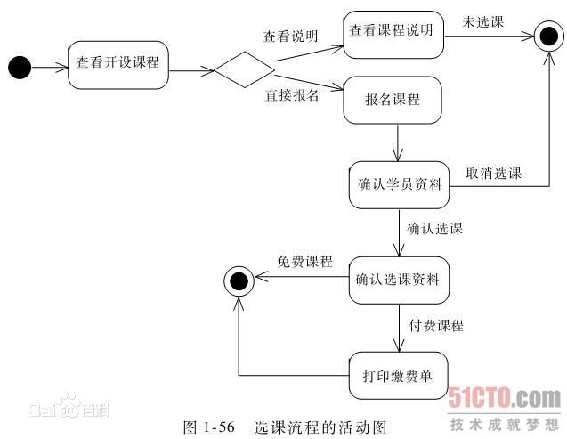
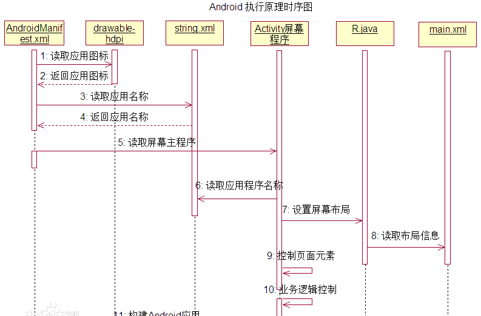
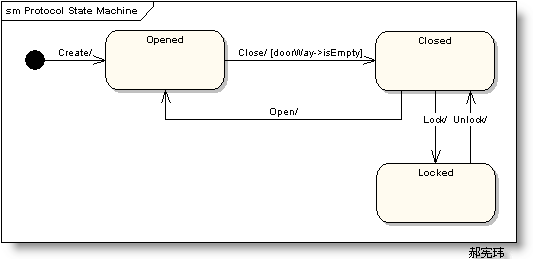

# 系统架构师设计培训心得之一——基本概念

# 一. 架构基本概念

## 1.1 架构定义

**架构 = 组成单元的结构 + 组成单元的关系 + 原则和指南**

架构定义是一个过程，首先捕获需求，然后根据需求设计出满足这些需求的软件架构。

## 1.2 架构原理

架构的原理，是将整个大问题从**深度**和**广度**的角度分别出发，进行子问题的分解，设计出对应的各个子系统的过程。

## 1.3 架构视角

一个复杂系统，用户的视角不同，看到的内容（即视图）也不同。

## 1.4 架构层次

架构包含三个层次：

- **顶层设计**：企业架构视角；
- **概要设计**：系统架构视角；
- **详细设计**：开发架构视角；

## 1.5 架构设计步骤

架构设计过程中经常出现思维混乱的情况。比如在实现架构的时候，一个系统模块之间各种相互依赖，结构和行为过多的混在了一起，这样就导致了思维混乱。

架构设计的步骤如下：

1. **结构**思维模式
	- 基于三个维度初步划分系统：
		- **合成-分解维度**：将整个系统从顶向下的分解为子系统、模块、类；
		- **职责划分维度**：根据职责功能进行划分，分为展现层、业务层、数据层等；
		- **通用-专用维度**：分为特定应用部分、领域通用部分、技术通用部分等；
2. **行为**思维模式
	- 基于应用场景，串联各个功能块，用时序图等方式绘制其行为；
3. **优化**思维模式
	- 通过质疑的方式（如针对性能等质量场景），找到新的职责与写作方式，优化架构设计；

## 1.6 架构的表示——UML 语言

UML 是一种建模语言，是面向对象方法用来表述系统设计的图形表示法，是用来可视化表达、叙述、构建和记录复杂软件不同方面的语言。即 UML 是语法，OOAD 是说话的技巧，EA 是工具。

# 二. 从需求到设计实操演练——订餐系统案例

## 2.1 项目需求

订餐系统：某软件园区员工到食堂用餐，在路途和排队上**浪费很多时间**，并且由于食堂**菜品种类少，菜量少**，去玩了经常会吃不到想吃的食物，所以员工对食堂的满意度不高，有将近一半的人员会选择去周边饭店用餐。这样一来，食堂**更加无法准确预测食物需求**，经常会出现有些食物因为没有卖出去只好倒掉，而需要的食物却已经卖完的现象。

## 2.2 关键需求提取

需求已经有了，这时候需要把需求提取出来。那么哪些是影响架构的关键需求呢？

1. 对类图有重要影响；
2. 包含丰富的业务过程信息和线索；
3. 有开发风险、时间紧迫或功能复杂；
4. 设计到重要核心技术或新技术；
5. 能直接产生经济效益或降低成本；
6. 代表本系统的核心流程；

## 2.3 最小可用产品 (MVP)

最小可用产品 (Minimal Viable Product) 用于对未知市场的勘测，主要理念是用最小的代价来验证你的商业可行性。  
例如有一个名片扫描的产品，它最大面向的市场自然是市场等部分。那么如何知道这个产品有没有市场价值呢？MVP 理念建议设计一个小范围的实验，比如随便找一个市场部门，推荐他们中的 100 人使用公众号扫二维码的形式，把名片图片上传到后台。为了节省财力、人力、协调等各个方面的成本，这时候的后台可以用最简单的方法进行处理（比如直接人工识别），然后把识别结果传回给用户。  
在实验过程中，可以观察用户使用软件的频率与数据，其中证明我们产品商业可行性的最有价值的两个指标，是**订单量**和**重复订单量**。收集到了小范围的数据，这个项目就可以找领导或者风头进行投资了。换句话说，众筹就是最初级的 MVP。

在这种最小可用产品理念中，发现他的软件设计流程和我们传统的方式并不一样。我们平常接手一个项目，通常是一开始就尽可能考虑到尽可能多的情况，设计一个大而全的架构。而我们在这个项目中一开始用了很简单的后台实现方式，但随着用户量与投入资金的增长，**架构需要不断的重新设计**，大约每一两个月都需要推翻重构之前的架构。这种开发流程被称作为 **LEAN 精益开发流程**。

## 2.4 从需求到设计

> 注：参考地址：[《UML各种图总结-精华》](https://www.cnblogs.com/jiangds/p/6596595.html)

我们可以使用 UML 中的状态图、活动图、时序图、通信图和交互概览图等来表示需求与设计之间的关系。

**活动图**主要用于人机交互比较多的场景；

**时序图**主要用于多个系统，或是第三方系统调用比较多的场景，它通过描述对象之间发送消息的时间顺序显示多个对象之间的动态协作。时序图可以表示用例的行为顺序，当执行一个用例行为时，其中的每条消息对应一个类操作或状态机中引起转换的触发事件。

**状态图**是一种由状态、变迁、事件和活动组成的状态机，用来描述类的对象所有可能的状态以及时间发生时状态的转移条件。主要用于状态比较多的情况。

# 三. 领域建模