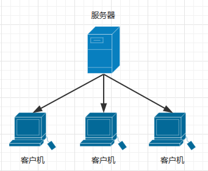

# 系统架构师设计培训心得之三——需求对架构方案的影响

在上一篇[《》]()学习过程中，一个系统的架构已经搭建起来了。但是架构始终是围绕着需求的，同时需求又往往伴随着诸多限制、要求等，对我们的架构会有进一步的影响。本篇文章总结一下需求对架构方案的影响。

需求对架构方案，大致有五方面的影响：**系统组成**、**网络硬件**、**消息通讯**、**数据架构**，以及**非功能需求**。

# 一. 系统组成

**系统组成**从**人员**作为出发视角观察架构的。比如用户部门组成、开发方项目组划分等等。  

## 1.1 业务视角

业务视角从用户视角出发，将项目根据各项业务**垂直拆分**为多个子系统，各个子系统之间存在业务联系。此外，由于拆分子业务本身的意义就是降低耦合度，但如果拆分的子系统数量过多，那么子系统之间的业务联系也会变的过于复杂。所以建议子系统拆分数量为 **3-5** 个。  
以医院挂号看病这一业务为例，我们可以将业务垂直拆分为物资管理、体检业务、客服管理三个子系统。

## 1.2 技术视角

技术视角从开发人员视角出发，将项目根据软件层次进行**水平划分**。  
对于开发人员，传统 MVC 架构就是典型的水平划分结果。如果更加详细划分的话，还可以将系统水平划分为表示层、应用层、领域层、业务层、技术服务、基础层。

# 二. 网络硬件

**网络硬件**主要是从**硬件**作为出发视角进行观察的，内容主要为当前网络、硬件条件、安全要求等。例如：如何通过服务器部署和配置网络环境，来实现应用程序的“可伸缩性、高可用性”。  

常见的网络硬件架构设计有：

## 2.1 客户机 - 服务器体系结构

## 2.2 多级体系结构

多级体系结构基本就是通常使用的 C/S + B/S 结构。

