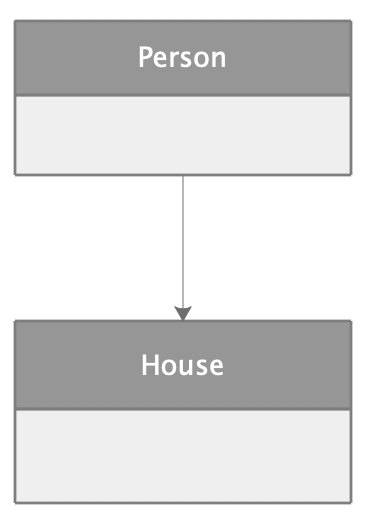
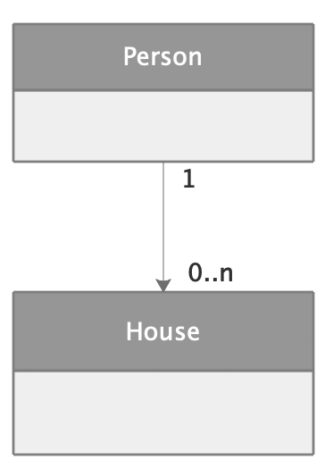
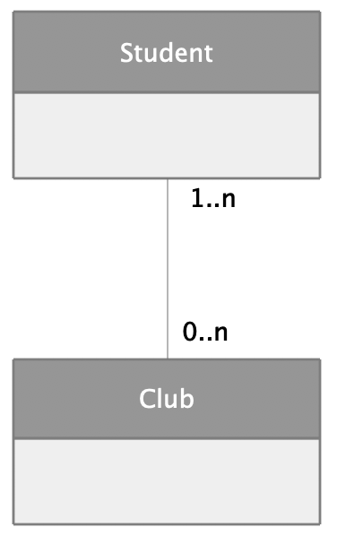
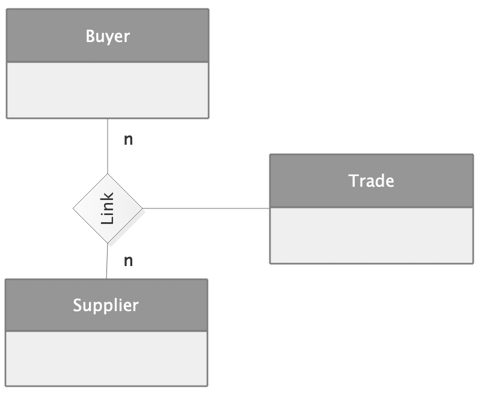
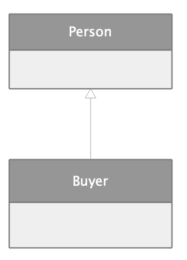
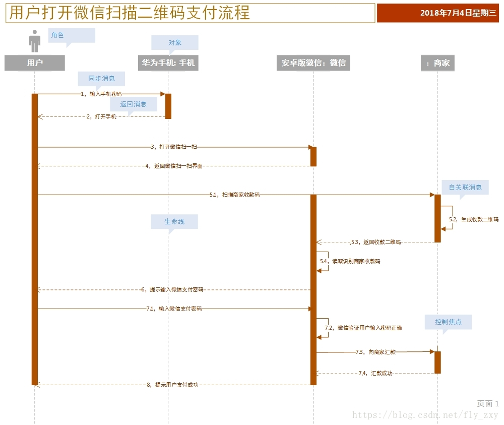
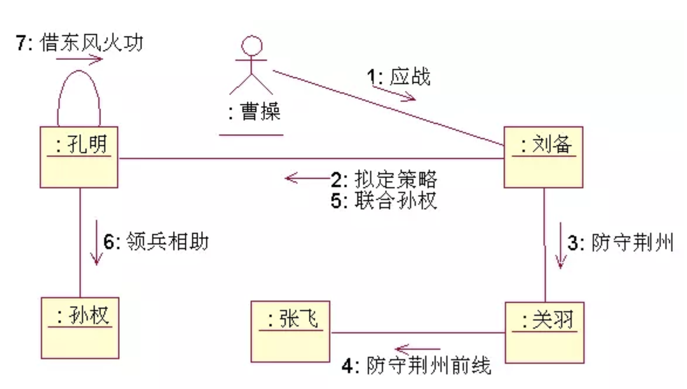

# 系统架构师设计培训心得之二——架构设计

培训过程中，老师用例子说明了一个项目的架构设计的流程。按步骤可以分为：

1. 框架技术的选择应用；
2. 架构平台重构与设计过程；
3. **领域建模**；
4. **行为建模**；

这四个步骤中，第三步与第四步是最重要的核心。

# 一. 框架技术的选择应用

人们经常对框架与架构的概念混淆。最简单的区分方法，就是可以将架构比作**设计图纸**，框架比作**源码**。而**框架的选择是架构设计的重要部分**，选择框架的一步，被称为架构的**概要设计**。  
市面上有很多已经很成熟的架构，比如 Java 的 SSM 架构，C++ 的 .NET 架构等等。但并不一定说 SSM 架构或者 .NET 架构适用于所有项目。如果分析一个项目的需求之后，发现常用架构不能满足这个新需求，可以选择去 GitHub 等开源社区找同类项目，在开发过程中也可以去 Stack Overflow 论坛请教问题。

# 二. 架构平台重构与设计过程

这个过程是属于产品设计过程，培训老师给了一堆的图和概念，比如 VRM 版本、共用构建组件 (CBB, Common Building Block)、功能分解、模块差异分析、产品平台组合战略等等，都是我看不懂的。最后老师也说，这一部分是属于领导的决策层面的，所以对我并没有什么卵用。跳过忽略。

# 三. 领域建模

**领域建模**的概念是，对领域内的概念类或者现实世界中对象的可视化表示。又称概念模型、领域对象模型、分析对象模型。一般采用 **UML** 中的类图来描述。它专注于分析问题领域本身，发掘重要的业务领域概念，并建立业务领域概念之间的关系。  

鲁迅先生曾经说过，讲概念就是不说人话。（手动滑稽 \^_\^）  
所以我个人对领域建模浅显的理解为，领域建模过程就是我们分析需求找出对象的过程，同时我们需要把对象之间的关系找出来，最后设计数据表内容。行为建模就是把各种对象之间如何交互的方式设计出来。再换句话说，设计出了**领域模型（对象结构）与交互模型（行为）**，就基本写出了**类图和方法**。

## 3.1 UML 类图基本概念

类之间的关系，主要使用 UML 类图表示。


> 参考地址：[《UML类图与类的关系详解》](https://www.cnblogs.com/pangjianxin/p/7877868.html)
 
## 3.2 UML 类图总结 

如果把 UML 类图比较多的种类进行总结，它可以分为五种基本的种类：**一对一关联**、**一对多关联**、**多对多关联**、**二元关联**、**继承关联**。

### 3.2.1 一对一关联

拿房子和人举例，在大学宿舍的情景下，一个学生只能属于一个宿舍，这就是一对一关联的例子。UML 图如下：

<center>

</center>

代码如下：

```java
public class House {
    public House() {}
}

public class Person {
    private House oneHouse;
    public Person() {
    }
}
```

### 3.2.2 一对多关联

拿人和房子举例，有钱人都会去买房炒房，也就是说一个人有好几套房产，这就是一对多关联的例子。UML 图如下：

<center>

</center>

代码如下：

```java
public class House {
    public House() {}
}

public class Person {
    private House[] allHouses;
    public Person() {
    }
}
```

### 3.2.3 多对多关联

依旧拿大学生和社团举例，一个大学生可以参加好几个社团，一个社团也可以有很多大学生，这就是多对多关联的例子。UML 图如下：

<center>

</center>

代码如下：

```java
public class Student {
    private Vector<Club> clubs = new Vector<>();
    public Student() {}
}

public class Club {
    private Vector<Student> students = new Vector<>();
    public Club() {}
}
```

### 3.2.4 二元关联

拿交易来举例，交易需要买家与卖家，但必须有了交易这个事情本身，买家与卖家的关系才能成立，这就是二元关联的例子。同理三元、四元关联也一样。UML 图如下：

<center>

</center>

代码如下：

```java
public class Buyer {
    Trade trades[];
    public Buyer() {}
}

public class Supplier {
    Trade trades[];
    public Supplier() {}
}

public class Trade {
    Supplier oneSupplier;
    Buyer oneBuyer;
    public Trade() {}
}
```

> 注：与多对多不同，Trade 作为关联，**它也有自己的属性**，如交易时间、交易量等。

### 3.2.5 继承关联

以交易为例，买家与卖家都是人，所以卖家与人、买家与人都是继承关系。UML 图如下：


<center>

</center>

代码如下：

```java
public class Person {
    public Person() {}
}

public class Buyer extends Person {
    public Buyer() {}
}
```

# 四. 行为建模

行为建模又被称为**职责分配**。	前面分析过，行为建模的过程就是表述各个领域之间关系的过程。在这个过程中，我们可以使用时序图、通信图等 UML 图，或者鲁棒图等方式来表示行为建模过程。

## 4.1 时序图

**时序图**是一种强调消息时间顺序的交互图，为读者提供了控制流随着时间推移的清晰的可视化轨迹。如下图所示：

<center>

</center>

> 参考地址：[《UML时序图(Sequence Diagram)学习笔记》](https://blog.csdn.net/fly_zxy/article/details/80911942)

## 4.2 通信图

**通信图**强调的是参加交互对象的组织，为读者提供了在写作对象的结构组织的语境中观察控制流的一个清晰的可视化轨迹。UML2.0 中的通信图基本上就是 UML1 中的协作图。  
通信图并不是很关键的行为建模形式，大部分时间我们是不需要画通信图的。因为如果真的画了一张通信图，基本上就能把代码写完了。所以如果真的画通信图的话，大部分时间只是用来面对大项目理清思路。[《UML系列——协作图（通信图）collaboration diagram》](https://www.jianshu.com/p/88aa96090105)一文中用赤壁之战的例子表达了通信图的作用。

<center>

</center>

## 4.3 鲁棒图

**鲁棒图**不是 UML 模型的一部分，它是一个强大的草图工具，是结语分析和设计之间的一种有效工具。在实践中，简化的鲁棒图语法将有利于集中精力进行初步设计，而不是关注细节。  
网上查询资料过程中，发现[《基于鲁棒图进行概念架构设计》](https://www.cnblogs.com/doit8791/p/9461202.html)一文中的内容完全就是上课讲的关于鲁棒图的所有内容，这里就不多赘述了。

# 五. 总结

基本上一个项目的架构设计的过程就是上面的四个步骤。最后老师又给我们举了一个项目管理系统的例子。整个项目从获取需求，到最终看到前端页面的整个过程，如下图所示：

步骤如下所示：

1. 出现问题，用户提出需求；
2. 需求师捕获需求并总结（例如使用用户需求捕获卡的形式）；
3. 需求师总结出**用户需求特性列表**；
4. 建立领域模型
	- **发现类**：从用户需求特性列表中，找到合适的名词，将其总结出来，再从这些找出的名词中提取关键内容，往往这些就是领域模型的关键类；
	- **关联分析**：即上文提到的找到类之间的联系，画出由 3.2 章节中各模块组成的 UML 类图模型；
	- **职责分析**：分析各领域之间的行为，建立各领域之间的联系，向上一步中 UML 类图模型中填充方法；
5. 建立用例模型
	- 用例图主要是站在人的视角上进行的，即为项目过程中的各种职能角色分配工作；
	- (1) **识别参与者**：将参与项目的人员分为各种职能角色（项目经理、开发人员、研发经理、管理层等）；
	- (2) **合并特性**：将用户需求特性列表中的内容按照各种职能角色进行分析，并将任务分配，分配的每项任务都需要用例覆盖；
	- (3) **描述用例**：对每个用例进行描述；
	- (4) **划分用例优先级**；
	- (5) 为每个用例进行详细的用例描述；
	- (6) 为每个用例绘制时序图；
	- (7) 构建前端用户界面；

--------------------

本文总结下来，笔者对架构的理解确实加深了一些。但笔者还是认为，前面这些步骤可能看起来是一个很完整很标准的流程。实际开发过程中难免会出现人手不足、人员分配不当等等等等各种各样的原因，不能做到各岗位各司其职，最后又回到了原始的 "总体 + 后台 + 前台" 的项目结构与开发状态。

话说这次架构师培训名单上本来是没有我本人的，但是毕竟死猪不怕开水烫，我还是抱着好奇心厚脸皮的向领导申请中途参加培训。参加培训的当天上午，笔者正好刚刚设计了一个项目并简单把思路汇报给了同事龙哥，龙哥正好让我写一个设计文档把思路表达一下，又正好在下午参加的架构师培训中加了这么多通过 UML 图表达项目开发流程的技能点。  
这么多正好，我也不介意多加一笔：把整个培训内容总结完之后，我也正好用自己设计的项目用培训中学到的架构设计方法**写一篇设计文档**。  

Flag 已经立起来了。为什么立 Flag 呢？也许是因为立了 Flag 之后就逃不了了吧哈哈哈 ~ 