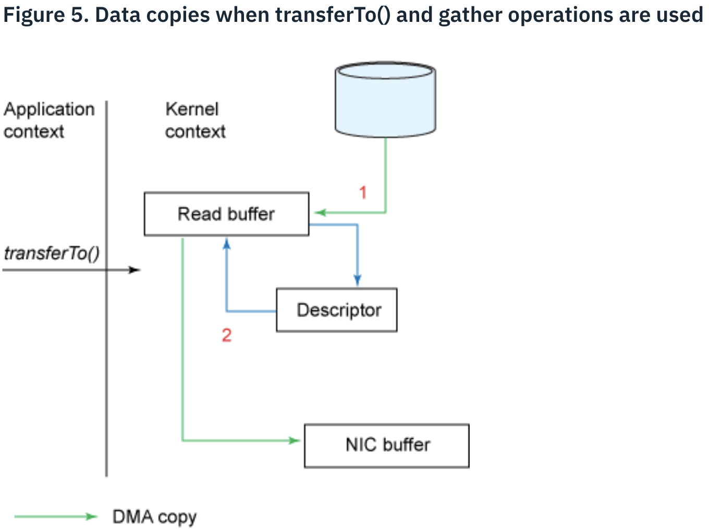

# 一、Java篇

## 1.JVM部分

JVM 是每一个开发人员必备的技能，推荐看国内比较经典的 JVM 书籍，里面包含JVM的内存接口，类的加载机制等基础知识，是不是觉得这些在面试中似曾相识？所以对于 JVM 方面的知识的巩固与其在网上看一些零零碎碎的文章不如啃一下这本书。《深入理解 Java 虚拟机：JVM 高级特性与最佳实践(第 2 版)》，当然了如果你的英文好强烈推荐看 Oracle 最新发布的 JAVA 虚拟机规范。在啃书的时候切记不能图快，你对知识的积累不是通过看书的数量来决定，而是看书的深度。所以在看每一章节的时候看到不懂的要配合网上的文章理解，并且需要看几篇文章理解，因为一篇文章很可能是错误的，小编认为文章的可信度顺序：自建域名>*.github.io>SF>简书=博客园>CSDN>转载

### 1.1 JAVA垃圾回收机制
[《JVM内存管理、JVM垃圾回收机制、新生代、老年代以及永久代》](https://www.cnblogs.com/alsf/p/9017447.html)

### 1.2 JAVA垃圾回收器种类与区别
### 1.3 JAVA类加载机

主要的三个雷加载器有根类加载器（bootstrap）、扩展类加载器（ext）、系统类加载器（对应 classpath 路径），从前到后依次为父子关系。某些框架级别的源码会自定义类加载器，它们属于系统类加载器的子类。

类加载器 ClassLoader 源码中，类变量定义有 ClassLoader parent，记录当前类加载器的父类加载器。如果 parent == null，则当前类加载器为根类加载器。

Thread 中有类变量 contextClassLoader，即线程上下文类加载器。用于打破线程的父加载机制：使得父类加载器可以访问子类加载器的 class。

### 1.4 JVM性能调优
### 1.5 JAVA字节码结构

### 1.6 JVM内存模型

JVM 内存模型是一个虚拟模型，无论是堆内存还是栈内存，都是在主内存中。  
每个线程都有自己的工作内存。对于共享变量，每个线程从主内存中读取该变量，存入该内存自己的工作内存中。对共享变量进行修改时，首先修改该线程工作内存中的值，然后再将工作内存中的值拷贝到主内存中。


JVM内存模型分为：程序计数器、栈区(虚拟机栈、本地方法栈)、堆区、方法区、运行时常量池、直接内存(Direct Buffer)。

**程序计数器(PC)**：字节码解释器通过改变这个计数器，来获取下一条字节码指令，每个线程都有独立的程序计数器，以便相互独立，因此是线程私有的；如果正在执行Native方法，则程序计数器的值为Undefined(无异常区域)；

**虚拟机栈(VM Stack)**：

> XM 记：

- 与程序计数器一样，虚拟机栈也是线程私有的。线程在执行每一个方法时，都会创建一个栈帧，存放局部变量表、操作数、动态链接、方法出口信息。
- 局部变量表中存储各种基本数据类型以及对象的引用，并且不同的数据变量类型占据不同大小的变量空间 (Slot)，一般来说 double 和 long 占据 2 个 Slot 大小，其他例如int, float, byte 等占据一个（当线程请求的栈深度大于允许深度，将抛出 StackOverflowError；当虚拟机栈扩展时无法申请到足够的内存，则抛出 OutOfMemoryError）；

> GRQ 记：

- 虚拟机栈的单位是栈帧，每一个栈帧与一个线程的生命周期相对应；
- 虚拟机栈中记录的是 Java 方法；


**本地方法栈(Native Method Stack)**：与虚拟机栈类似，JVM执行Native方法的时候会为Native方法创建栈结构(StackOverflowError和OutOfMemoryError)；

**Java堆区(Java Heap)**: Java堆区是所有线程共享的一块区域，用以存放对象实例。并且Java Heap是垃圾回收器管理的主要区域。按照垃圾回收的机制，可以将Java堆分为老年代、新生代，其中新生代也可以分为Eden空间、From Survivor、To Survivor。同时，为了加快空间分配，Java堆为多个线程分配线程私有的分配缓冲区(OutOfMemoryError)；

**方法区(Method Area)**: 方法区也是线程共享的区域。常用以存储虚拟机的类信息、常量、静态变量、JIT编译后的代码数据(OutOfMemoryError)；

**运行时常量池(Runtime Constant Pool)**：运行时常量池时时方法区的一部分，用以存放各种字面量和符号量。并非编译后的CLass常量池内容才能进入运行时常量池，例如String.intern()方法，也能把某个String的内容作为字面量放入常量池(OutOfMemoryError)；

**直接内存(Direct Memory)**：直接内存并不是Java虚拟机规范中定义的内存区域。通常用于NIO中，可以使用Native方法直接分配堆外内存，然后通过存储在堆区中的DirectByteBuffer对象作为这块堆外内存的引用进行操作(OutOfMemoryError)。


### 1.7 JIT编译器

## 2.并发部分
### 2.1 ThreadLocal原理以及内存泄漏

  ThreadLocal用以存储线程安全变量。例如，一个事务的执行必须是在同一个Connection上。Spring事务在同一个线程中执行事务，用到的Connection永远是同一个，原因就是在DataSource.getConnection()里面做了相应的处理，即使用了ThreadLocal，使得获取的Connection是线程安全的。
  ThreadLocal线程安全原理：
  线程里面有一个ThreadLocalMap类，以ThreadLocal的弱引用作为key，以ThreadLocal中的值作为value，不同的线程有不同的ThreadLocalMap，因此即使不同线程访问同一个ThreadLocal，也会对应不同的ThreadLocalMap，取值不同。以下为JVM中ThreadLocal以及Thread的内存模型：
  
  由于线程中的ThreadLocalMap使用了ThreadLocal的弱引用作为key，因此当没有强引用指向该ThreadLocal时，只有一个弱引用执行ThreadLocal，当下一次触发GC时，ThreadLocal就被回收，此时就会出现Key为null的Value。而当线程未结束时，一直有线程对象能够引用到该Value，导致Value在线程周期内不会被回收，如果线程迟迟不结束，那么最终导致内存泄漏。以下为ThreadLocal核心代码：
  
```java
    public void set(T value) {
         Thread t = Thread.currentThread();
         ThreadLocalMap map = getMap(t);
         if (map != null)
            map.set(this, value);
         else
            createMap(t, value);
    }
```
    
```java
    public T get() {
        Thread t = Thread.currentThread();
        ThreadLocalMap map = getMap(t);
        if (map != null) {
            ThreadLocalMap.Entry e = map.getEntry(this);
            if (e != null) {
                @SuppressWarnings("unchecked")
                T result = (T)e.value;
                return result;
            }
        }
        return setInitialValue();
    }
```
  
  
```java
    ThreadLocalMap getMap(Thread t) {
        return t.threadLocals;
    }
```

```java
    void createMap(Thread t, T firstValue) {
        t.threadLocals = new ThreadLocalMap(this, firstValue);
    }
```

  **如何避免**: 当调用ThreadLocal的get/set/remove方法时，会手动清除掉那些key为Null的Value。


### 2.2 JAVA线程模型
### 2.3 CountDownLatch和CycleBarrier的原理和区别
### 2.4 AQS原理
### 2.5 CAS原理
### 2.6 JAVA锁类型
### 2.7 Java线程池原理以及参数最优化配置
### 2.8 Java自旋锁


## 3.JAVA基础部分
### 3.1 HashMap、LinkedHashMap、TreeMap、ConcurrentHashMap等原理

#### 3.1.1 HashMap

单个节点的结构为 Node\<K, V>，类似于 Entry\<K, V>。

JDK 8 之后，采用数组 + 链表 / 数组 + 红黑树的结构。整个结构为：

```java
transient Node<K, V>[] table;
```

对 Key 进行 Hash 计算，计算出的结果作为 Node 数组的 index 值，在该 index 位置后添加 Node。对于某 index 位置后面接的 Node 数量：

- Node 在 8 个以下：使用链表形式存储；
- Node 在 8 个及以上：使用红黑树形式存储；

（后续待更新）

### 3.2 ArrayList、LinkedList、CopyOnWriteList等原理
### 3.3 几种阻塞队列
### 3.4 Thread、Runnable与Callable的区别
### 3.5 如何理解Future模式
### 3.6 几种IO模型(BIO、NIO、AIO)
### 3.7 XML部分

### 3.8 NIO 模型基础

#### 3.8.1 NIO 与传统 IO 的对比

- **线程资源的限制**：
	- BIO：对于 N 个连接，每个连接有一个线程对应，共有 N 个线程。每个线程不停轮询对应的连接是否有数据可读写；所以如果有 10000 个连接，对于传统 IO 则需要有 10000 个线程，极其浪费线程资源；
	- NIO：所有连接都注册到一个线程，该线程被称为 selector，selector 对所有连接反复进行轮询，观察哪个线程有数据可读写；
- **线程切换效率提高**：
	- 由上面可知，NIO 需要的线程数量相较于传统 IO 大大减少，所以线程切换需要消耗的资源也大大减少；
- **数据读写格式**：
	- BIO：只能通过操作系统底层一个个字节为单位，实现读写；
	- NIO：以**字节块**为单位；NIO 维护一个缓冲块，每次从缓冲区读取一块的数据；

#### 3.8.2 JDK 原生 NIO 核心思路

- NIO 通常有两个 selector: ServerSelector 用于轮询监听是否有新的连接接入；ClientSelector 用于轮询监听所有的连接是否有数据可读；所以，NIO 通常也需要有两个线程；
	- 类比理解：可理解为老板与员工的工作关系：ServerSelector 对应的线程是老板，ClientSelector 对应的是员工。老板线程在外面揽活，拉来了活丢给员工线程工作；
- 数据块的读写，以 ByteBuffer 为单位；


### 3.9 NIO 的零拷贝技术

> 参考：  
> [《Efficient data transfer through zero copy》](https://developer.ibm.com/articles/j-zerocopy/#listing1)

通过对例程的优化，逐步说明零拷贝技术：**读取文件内容，通过网络传输。**  
传统的 BIO 实现，有 Java 源码简要实现如下：

```java
File.read(fileDesc, buf, len);
Socket.send(socket, buf, len);
```

该过程中可分为两个上下文：应用程序上下文 (Application Context) 与内核上下文 (Kernel Context)。  
该 BIO 实现共进行了**四次拷贝，四次上下文切换**。


1. File.read 方法调用完成前：
	- 第一次拷贝：用 DMA 方式从文件读入内存，存入 Read Buffer；
	- 第一次切换上下文：过程中从应用程序上下文调用 File.read 方法，进入内核上下文；
2. File.read 方法调用后返回过程：
	- 第二次拷贝：从内核上下文的 Read Buffer 拷贝到应用上下文的缓存；
	- 第二次切换上下文：内核上下文 -> 应用上下文
3. Socket.send 方法调用完成前：
	- 第三次拷贝：从应用上下文缓存拷贝到内核上下文的 socket 缓存；
	- 第三次切换上下文：应用上下文 -> 内核上下文
4. Socket.send 方法调用完成后：
	- 第四次拷贝：从内核上下文的 socket 缓存中，通过 DMA 方式直接拷贝到协议引擎 (protocol engine) 中；
	- 第四次切换上下文：该循环单元操作结束，重新从内核上下文切换到应用上下文，进行下一个循环；

--------------

观察发现，中间 2, 3 两次切换上下文的过程并没有必要，可以直接将数据通过 DMA 方式在内存中从 Read Buffer 传到 Socket Buffer：


调用 NIO 的 transferTo() 方法，就可以实现两次上下文切换过程的省略。FileChannel # transferTo() 方法使用方法：

```java
    public abstract long transferTo(long position, long count,
                                    WritableByteChannel target)
```

使用 transferTo 方法，上下文的四次切换**变成了两次切换**：

1. 第一次切换：
	- 应用上下文中，调用 transferTo 方法，切换到内核上下文。直接将文件内容拷贝到 DMA 引擎（第一次拷贝）；然后将 DMA 引擎中内容拷贝至待输出的 Socket 缓存中（第二次拷贝）；最后再通过 DMA 将内容拷贝至协议引擎（第三次拷贝）；
2. 第二次切换：
	- 该循环单元操作结束，重新从内核上下文切换到应用上下文，进行下一个循环；

---------------

如果操作系统内核支持聚合操作 (Gather Operation)，则通过文件描述符 (File Descriptor) 的方法，可以实现进一步优化：只有**两次拷贝、两次切换上下文**。  



这样就省去了从 Read Buffer 拷贝到 Socket Buffer 的过程，直接从 Read Buffer 拷贝到协议引擎的缓存中。

---------

零拷贝技术的典型应用：  

- Kafka 的多个消费者订阅 topic 的情况；


## 4 Spring篇
### 4.1 IOC 原理

与常规的应用程序控制对象相反，IoC 容器（Spring 容器）控制应用程序，控制对象本身的创建、实例化与依赖关系。控制反转是指对象的创建权与控制权都从开发者转移到了 Spring IoC 容器上，即从我们自己在 A 对象中 new B 对象的方式，变为了首先 new A, new B，然后通过 IoC 容器注入依赖关系。

### 4.2 AOP原理
### 4.3 Bean创建方式与过程以及生命周期(注意循环依赖)
### 4.4 Autowired和@Resource区别
### 4.5 FactoryBean的原理
### 4.6 Spring事务机制(事务的ACID，事务的级别以及传播性)
### 4.7 Spring 事件机制
见《设计模式篇》观察者模式部分。

参考：  
[《spring事件驱动模型--观察者模式在spring中的应用》](https://www.cnblogs.com/fingerboy/p/6393644.html)

三部分：事件源 (T, 通常为 ApplicationContext)、事件监听器 (ApplicationListener)、事件 (ApplicationEvent)

### 4.8 Spring MVC接收请求-处理请求-响应请求的全过程

* Spring MVC如何映射请求
* 消息转换器
* 参数验证与绑定
* 视图解析器

### 4.9 Spring MVC如何实现请求异步化？原理是什么？

## 5 Spring Boot
### 5.1 Spring Boot启动方式与启动原理
### 5.2 Spring自动配置原理(spring-factories.properties)
### 5.3 常用注解如@Import、@ImportSelector、@Profile、@ConditionalOnClass、@ConditionalOnBean等
### 5.4 为何不需要web.xml
### 5.5 怎么样实现一个自己的Spring Boot Starter
### 5.6 Spring Boot热部署

## 6 用户安全
### 6.1 Spring Security
### 6.2 Shiro
### 6.3 JWT、Session+Cookie以及Session同步
### 6.4 单点登录原理

## 7 RPC相关
### 7.1 几种RPC框架的对比(如Dubbo、gRPC、Thrift等)
### 7.2 常用的序列化技术(如Protobuf以及Hessian等)
### 7.3 gRPC详细原理(服务端、客户端以及通信协议等)
### 7.4 Http2.0相关


## 8 数据库连接池
### 8.1 为何需要连接池
### 8.2 连接池常用参数设置
### 8.3 连接池原理
### 8.4 常见的连接池有哪些？如何比较？
### 8.5 多数据源怎么实现？

## 9 Mybatis相关

### 9.1 SqlSession 与 SqlSessionFactory

生命周期：


### 9.2 ResultMap
### 9.3 SqlMapping
### 9.4 Statement
### 9.5 如何实现Mybatis插件？插件原理是什么？
### 9.6 mybatis配置
### 9.7 #{}和${}相关
### 9.8 Mybatis类型转换(TypeHandler)
### 9.9 Mybatis的Executor有哪些
### 9.10 MyBatis 命名空间

命名解析：

- 完全限定名：类似于 Java 的全类名（包名 + 类名），这里的完全限定名 = 命名空间 + 短名；
- 短名：如果有全局唯一的短名，可以使用；但如果全局有两个相同的短名，则必须使用完全限定名，否则会报出错误；

## 10 MQ相关
### 10.1 几种常用的MQ对比(RabbitMq、Kafka、JMS等)
### 10.2 Kafka的IO模型
### 10.3 Kafka的Topic与Partition
### 10.4 Kafka消息生产者
### 10.5 Kafka消费组与消费者
### 10.6 Kafka如何保证消息的可靠性
### 10.7 Kafka如何保证高可用
### 10.8 MQ如果遇到消息积压怎么办
### 10.9 Kafka与Zookeeper
### 10.10 Kafka典型使用场景
### 10.11 Kafka高可用、低延迟、高吞吐量特点

#### 10.11.1 高可用

- **NIO 的零拷贝技术 (Zero-Copy)**
	- 一个生产者发布了一个 topic，多个消费者同时订阅，则会产生多次消费过程。使用零拷贝技术可以节省大量时间。
	- 例如有 10 个订阅 topic 的消费者，如果没有使用零拷贝技术，按照 3.8 的 BIO 过程所述，需要进行 4*10=40 次拷贝；如果使用了 NIO 的零拷贝，则只需要 1+10=11 次拷贝（第一次从文件中读取到内核中，后 10 次直接从内核通过 DMA 方式拷贝到网络协议引擎缓存中）；


### 10.12 Kafka如何保证消息不丢失

## 11 Redis相关
### 11.1 几种常用的缓存介绍(Memcache、Redis等)
### 11.2 Redis五种数据结构
### 11.3 Redis持久化(RDB和AOF)
### 11.4 Redis事件
### 11.5 Redis服务器搭建
### 11.6 Redis集群搭建与Master选举
### 11.7 Redis Sentinel
### 11.8 Redis缓存穿透与雪崩
### 11.9 Redis Pipeline
### 11.10 假定Redis有10亿个Key，线上如何获取这10亿个key?
### 11.11 Redis主从复制如何进行？
### 11.12 能否用Redis做消息队列？如何保证消息被多个消费者消费？
### 11.13 能否用Redis做分布式锁？

## 12 Zookeeper相关
### 12.1 CAP原理与Paxos原理？
### 12.2 何为分布式一致性？如何保证？
### 12.3 Zookeeper如何保证事务的顺序性？
### 12.4 Zookeeper的网络IO模型
### 12.5 Zookeeper的节点类型？有何区别？
### 12.6 Zookeeper的权限机制
### 12.7 Zookeeper的Watcher机制？Watcher是永久的还是一次性的？
### 12.8 Zookeeper的选举过程
### 12.9 Zookeeper是否会自己动清理日志？如何清理？
### 12.10 客户端如何正确处理ConnectionLoss(连接断开)与SessionExpired(Session过期)两类连接异常？
### 12.11 客户端对ServerList的轮询机制


## 13 Web容器相关
### 13.1 如何优化Tomcat连接参数
### 13.2 Context、Engine、Host、Connector之间的联系
### 13.3 Tomcat启动机制
### 13.4 Tomcat webapps之间如何设置启动顺序
### 13.5 BIO、NIO、APR几种Connector之间的区别
### 13.6 Tomcat类加载机制？如何理解WebAppContextLoader？

## 14 数据库相关
### 14.1 数据库索引
 * 为何要建立索引
 * 索引数据结构
 * 索引类型
 * 索引失效
 * 如何优化索引

### 14.2 如何优化SQL查询
### 14.3 数据库事务
### 14.4 表锁与行锁
### 14.5 慢查询
### 14.6 Mysql的InnoDB与MyISAM存储引擎对比
### 14.7 Mysql的Binlog
### 14.8 内存泄漏
### 14.9 视图与游标
### 14.10 Truncate与DELETE


JVM；
排序算法和 Java 集合&工具类；
多线程和并发包；
存储相关：Redis 、Elastic Search、MySQL；
框架：Spring，SpringMVC，Spring Boot
分布式：Dubbo；
设计模式；